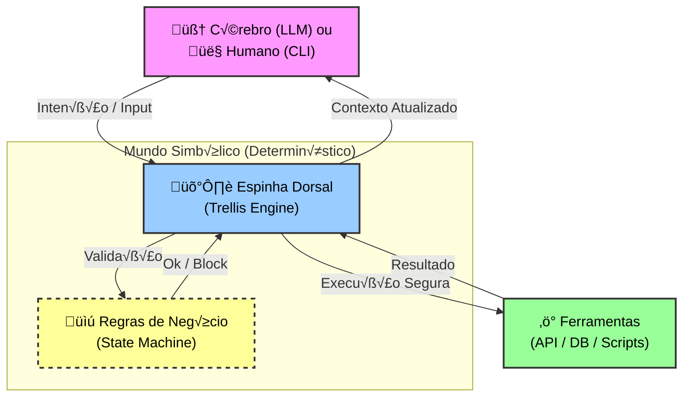

# Trellis

[](https://goreportcard.com/report/github.com/aretw0/trellis)
[](https://godoc.org/github.com/aretw0/trellis)
[](LICENSE.txt)
[](https://github.com/aretw0/trellis/releases)

> **The Neuro-Symbolic Backbone for Agents & Automation.**

**Trellis** e um motor deterministico de fluxos para orquestrar ferramentas, scripts e guardrails com previsibilidade.
Use como framework de CLI/Markdown ou como biblioteca Go dentro do seu backend.

> **Hybrid Nature**: Use como **Framework** (CLI + Markdown) para prototipagem rápida, ou como **Biblioteca** (Go) para controle total em seu backend. *"Opinionated by default, flexible under the hood."*

## Onde brilha

- **CLIs e Ops**: fluxos guiados, com validacao e auditabilidade.
- **Automacao de ferramentas**: scripts e APIs encadeados como um grafo versionavel.
- **Agentes com governanca**: guardrails reais, sem depender apenas de prompt.
- **Backends duraveis**: execucoes longas com pause/resume e padroes SAGA.

## O Conceito Neuro-Simbólico & Automação

O Trellis preenche a lacuna entre a **Rigidez dos Processos** e a **Flexibilidade da Inteligência**:

- **Para Agentes de IA**: Substitua "If/Else" frágeis e Prompts gigantes por um grafo de estados auditável. O Trellis impede alucinações de fluxo.
- **Para Humanos**: Funciona como um motor de **Workflow as Code** (similar a um n8n/Zapier, mas compilado e versionável), ideal para CLIs complexas e automação de Ops.



O decisor (seja **IA** ou **Humano**) escolhe *qual* caminho tomar, mas o Trellis garante que ele *existe* e é *válido*.

## Como modelar um fluxo

Voce define um **Grafo de Estados** com **Nos** (Passos) e **Transicoes** (Regras), e o Trellis gerencia a navegacao.

Voce pode definir esse grafo de duas formas:

### 1. Declarativo (Arquivos)

Ideal para prototipagem, visualização (Mermaid) e edição por LLMs. Suporta **Markdown** (Frontmatter), **YAML** ou **JSON** via [Loam](https://github.com/aretw0/loam).

```yaml
# start.yaml
type: question
content: Olá! Qual é o seu nome?
save_to: user_name  # Data Binding automático
to: greeting        # Transição incondicional
```

### 2. Programático (Go Structs)

Ideal para integração profunda em backends, performance crítica e type-safety total.

```go
&domain.Node{
    ID: "start",
    Type: "question",
    Content: []byte("Olá! Qual é o seu nome?"),
    SaveTo: "user_name",
    Transitions: []domain.Transition{{ToNodeID: "greeting"}},
}
```

> **Nota**: Ambas as formas geram a mesma estrutura em memória e podem co-existir (ex: carregar arquivos e injetar nós via código).

## Funcionalidades Principais

**Para produto e UX**

- **Data Binding & Contexto**: Capture inputs (`save_to`) e use variaveis (`{{ .name }}`) nativamente.
- **Namespaces (Sub-Grafos)**: Organize fluxos complexos em pastas e modulos (`jump_to`).
- **MCP Server**: Integracao nativa com **Model Context Protocol** para conectar Agentes de IA.

**Para engenharia**

- **Strict Typing**: Garante que seus fluxos sejam robustos e livres de erros de digitacao.
- **Embeddable & Agnostic**: Use como CLI, Lib ou Service. O Core e desacoplado de IO e Persistencia.
- **Native SAGA Support**: Orquestracao de transacoes distribuidas com `undo` e `rollback` automatico.

## Quick Start

### Instalação

#### Windows (Recomendado)

A forma mais fácil de instalar no Windows é via **Scoop**:

```powershell
# 1. Adicione o bucket (apenas a primeira vez)
scoop bucket add aretw0 https://github.com/aretw0/scoop-bucket

# 2. Instale o Trellis
scoop install trellis
```

#### macOS / Linux

Instale via **Homebrew**:

```bash
brew install aretw0/tap/trellis
```

#### Via Go (Library Mode)

Para usar o Trellis como biblioteca dentro do seu backend (sem arquivos, puramente em memória):

```bash
go get github.com/aretw0/trellis
```

```go
// Exemplo: Instanciando o Engine sem ler arquivos
loader, _ := memory.NewFromNodes(myNodes...)
eng, _ := trellis.New("", trellis.WithLoader(loader))
```

### Rodando o Golden Path (Demo)

```bash
# Execucao do Engine (Demo)
trellis run ./examples/tour
```

Se voce estiver desenvolvendo dentro do repo, veja a secao "Modo de Desenvolvimento" abaixo.

## Usage

### Rodando um Fluxo (CLI)

```bash
# Modo Interativo (Terminal)
trellis run ./examples/tour

# Modo HTTP Server (Stateless API)
trellis serve --dir ./examples/tour --port 8080
# Swagger UI disponível em: http://localhost:8080/swagger

# Modo MCP Server (Para Agentes de IA)
trellis mcp --dir ./examples/tour
```

Detalhes e variacoes em:

- [docs/guides/running_http_server.md](docs/guides/running_http_server.md)
- [docs/guides/running_mcp_server.md](docs/guides/running_mcp_server.md)
- [examples/README.md](examples/README.md)

### Introspecção

Visualize seu fluxo como um grafo Mermaid:

```bash
trellis graph ./my-flow
# Saída: graph TD ...
```

### Para quem esta contribuindo

**Usando Makefile (Recomendado):**

```bash
make gen    # Gera código Go a partir da spec OpenAPI
make serve  # Roda servidor com exemplo 'tour'
make test   # Roda testes
```

**Executar direto do repo (Go):**

```bash
go run ./cmd/trellis run ./examples/tour
go run ./cmd/trellis serve --dir ./examples/tour --port 8080
go run ./cmd/trellis mcp --dir ./examples/tour
```

**Hot Reload Manual:**
Itere mais rápido observando mudanças de arquivo:

```bash
trellis run --watch --dir ./my-flow
```

O engine monitorará seus arquivos `.md`, `.json`, `.yaml`. Ao salvar, a sessão recarrega automaticamente (preservando o loop de execução).

## Documentacao

- [📖 Product Vision & Philosophy](./docs/PRODUCT.md)
- [🏗 Architecture & Technical Details](./docs/TECHNICAL.md)
- [🌐 Guide: Running HTTP Server (Swagger)](./docs/guides/running_http_server.md)
- [🧭 Node Syntax Reference](./docs/reference/node_syntax.md)

Mais em [`docs/`](./docs/).

## Estrutura

```text
trellis/
├── cmd/           # Entrypoints (trellis CLI)
├── docs/          # Documentação do Projeto
├── examples/      # Demos e Receitas (Tours, Patterns)
├── internal/      # Implementação Privada (Runtime, TUI)
├── pkg/           # Contratos Públicos (Facade, Domain, Ports, Adapters)
└── tests/         # Testes de Integração (Certification Suite)
```

## Licença

[AGPL-3.0](LICENSE.txt)
