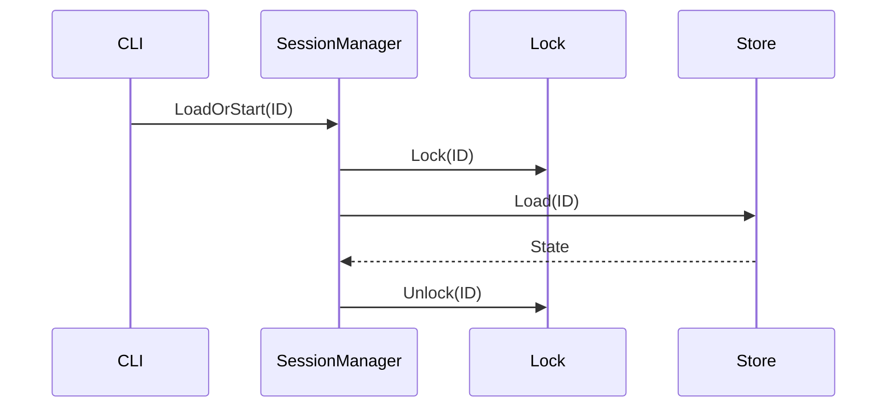
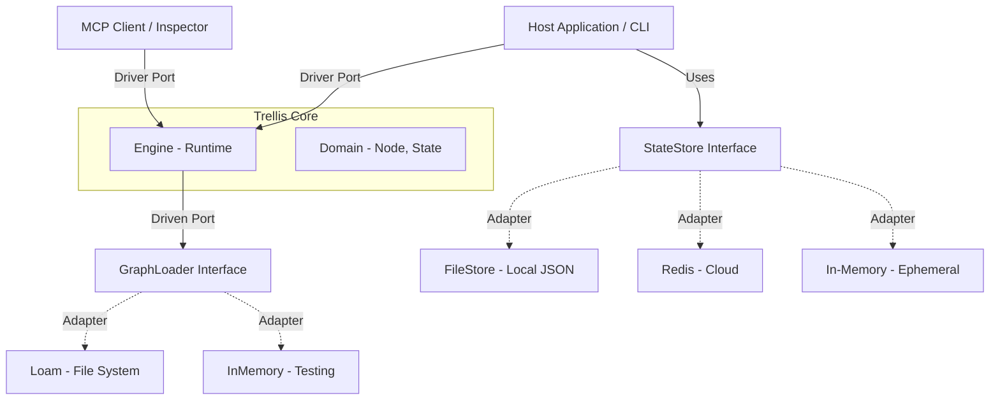
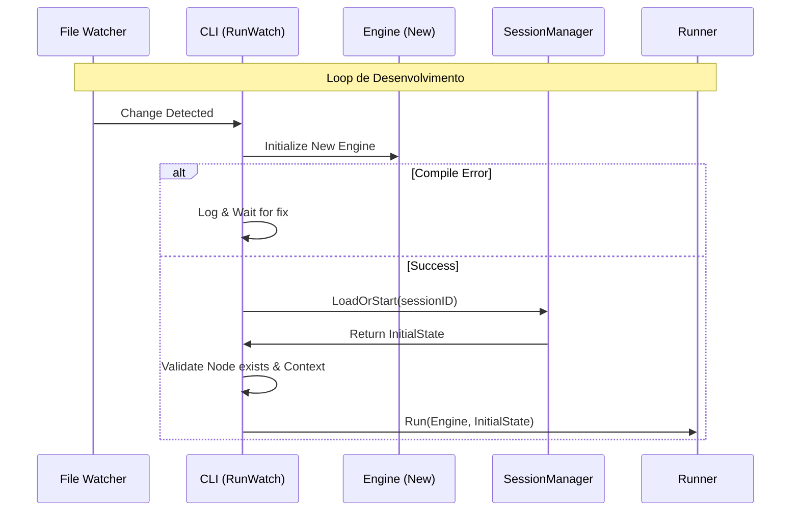
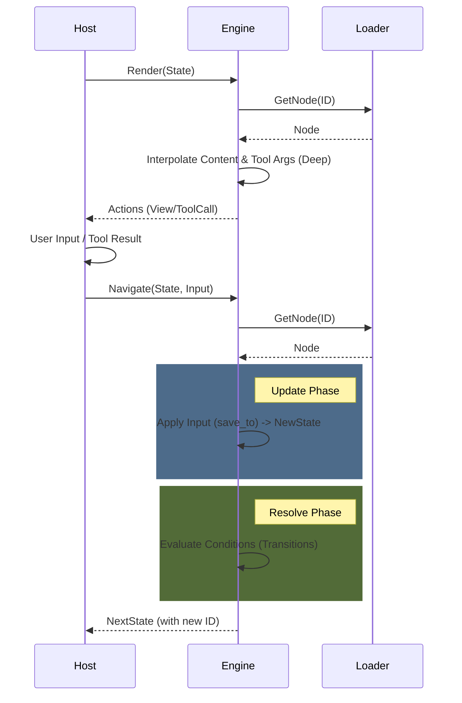
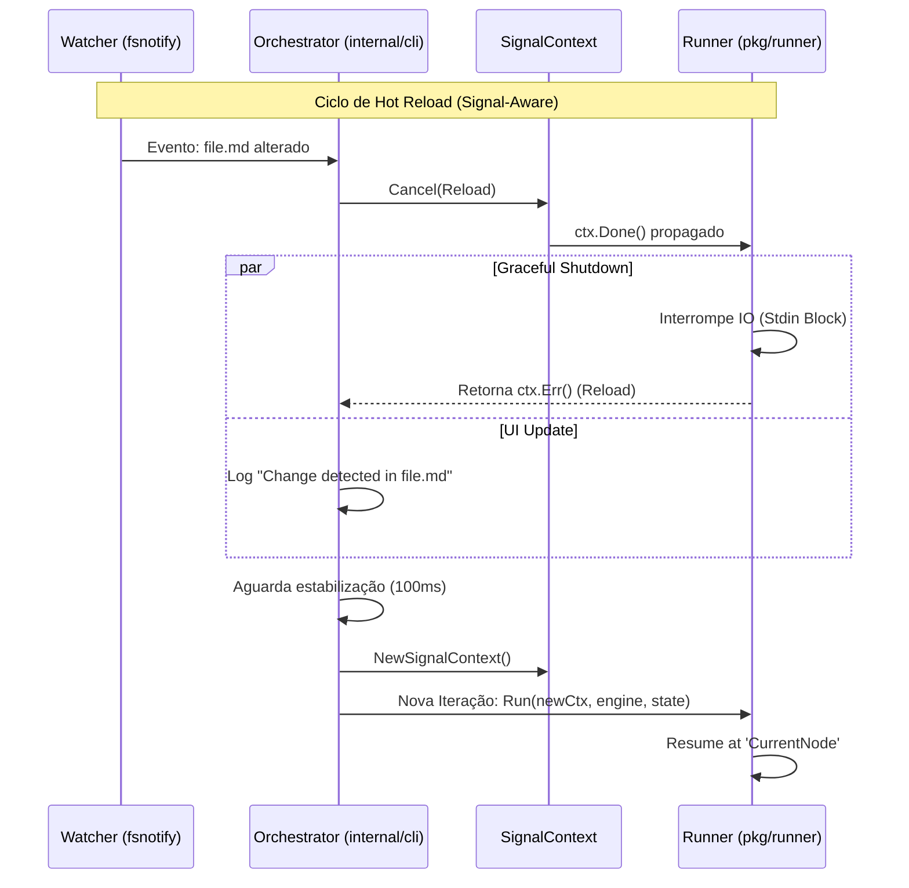
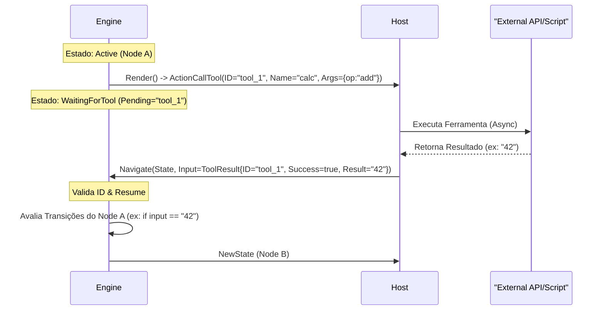
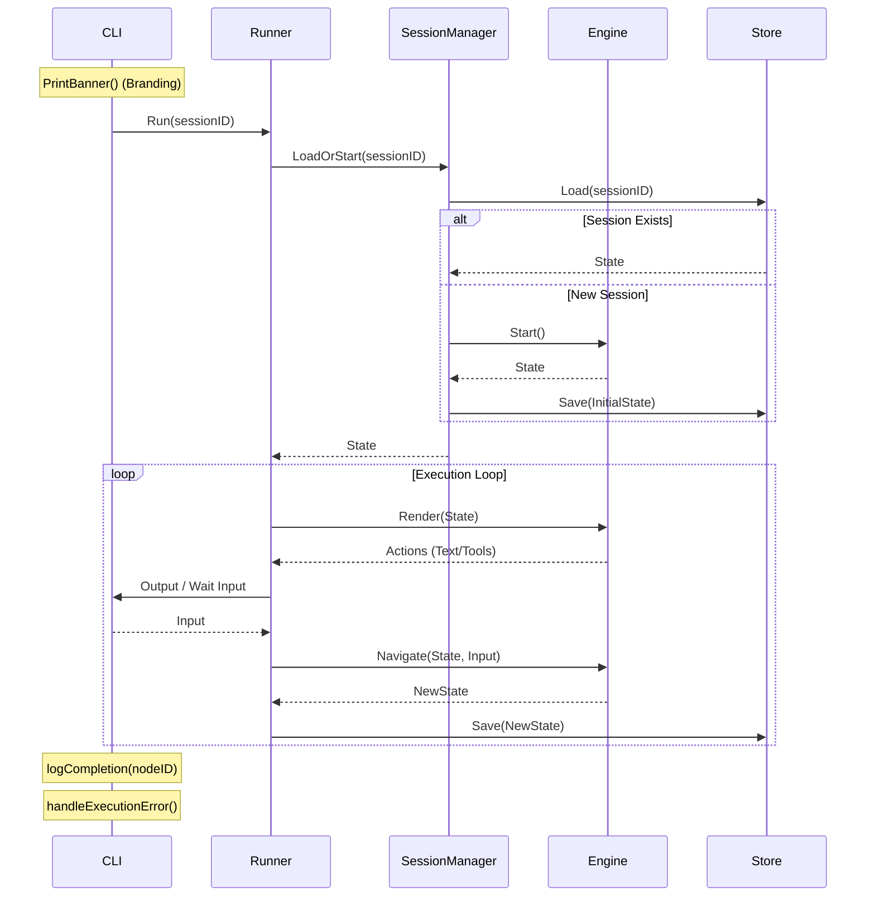
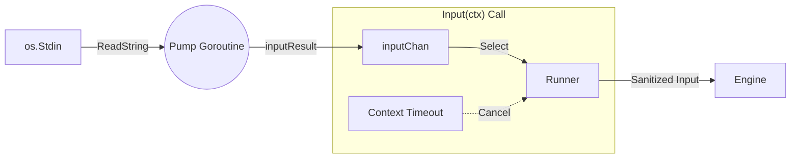
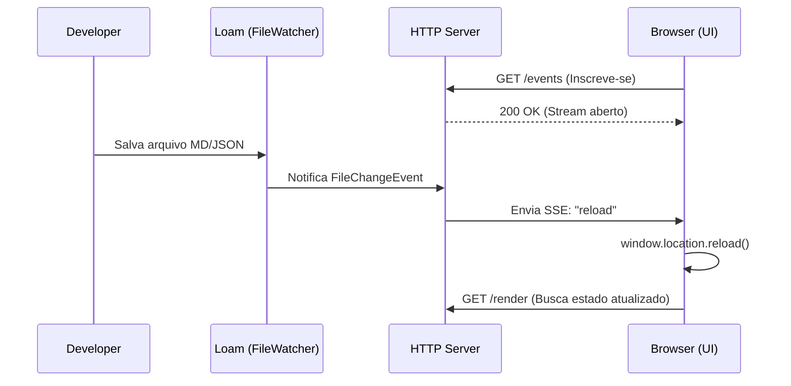
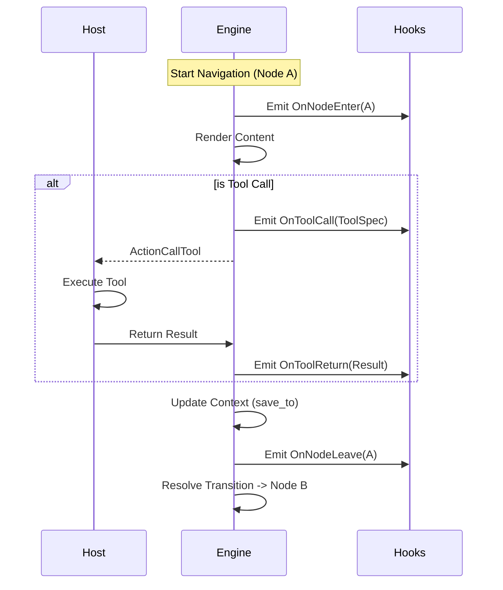

# Technical Reference: Trellis Architecture

## I. Fundamentos (Core Foundation)

Esta seção define os pilares arquiteturais, regras de design e estratégias que governam todo o projeto.

### 1. Definição Formal (Identity)

Tecnicamente, o Trellis é um **Reentrant Deterministic Finite Automaton (DFA) with Controlled Side-Effects**.

- **Reentrant**: O Engine pode ser serializado ("adormecido") e reidratado ("acordado") em qualquer estado estável sem perda de continuidade.
- **Deterministic**: Dado o mesmo Estado Inicial + Input + Resultado de Tools, o Engine *sempre* produzirá a mesma transição, eliminando "flaky workflows".
- **Managed Side-Effects**: Efeitos colaterais (IO, API calls) são delegados ao Host via *Syscalls* (`ActionCallTool`), garantindo que a lógica de transição permaneça pura e testável.

### 2. Arquitetura Hexagonal (Ports & Adapters)

O *Core* da Trellis não conhece banco de dados, não conhece HTTP e não conhece CLI. Ele define **Portas** (Interfaces) que o mundo externo deve satisfazer.
Essa arquitetura desacoplada torna o Trellis leve o suficiente para ser embutido em CLIs simples ou usado como biblioteca "low-level" dentro de frameworks de Agentes de IA maiores.

#### 2.1. Driver Ports (Entrada)

A API primária para interagir com o engine.

- `Engine.Render(state)`: Retorna a view (ações) para o estado atual e se é terminal.
- `Engine.Navigate(state, input)`: Computa o próximo estado dado um input.
- `Engine.Inspect()`: Retorna o grafo completo para visualização.

#### 2.2. Driven Ports (Saída)

As interfaces que o engine usa para buscar dados.

- `GraphLoader.GetNode(id)`: Abstração para carregar nós. O **Loam** implementa isso via adapter.
- `GraphLoader.ListNodes()`: Descoberta de nós para introspecção.

#### 2.2.1. Portas de Persistência (Store) - *Experimental v0.6*

Interface experimental para "Durable Execution" (Sleep/Resume).

- `StateStore.Save(ctx, sessionID, state)`: Persiste o snapshot da execução.
- `StateStore.Load(ctx, sessionID)`: Hidrata uma sessão anterior.

#### 2.2.2. Session Manager (Orchestrator)

The `pkg/session` package acts as the orchestrator for state durability. It wraps the `StateStore` to add concurrency control (locking) and lifecycle management (atomic "Load or Create").



#### 2.3. Diagrama de Arquitetura



### 3. Estrutura de Diretórios

```text
trellis/
├── cmd/
│   └── trellis/       # Entrypoint (CLI)
├── internal/          # Detalhes de implementação (Privado)
│   ├── adapters/      # Implementações (Loam, HTTP, MCP)
│   ├── presentation/  # TUI & Renderização
│   ├── runtime/       # Engine de execução
│   └── validator/     # Lógica de validação
├── pkg/               # Contratos Públicos (Safe to import)
│   ├── adapters/      # Adaptadores de Infraestrutura (Inmemory)
│   ├── domain/        # Core Domain (Node, State)
│   ├── ports/         # Interfaces (Driver & Driven)
│   ├── registry/      # Registro de Ferramentas
│   ├── runner/        # Loop de Execução e Handlers
│   └── session/       # Gerenciamento de Sessão e Locking
└── go.mod
```

### 4. Princípios de Design (Constraints)

Para evitar a "Complexidade Oculta", seguimos estas restrições:

#### 4.1. Logic-Data Decoupling

A lógica complexa **nunca** deve residir no grafo (Markdown).

- **Errado**: `condition: user.age > 18 && user.status == 'active'` (Exige parser complexo).
- **Correto**: `condition: is_adult_active` (O Host resolve e retorna bool).

> Veja [Interactive Inputs](../docs/guides/interactive_inputs.md) para detalhes sobre como o Host gerencia inputs.

#### 4.2. Strict Mode Compiler

O compilador deve ser implacável.

- Variáveis não declaradas resultam em erro de compilação.
- O objetivo é **Confiança Total**: Se compilou, não existem "Dead Ends" lógicos causados por typos.

#### 4.3. Convenção de Ponto de Entrada (Entry Point)

O Trellis segue a filosofia **Convention over Configuration** para o início do fluxo.

- **ID Obrigatório**: O fluxo SEMPRE começa no nó com ID `start`.
- **Resolução de Arquivo**: Por padrão, o `LoamLoader` busca por um arquivo chamado `start.md` (ou `start.json`) na raiz do diretório.
- **Sub-Grafos**: Ao pular para um sub-módulo (`jump_to: modules/auth`), o engine busca por `modules/auth/start.md`.

> **Nota**: Embora seja possível injetar um `State` inicial diferente via código (`engine.Navigate(ctx, customState, input)`), a CLI e os Runners padrão assumem `start` como entrypoint.

#### 4.4. Hot Reload Lifecycle (v0.6)

Com a introdução do `StateStore`, o ciclo de Hot Reload tornou-se "Stateful". Ao detectar uma mudança, o Engine é recarregado, mas o Runner tenta reidratar o estado anterior.



**Estratégias de Recuperação (Guardrails)**:

- **Missing Node**: Fallback para `start` se o nó atual for removido.
- **Validation Failure**: Pausa se novos `required_context` surgirem sem dados na sessão.
- **Type Mismatch**: Reseta o status de `WaitingForTool` se o nó mudar de tipo.

### 5. Design Constraints & Known Limitations (v0.6)

While ensuring "Durable Execution", some trade-offs were made for simplicity in v0.6:

1. **Session Concurrency (Lock Leaking)**:
    - The `SessionManager` uses a `sync.Map` of Mutexes. Currently, these locks are not garbage collected after session deletion. This is acceptable for CLI/Dev use but requires an LRU/GC for long-running high-traffic servers.

2. **Redis Adapter Performance**:
    - The `List()` method uses `SCAN`, which is O(N). For production with millions of keys, a separate `SET` of active session IDs should be maintained.
    - *TTL*: Sessions currently store indefinitely (Expiration=0).

### 6. Estratégia de Testes

Para garantir a estabilidade do Core enquanto o projeto evolui, definimos uma pirâmide de testes rígida:

#### 6.1. Níveis de Teste

1. **Core/Logic (Unit)**:
    - **Alvo**: `pkg/domain`, `internal/runtime`.
    - **Estilo**: Table-Driven Tests extensivos.
    - **Objetivo**: Garantir que a máquina de estados (Engine) transite corretamente dado um input, sem depender de IO ou Filesystem.
    - **Strict Serialization**: Inclui testes de regressão (`tests/serialization_test.go`) para garantir consistência de `json.Number` e tipos.

2. **Adapters (Contract Tests)**:
    - **Alvo**: `LoamLoader` vs `MemoryLoader`.
    - **Estilo**: Interface Compliance Tests.
    - **Objetivo**: O mesmo suite de testes deve rodar contra ambas as implementações para garantir que o comportamento seja idêntico. Se o `MemoryLoader` funciona, o `LoamLoader` deve funcionar igual.

3. **Integration (E2E)**:
    - **Alvo**: `cmd/trellis` (Blackbox).
    - **Estilo**: CLI Runners / JSON In-Out.
    - **Objetivo**: Simular um usuário real ou sistema externo interagindo com o binário. Verifica se a "cola" (Wiring) entre as camadas está funcionando.

4. **Snapshot Testing**:
    - **Alvo**: CLI Output / TUI.
    - **Objetivo**: Garantir que a experiência de cada pixel na tela não regrediu (útil para detectar quebras de layout).

---

## II. Mecânica do Core (Engine & IO)

Esta seção detalha o funcionamento interno do engine, ciclo de vida e tratamento de dados.

### 7. Ciclo de Vida do Engine (Lifecycle)

O Engine segue um ciclo de vida estrito de **Resolve-Execute-Update** para garantir previsibilidade.



**Fases do Ciclo:**

1. **Render (View)**: Carrega o nó, aplica interpolação profunda (incluindo argumentos de ferramentas) e retorna as ações. O estado *não* muda.
2. **Navigate (Update)**:
    - **Update**: Aplica o input ao contexto da sessão (se `save_to` estiver definido).
    - **Resolve**: Avalia as condições de transição baseadas no novo contexto.
    - **Transition**: Retorna o novo estado apontando para o próximo nó.

#### 7.1. Hot Reload Lifecycle (v0.6)

No modo `watch`, o Runner orquestra o recarregamento do motor e a reidratação do estado usando um `SignalContext` hierárquico.



**Estratégias de Recuperação (Guardrails):**

1. **Node Tipo 'tool' → 'text'**: Se o estado salvo era `WaitingForTool`, mas o nó foi alterado para `text` (ou deletado), o motor reseta o status para `Active` para evitar travamentos.
2. **Erro de Sintaxe**: Se o arquivo alterado contiver erro de sintaxe, o Runner aguarda a próxima correção sem derrubar o processo e registra o erro via `logger.Error`.
3. **Session Scoping**: No modo `watch`, se nenhum ID de sessão for fornecido, um ID determinístico baseado no hash do caminho do repositório (`watch-<hash>`) é gerado para evitar colisões entre projetos.

### 8. Protocolo de Efeitos Colaterais (Side-Effect Protocol)

O protocolo de side-effects permite que o Trellis solicite a execução de código externo (ferramentas) de forma determinística e segura.

#### 8.1. Filosofia: "Syscalls" para a IA

O Trellis trata chamadas de ferramenta como "Chamadas de Sistema" (Syscalls). O Engine não executa a ferramenta; ele **pausa** e solicita ao Host que a execute.

1. **Intenção (Intent)**: O Engine renderiza um nó do tipo `tool` e emite uma ação `CALL_TOOL`.
2. **Suspensão (Yield)**: O Engine entra em estado `WaitingForTool`, aguardando o resultado.
3. **Dispatch**: O Host (CLI, Servidor HTTP, MCP) recebe a solicitação e executa a lógica (ex: chamar API, rodar script).
4. **Resumo (Resume)**: O Host chama `Navigate` passando o `ToolResult`. O Engine retoma a execução verificando transições baseadas nesse resultado.

#### 8.2. Ciclo de Vida da Chamada de Ferramenta



#### 8.3. Universal Dispatcher

Graças a este desacoplamento, a mesma definição de grafo pode usar ferramentas implementadas de formas diferentes dependendo do adaptador:

- **CLI Runner**: Executa scripts locais (`.sh`, `.py`) ou funções Go embutidas.
- **MCP Server**: Repassa a chamada para um cliente MCP (ex: Claude Desktop, IDE).
- **HTTP Server**: Webhooks que notificam serviços externos (ex: n8n, Zapier).

#### 8.4. Defining Tools in Loam

You can define available tools directly in the Node's frontmatter. This allows the Engine to be aware of the tool's schema (name, description, parameters) without needing hardcoded Go structs.

```yaml
type: text
tools:
  - name: get_weather
    description: Get current temperature
    parameters:
      type: object
      properties:
        city: { type: string }
---
The weather is...
```

#### 8.5. Reusable Tool Libraries (Polymorphic Design)

To support modularity, the `tools` key in Frontmatter is polymorphic. It accepts both inline definitions and string references to other files.

```yaml
tools:
  - name: local_tool         # Inline Definition
    description: ...
  - "modules/tools/math.md"  # Reference (Mixin)
```

##### Resolution Strategy

The `LoamLoader` implements a recursive resolution strategy with **Shadowing** (Last-Write-Wins).


**Technical Constraints:**

1. **Polymorphism (`[]any`)**: The Loader accepts generic types to support this UX. This requires **manual schema validation** at runtime.
2. **Cycle Detection**: Recursive imports are guarded against infinite loops (`visited` set).
3. **Shadowing Policy**: Local definitions always override imported ones.

### 9. Runner & IO Architecture

The `Runner` serves as the bridge between the Core Engine and the outside world. It manages the execution loop, handles middleware, and delegates IO to an `IOHandler`.

It delegates signal handling to a dedicated **SignalManager** (`pkg/runner/signal_manager.go`) which ensures race-free context cancellation and signal resetting.

#### 9.1. Session Cycle



#### 9.2. Stateless & Async IO

Trellis supports two primary modes of operation:

1. **Text Mode** (`TextHandler`): For interactive TUI/CLI usage. Blocks on user input.
2. **JSON Mode** (`JSONHandler`): For headless automation and API integration.

**Key constraint for JSON Mode:**

- **Strict JSON Lines (JSONL)**: All inputs to the `JSONHandler` must be single-line JSON strings.
- **Async/Non-Blocking**: The handler reads from Stdin in a background goroutine, allowing cancellation (timeout/interrupt).
- **Signal Mapping (Context-Aware)**: The Runner monitors:
  - `signals.Context().Done()`: Explicit User Signal (SIGINT). Maps to `"interrupt"`.
  - `ctx.Done()` (Parent): External Orchestrator (Watch Reload). Treated as Clean Exit (no signal mapping).
  - `inputCtx.Done()` (Deadline): Maps to `"timeout"`.

#### 9.3. Semântica de Texto e Bloqueio

O comportamento de nós de texto segue a semântica de State Machine pura:

1. **Nodes de Texto (`type: text`)**: São, por padrão, **Non-Blocking (Pass-through)** para o Engine.
    - Se houver uma transição válida incondicional, transita *imediatamente*.
    - **Nota de UX**: No modo **Interativo (CLI)**, o Runner força uma pausa após renderizar o texto para permitir leitura. No modo **Headless**, a transição é imediata.
2. **Pausas Explícitas**:
    - `wait: true`: Força pausa para input (ex: "Pressione Enter") em *ambos* os modos.
    - `type: question`: Pausa explícita aguardando resposta (hard step).

#### 9.4. Diagrama de Decisão (Input Logic)


#### 9.5. Pattern: Stdin Pump (IO Safety)

Input handling in Go, especially with `os.Stdin`, is blocking by nature. To support **Timeouts** (cancelable reads) without blocking the main event loop or leaking "ghost readers" (race conditions where a stale goroutine eats input intended for the next step), `TextHandler` implements the **Stdin Pump** pattern.

- **Single Producer**: A persistent goroutine (`pump`) reads from the underlying Reader loop forever.
- **Buffered Channel**: Results (`string` or `error`) are sent to `inputChan`.
- **Select-based Consumption**: The `Input(ctx)` method listens to `inputChan`. If `ctx` times out, it stops listening, but the pump **remains active**, ready to serve the next call (type-ahead support).



> **Stewardship Note**: This pattern prevents multiple goroutines from fighting over `bufio.Reader`. The `Runner` automatically memoizes the handler instance to ensure that reusing a `Runner` instance also reuses the single Pump goroutine.

#### 9.6. Architectural Insight: Engine-bound vs Runner-bound

Para manter a arquitetura limpa, diferenciamos onde cada responsabilidade reside:

1. **Engine-bound (Passive/Logic)**:
    - *Exemplos*: `LifecycleHooks` (`OnNodeEnter`, `OnTransition`).
    - *Natureza*: O Engine apenas **emite** eventos sobre o que calculou. Ele não sabe quem está ouvindo e não espera resposta.
    - *Propósito*: Observabilidade pura.

2. **Runner-bound (Active/Control)**:
    - *Exemplos*: `StateStore` (Persistência), `ToolInterceptor` (Segurança), `SignalManager` (Interrupção).
    - *Natureza*: O Runner **orquestra** e decide se o fluxo deve continuar, pausar ou falhar.
    - *Propósito*: Controle do Ciclo de Vida e Integração com o Mundo Real (IO).

Essa separação garante que o Core permaneça uma Máquina de Estados Pura e Determinística, enquanto o Runner assume a responsabilidade pela "sujeira" (Timeouts, Discos, Sinais de SO).

#### 9.7. Estratégia de Persistência (Scope)

- **Workspace-first**: As sessões são armazenadas em `.trellis/sessions/` no diretório de trabalho atual.
- **Motivação**: Isolar sessões por projeto (como `.git` ou `.terraform`), facilitando o desenvolvimento e evitando colisões globais em ambientes multi-projeto.
- **Formato**: Arquivos JSON simples para facilitar inspeção e debugging manual ("Loam-ish").

#### 9.8. Session Management CLI (Chaos Control)

Para gerenciar o ciclo de vida dessas sessões persistentes, o Trellis expõe comandos administrativos ("Chaos Control"):

- **List (`ls`)**: Enumera sessões ativas no workspace.
- **Inspect**: Visualiza o Estado JSON puro (Current Node, Context, History) para debugging.
- **Remove (`rm`)**: Permite "matar" sessões travadas ou limpar o ambiente.

Essa camada é crucial para operações de longa duração, onde "desligar e ligar de novo" (resetar o processo) não é suficiente para limpar o estado.

#### 10. Fluxo de Dados e Serialização

#### 10.1. Data Binding (SaveTo)

O Trellis adota a propriedade `save_to` para indicar a *intenção* de persistir a resposta de um nó no contexto da sessão.

```yaml
type: question
text: "Qual é o seu nome?"
save_to: "user_name" # Salva input em context["user_name"]
```

**Regras de Execução:**

1. **Precedência**: O valor é salvo no contexto *antes* de avaliar as transições.
2. **Imutabilidade**: O Engine realiza **Deep Copy** do Contexto a cada transição.
3. **Tipagem Preservada**: `save_to` armazena o input como recebido (`any`).

#### 9.2. Variable Interpolation

O Trellis adota uma arquitetura plugável para interpolação de variáveis via interface `Interpolator`.

- **Default Strategy**: Go Templates (`{{ .UserName }}`).
- **Legacy Strategy**: `strings.ReplaceAll` (`{{ Key }}`).

#### 10.3. Global Strict Serialization

O Trellis força **Strict Mode** em todos os adaptadores para resolver o problema do `float64` em JSON. Números são decodificados como `json.Number` ou `int64` para garantir integridade de IDs e timestamps.

#### 10.4. Data Contracts (Validation & Defaults)

**Standard Serialization (Snake Case):**

To ensure interoperability, the Engine serializes its state to JSON using `snake_case` keys (e.g., `current_node_id`, `pending_tool_call`), regardless of the internal Go struct naming. This allows for cleaner integration with external tools and manual session inspection.

**Fail Fast (Required Context):**

Nós servem como fronteiras de dados e podem impor contratos de execução:

**Fail Fast (Required Context):**

```yaml
required_context:
  - user_id
  - api_key
```

Se uma chave estiver faltando, o Engine aborta a execução com `ContextValidationError`.

**Valores Padrão (Mocking):**

Nós (convencionalmente `start`) podem definir valores de fallback para simplificar o desenvolvimento local:

```yaml
default_context:
  api_url: "http://localhost:8080"
```

#### 10.5. Initial Context Injection (Seed State)

Para facilitar testes automatizados e integração, o Trellis permite injetar o estado inicial.

- **API**: `Engine.Start(ctx, initialData map[string]any)`
- **CLI**: Flag `--context '{"user": "Alice"}'`
- **Configuração**: Use `trellis.WithEntryNode("custom_start")` para sobrescrever o ponto de entrada padrão ("start").
- **Precedência**: `initialData` (Runtime) > `default_context` (File).
- **Uso**: Dados injetados estão disponíveis imediatamente para interpolação (`{{.user}}`) no nó de entrada.

---

## III. Funcionalidades Estendidas (System Features)

Recursos avançados para escalabilidade, segurança e integração.

### 11. Escalabilidade: Sub-Grafos e Namespaces

Para escalar fluxos complexos, o Trellis suporta **Sub-Grafos** via organização de diretórios.

#### 11.1. Semântica `jump_to` vs `to`

- **`to`**: Transição local (mesmo arquivo/contexto).
- **`jump_to`**: Transição para um **Sub-Grafo** ou Módulo externo (mudança de contexto).

#### 11.2. IDs Implícitos e Normalização

- **Implicit IDs**: Arquivos em subdiretórios herdam o caminho como ID (ex: `modules/checkout/start`).
- **Normalization**: O Adapter normaliza todos os IDs para usar `/` (forward slash).

#### 11.3. Syntactic Sugar: Options

Atalho para menus de escolha simples.

- **Options**: Correspondência exata de texto. Avaliadas PRIMEIRO.
- **Transitions**: Lógica genérica. Avaliadas DEPOIS.

### 12. Segurança e Policies

#### 12.1. Interceptors (Safety Middleware)

Para mitigar riscos de execução arbitrária, o Runner aceita interceptadores:

```go
type ToolInterceptor func(ctx, call) (allowed bool, result ToolResult, err error)
```

- **ConfirmationMiddleware**: Solicita confirmação explícita (`[y/N]`). O trecho `metadata.confirm_msg` no nó pode personalizar o alerta.
- **AutoApproveMiddleware**: Para modo Headless/Automação.

#### 12.2. Error Handling (on_error)

Mecanismo robusto para recuperação de falhas em ferramentas.

- Se `ToolResult.IsError` for true:
  - O Engine **PULA** o `save_to` (evita context poisoning).
  - O Engine busca transição `on_error` ou `on_error: "retry"`.
  - Se houver `on_error`: Transita para o nó de recuperação.
  - Se não houver handler, o erro sobe (Panic/Fatal).

#### 12.3. Controle de Execução (Signals & Timeouts)

Mecanismos para controle de fluxo assíncrono e limites de execução.

**Timeouts (Sinal de Sistema):**

- **Definição**: `timeout: 30s` (declarativo no nó).
- **Mapping**: O Runner mapeia `context.DeadlineExceeded` automaticamente para o sinal `"timeout"`.
- **Fail Fast**: Se o sinal `"timeout"` não for tratado via `on_signal`, o Runner encerra a execução com erro (`timeout exceeded`). Isso evita loops infinitos ou estados zumbis.

**Sinais Globais (Interrupções):**

- **API**: `POST /signal` (e.g., Interrupt, Shutdown).
- **Handlers**: O Engine verifica `on_signal` no estado atual.
- **Workflow**:
  1. Runner detecta sinal via Context ou Input.
  2. Engine tenta criar transição (`on_signal`).
  3. **Sucesso**: Fluxo continua no novo estado.
  4. **Falha (Unhandled/Loader Error)**: Runner aborta execução (`fail fast`).


#### 12.4. System Context Namespace

O namespace `sys.*` é reservado no Engine.

- **Read-Only**: Templates podem ler (`{{ .sys.error }}`).
- **Write-Protected**: `save_to` não pode escrever em `sys` (proteção contra injeção).

#### 12.5. Global Signals (Interrupts)

O Trellis suporta a conversão de sinais do sistema operacional (ex: `Ctrl+C` / `SIGINT`) em transições de estado.

- **`on_signal`**: Define um mapa de sinais para nós de destino.
- **Engine.Signal**: Método que dispara a transição.

```yaml
type: text
wait: true
on_signal:
  interrupt: confirm_exit
```

Se o sinal "interrupt" for recebido enquanto o nó estiver ativo, o Engine transitará para `confirm_exit` em vez de encerrar o processo.

> **Consistency Note**: Quando um sinal dispara uma transição, o evento `OnNodeLeave` é emitido para o nó interrompido, mantendo a consistência do ciclo de vida.

#### 12.6. Extensibility: Signals & Contexts

O mecanismo de `on_signal` é a base para extensibilidade do fluxo via eventos:

- **System Contexts (Timeouts)**: `on_signal: { timeout: "retry_node" }`. (Implementado)
- **External Signals (Webhooks)**: `on_signal: { payment_received: "success" }`. Disparado via `POST /signal`. (Implementado)
- **Payload injection (Future)**: Injeção de dados junto com o sinal (ex: webhook payload -> `context.webhook_data`).


#### 12.7. Input Sanitization & Limits

To ensure robust operation in production (especially in shared-memory environments like Kubernetes Pods), Trellis enforces limits on user input at the Runner layer. This applies globally to **all adapters** (CLI, HTTP, MCP).

- **Max Input Size**: Defaults to 4KB. Configurable via `TRELLIS_MAX_INPUT_SIZE`.
- **Control Characters**: Automatically strips dangerous ANSI/Control codes to prevent log poisoning.
- **Behavior**: Inputs exceeding the limit are **Rejected** (returning an error) rather than silently truncated, preserving state integrity ("Deterministic State").

See [Deployment Strategies](../docs/guides/deployment_strategies.md) for provisioning advice.

### 13. Adapters & Interfaces

#### 13.1. Camada de Apresentação

Responsável por converter visualmente o grafo e estados.

- **Trellis Graph**: Gera diagramas Mermaid.
  - **Start/Root** (`(( ))`): Nó inicial ou com ID "start".
  - **Question/Input** (`[/ /]`): Nós que exigem interação do usuário.
  - **Tool/Action** (`[[ ]]`): Nós que executam efeitos colaterais.
  - **Default** (`[ ]`): Nós de texto simples ou lógica interna.
  - **Timeouts** (`⏱️`): Anotação visual no label do nó.

**Arestas e Transições:**

- **Fluxo Normal** (`-->`): Transições padrão.
- **Salto de Módulo** (`-.->`): Transições entre arquivos (`jump_to`).
- **Sinais/Interrupções** (`-. ⚡ .->`): Transições disparadas por `on_signal`.

#### 13.2. HTTP Server (Stateless)

Adaptador REST API (`internal/adapters/http`).

- **Endpoints**: `POST /navigate`, `GET /graph`.
- **SSE (Server-Sent Events)**: Endpoint `/events` notifica clientes sobre mudanças (Hot-Reload).
  - Fonte: `fsnotify` (via Loam).
  - Transporte: `text/event-stream`.



#### 13.3. MCP Adapter

Expõe o Trellis como um servidor MCP (Model Context Protocol).

- **Tools Expostas**: `navigate`, `render_state`.

### 14. Segurança & Privacidade (Privacy Hooks)

O Trellis oferece suporte camadas de middleware para garantir conformidade com políticas de segurança (Encryption at Rest) e privacidade (PII Sanitization).

#### 14.1. Envelope Encryption (At Rest)

Para proteger o estado da sessão (que pode conter chaves de API e dados do usuário) em armazenamento não confiável (como disco ou REDIS compartilhado), utilizamos o **Envelope Pattern**.

O middleware criptografa todo o estado da sessão e o armazena dentro de um "Estado Envelope" opaco.

```mermaid
graph LR
    Engine[Engine State] -->|Plain JSON| Middleware[Encryption Middleware]
    Middleware -->|AES-GCM (Key A)| Cipher[Ciphertext Blob]
    Cipher -->|Wrap| Envelope[Envelope State]
    Envelope -->|Save| Store[Storage Adapter]
    
    subgraph "Envelope State"
        Ctx["__encrypted__: <base64>"]
    end
```

- **Key Rotation**: O middleware suporta rotação de chaves sem downtime. Ao carregar, ele tenta a chave ativa; se falhar, tenta chaves de fallback sequencialmente. Ao salvar, sempre re-encripta com a chave ativa mais recente.

#### 14.2. PII Sanitization (Compliance)

Um middleware separado permite a sanitização de dados sensíveis (Personally Identifiable Information) antes da persistência.

- **Deep Masking**: Percorre recursivamente o mapa de contexto e substitui valores de chaves sensíveis (ex: `password`, `ssn`, `api_key`) por `***`.
- **Imutabilidade em Memória**: A sanitização ocorre em uma **cópia profunda** (Deep Copy) do estado antes de salvar. O estado em memória usado pelo Engine permanece intacto para execução contínua.
- **Caveat**: Se o processo falhar e for reiniciado, os dados persistidos estarão mascarados (`***`), o que pode impedir a retomada se o fluxo depender desses dados. Use este middleware para Compliance de Logs ou quando a durabilidade do dado sensível não for crítica.
- **Resources**: `trellis://graph`.

### 14. Observability

Trellis fornece **Lifecycle Hooks** para instrumentação externa.

- **Hooks**: `OnNodeEnter`, `OnNodeLeave`, `OnToolReturn`, etc.
- **Log Standard**: Events use consistent keys.
  - `node_id`: ID of the node.
  - `tool_name`: Name of the tool (never empty).
  - `type`: Event type (enter, leave, tool_call).
- **Integração**: Pode ser usado com `log/slog` e `Prometheus` sem acoplar essas dependências ao Core (ex: `examples/structured-logging`).

#### 14.1 Diagrama de Eventos (Lifecycle Hooks)

O diagrama abaixo ilustra onde cada evento é emitido durante o ciclo `Navigate`:


