# Referência Técnica: Arquitetura Trellis

## Índice (Table of Contents)

* [**I. Fundamentos (Core Foundation)**](#i-fundamentos-core-foundation)

    1. [Definição Formal](#1-definição-formal-identity)
    2. [Arquitetura Hexagonal](#2-arquitetura-hexagonal-ports--adapters)
    3. [Estrutura de Diretórios](#3-estrutura-de-diretórios)
    4. [Princípios de Design (Constraints)](#4-princípios-de-design-constraints)
    5. [Arquitetura de Sessão (Trade-offs & Limites)](#5-arquitetura-de-sessão-trade-offs--limites)
    6. [Estratégia de Testes](#6-estratégia-de-testes)

* [**II. Mecânica do Core (Engine & IO)**](#ii-mecânica-do-core-engine--io)

    7. [Ciclo de Vida do Engine](#7-ciclo-de-vida-do-engine-lifecycle)
    8. [Protocolo de Efeitos Colaterais (Side-Effect Protocol)](#8-protocolo-de-efeitos-colaterais-side-effect-protocol)
    9. [Arquitetura do Runner & IO](#9-arquitetura-do-runner--io)
    10. [Fluxo de Dados e Serialização](#10-fluxo-de-dados-e-serialização)

* [**III. Funcionalidades Estendidas (System Features)**](#iii-funcionalidades-estendidas-system-features)

    11. [Escalabilidade](#11-escalabilidade-sub-grafos-e-namespaces)
    12. [Controle de Execução e Governança](#12-controle-de-execução-e-governança)
    13. [Adapters & Interfaces](#13-adapters--interfaces)
    14. [Segurança de Dados e Privacidade](#14-segurança-de-dados-e-privacidade)
    15. [Observabilidade](#15-observabilidade-observability)
    16. [Process Adapter](#16-process-adapter-execução-de-script-local)

---

## I. Fundamentos (Core Foundation)

Esta seção define os pilares arquiteturais, regras de design e estratégias que governam todo o projeto.

> **Nota**: Para o histórico evolutivo e justificativas de design (Log de Decisões), consulte [DECISIONS.md](./DECISIONS.md).

### 1. Definição Formal (Identity)

Tecnicamente, o Trellis é um **Reentrant Deterministic Finite Automaton (DFA) with Controlled Side-Effects**.

* **Reentrant**: O Engine pode ser serializado ("adormecido") e reidratado ("acordado") em qualquer estado estável sem perda de continuidade.
* **Deterministic**: Dado o mesmo Estado Inicial + Input + Resultado de Tools, o Engine *sempre* produzirá a mesma transição, eliminando "flaky workflows".
* **Managed Side-Effects**: Efeitos colaterais (IO, API calls) são delegados ao Host via *Syscalls* (`ActionCallTool`), garantindo que a lógica de transição permaneça pura e testável.

### 2. Arquitetura Hexagonal (Ports & Adapters)

O *Core* da Trellis não conhece banco de dados, não conhece HTTP e não conhece CLI. Ele define **Portas** (Interfaces) que o mundo externo deve satisfazer.
Essa arquitetura desacoplada torna o Trellis leve o suficiente para ser embutido em CLIs simples ou usado como biblioteca "low-level" dentro de frameworks de Agentes de IA maiores.

#### 2.1. Driver Ports (Entrada)

A API primária para interagir com o engine.

* `Engine.Render(state)`: Retorna a view (ações) para o estado atual e se é terminal.
* `Engine.Navigate(state, input)`: Computa o próximo estado dado um input.
* `Engine.Inspect()`: Retorna o grafo completo para visualização.
* `Engine.Name`: Nome/Rótulo identificador do grafo (útil para logs e introspecção).

#### 2.2. Driven Ports (Saída)

As interfaces que o engine usa para buscar dados.

* `GraphLoader.GetNode(id)`: Abstração para carregar nós. O **Loam** implementa isso via adapter.
* `GraphLoader.ListNodes()`: Descoberta de nós para introspecção.

#### 2.2.1. Portas de Persistência (Store)

Interface experimental para "Durable Execution" (Sleep/Resume).

* `StateStore.Save(ctx, sessionID, state)`: Persiste o snapshot da execução.
* `StateStore.Load(ctx, sessionID)`: Hidrata uma sessão anterior.

#### 2.2.2. Distributed Locker (Concurrency)

Interface para controle de concorrência em ambiente distribuído (v0.7).

* `DistributedLocker.Lock(ctx, key, ttl)`: Adquire lock distribuído (ex: Redis).

#### 2.2.3. Session Manager (Orchestrator)

The `pkg/session` package acts as the orchestrator for state durability. It wraps the `StateStore` to add concurrency control (locking) and lifecycle management (atomic "Load or Create").

**Hybrid Locking Strategy (Process + Distributed):**

To balance performance and safety, the Manager uses a **Two-Level Locking** strategy:

1. **Local Mutex (`sync.Mutex`)**: Prevents race conditions between goroutines within the *same* process instance. Cheap and fast.
2. **Distributed Lock (Redis)**: Prevents race conditions between different replicas (Pods). Expensive (Network RTT).

The Distributed Lock is acquired *lazily* only inside critical sections (Load/Save), wrapped by the Local Mutex execution.

**Deferred Unlock (Best Effort Release):**

The engine ignores (but logs) errors during the lock release (Unlock) phase inside a `defer`.

* **Reasoning**: If the business logic (Load/Save) succeeds but the network fails during Unlock, retuning an error would mask the success and confuse the caller.
* **Safety**: The Distributed Lock has a TTL (Time-To-Live). If an explicit unlock fails, the lock will naturally expire, preserving system liveliness at the cost of slight contention delay.

**Concurrency Strategy (Reference Counting)**:
To prevent memory leaks in high-traffic scenarios, the Manager uses a **Reference Counting** mechanism for session locks. Locks are created on demand and automatically deleted when the reference count drops to zero.

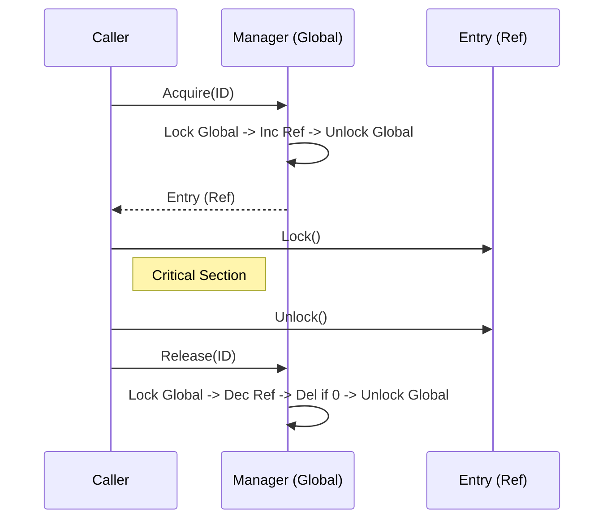
```mermaid
sequenceDiagram
    participant Caller
    participant Manager (Global)
    participant Entry (Ref)

    Caller->>Manager (Global): Acquire(ID)
    Manager (Global)->>Manager (Global): Lock Global -> Inc Ref -> Unlock Global
    Manager (Global)-->>Caller: Entry (Ref)

    Caller->>Entry (Ref): Lock()
    Note right of Caller: Critical Section
    Caller->>Entry (Ref): Unlock()

    Caller->>Manager (Global): Release(ID)
    Manager (Global)->>Manager (Global): Lock Global -> Dec Ref -> Del if 0 -> Unlock Global
```

#### 2.3. Diagrama de Arquitetura

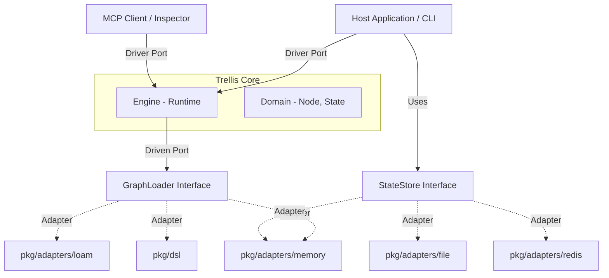
```mermaid
graph TD
    Host[Host Application / CLI] -->|Driver Port| Engine
    MCP[MCP Client / Inspector] -->|Driver Port| Engine
    subgraph "Trellis Core"
        Engine[Engine - Runtime]
        Domain[Domain - Node, State]
    end
    Engine -->|Driven Port| Loader[GraphLoader Interface]
    Loader -.->|Adapter| Loam[pkg/adapters/loam]
    Loader -.->|Adapter| Memory[pkg/adapters/memory]
    Loader -.->|Adapter| GoDSL[pkg/dsl]
    
    Host -->|Uses| Store[StateStore Interface]
    Store -.->|Adapter| File[pkg/adapters/file]
    Store -.->|Adapter| Redis[pkg/adapters/redis]
    Store -.->|Adapter| Memory[pkg/adapters/memory]
```

### 3. Estrutura de Diretórios

```text
trellis/
├── cmd/
│   └── trellis/       # Entrypoint (CLI)
├── internal/          # Detalhes de implementação (Privado)
│   ├── presentation/  # TUI & Renderização
│   ├── runtime/       # Engine de execução
│   └── validator/     # Lógica de validação
├── pkg/               # Contratos Públicos (Safe to import)
│   ├── adapters/      # Adaptadores (File, Redis, Loam, HTTP, MCP)
│   ├── domain/        # Core Domain (Node, State)
│   ├── ports/         # Interfaces (Driver & Driven)
│   ├── registry/      # Registro de Ferramentas
│   ├── runner/        # Loop de Execução e Handlers
│   └── session/       # Gerenciamento de Sessão e Locking
└── go.mod
```

### 4. Princípios de Design (Constraints)

O sistema impõe restrições explícitas para prevenir a "Complexidade Oculta":

#### 4.1. Logic-Data Decoupling

A lógica complexa **nunca** deve residir no grafo (Markdown).

* **Errado**: `condition: user.age > 18 && user.status == 'active'` (Exige parser complexo).
* **Correto**: `condition: is_adult_active` (O Host resolve e retorna bool).

> Veja [Interactive Inputs](../docs/guides/interactive_inputs.md) para detalhes sobre como o Host gerencia inputs.

#### 4.2. Strict Mode Compiler

O compilador deve ser implacável.

* Variáveis não declaradas resultam em erro de compilação.
* O objetivo é **Confiança Total**: Se compilou, não existem "Dead Ends" lógicos causados por typos.

#### 4.3. Convenção de Ponto de Entrada (Entry Point)

O Trellis segue a filosofia **Convention over Configuration** para o início do fluxo.

* **ID Obrigatório**: O fluxo SEMPRE começa no nó com ID `start`.
* **Resolução de Arquivo**: Por padrão, o `loam.Loader` busca por um arquivo chamado `start.md` (ou `start.json`) na raiz do diretório.
* **Sub-Grafos**: Ao pular para um sub-módulo (`jump_to: modules/auth`), o engine busca por `modules/auth/start.md`.

> **Nota**: Embora seja possível injetar um `State` inicial diferente via código (`engine.Navigate(ctx, customState, input)`), a CLI e os Runners padrão assumem `start` como entrypoint.

#### 4.4. Hot Reload Lifecycle (v0.6)

Com a introdução do `StateStore`, o ciclo de Hot Reload tornou-se "Stateful". Ao detectar uma mudança, o Engine é recarregado, mas o Runner tenta reidratar o estado anterior.

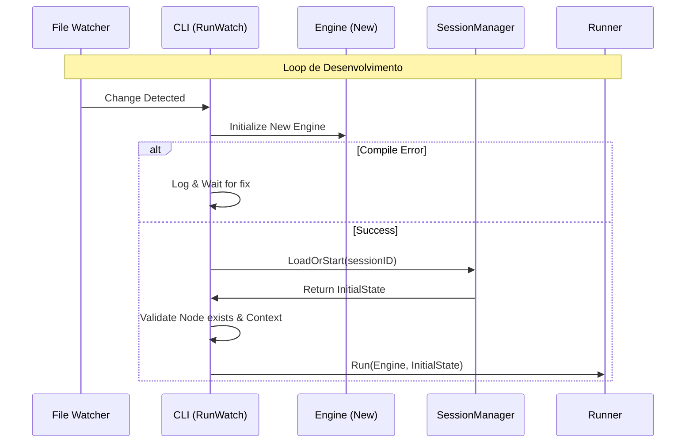
```mermaid
sequenceDiagram
    participant W as File Watcher
    participant C as CLI (RunWatch)
    participant E as Engine (New)
    participant S as SessionManager
    participant R as Runner

    Note over W, R: Loop de Desenvolvimento
    W->>C: Change Detected
    C->>E: Initialize New Engine
    alt Compile Error
        C->>C: Log & Wait for fix
    else Success
        C->>S: LoadOrStart(sessionID)
        S->>C: Return InitialState
        C->>C: Validate Node exists & Context
        C->>R: Run(Engine, InitialState)
    end
```

**Estratégias de Recuperação (Guardrails)**:

* **Missing Node**: Fallback para `start` se o nó atual for removido.
* **Validation Failure**: Pausa se novos `required_context` surgirem sem dados na sessão.
* **Type Mismatch**: Reseta o status de `WaitingForTool` se o nó mudar de tipo.

### 5. Arquitetura de Sessão (Trade-offs & Limites)

Esta seção mapeia os trade-offs arquiteturais assumidos na versão 0.6 para garantir leveza e robustez.

#### 5.1. Concorrência de Sessão (RefCounting)

Para resolver vazamentos de memória sem um Garbage Collector pesado, o pacote `pkg/session` utiliza **Reference Counting**:

* **Risco**: Depende estritamente do pareamento `Acquire/Release`. Um erro do desenvolvedor (panic fantasma ou defer ausente) pode criar um vazamento permanente para aquele ID.
* **Gargalo**: O `Manager` usa um **Global Mutex** (`mu`) para proteger o mapa de locks. Em concorrência extrema (>100k Lock/Unlock ops/sec), este lock global torna-se um ponto de contenção.
* **Decisão**: Adequado para casos de uso CLI/Agent. Para SaaS de alta escala, o `Manager` suportaria sharding (`ShardCount`).

#### 5.2. Redis Lazy Indexing (Entradas Zumbis)

O Adaptador Redis evita workers em background ("Serverless-friendliness"):

* **Mecanismo**: O método `List()` limpa entradas expiradas do Índice ZSET.
* **Implicação**: Se `List()` for chamado raramente, o índice ZSET pode conter "Entradas Zumbis" (IDs cujas chaves reais já expiraram) até a próxima listagem.
* **Custo**: `List()` incorre uma penalidade de escrita (`ZREMRANGEBYSCORE`).

#### 5.3. file.Store Pruning (Manutenção Manual)

* **Restrição**: O armazenamento local (`file.Store`) nunca deleta sessões `.json` antigas automaticamente.
* **Mitigação**: Confia na higiene manual (`trellis session rm`) ou jobs externos (cron). Nenhuma lógica de auto-pruning existe dentro do binário para mantê-lo simples.

### 6. Estratégia de Testes

Para garantir a estabilidade do Core enquanto o projeto evolui, definimos uma pirâmide de testes rígida:

#### 6.1. Níveis de Teste

1. **Core/Logic (Unit)**:
    * **Alvo**: `internal/runtime` (Engine), `internal/validator`, `pkg/session` (Concurrency), `pkg/runner` (Execution Loop).
    * **Estilo**: Table-Driven Tests extensivos e testes de concorrência.
    * **Objetivo**: Garantir que a lógica de estado, validação e orquestração funcione isoladamente.

2. **Adapters (Contract Tests)**:
    * **Alvo**: `pkg/adapters/*` (Abrangendo Loaders, Stores e Protocols).
    * **Exemplos**: `loam` vs `memory` (Graph), `file` vs `redis` (State Store).
    * **Estilo**: Interface Compliance Tests (Contract Tests).
    * **Objetivo**: Garantir que diferentes implementações das portas (`GraphLoader`, `StateStore`) respeitem o mesmo contrato comportamental.

3. **Integration (E2E/Certification)**:
    * **Alvo**: `tests/` (exercita `cmd/trellis` externamente).
    * **Estilo**: Blackbox Testing & Certification Suite.
    * **Objetivo**: Simula um usuário real interagindo com o sistema completo, validando o fluxo ponta-a-ponta (`cmd` -> `runner` -> `engine` -> `fs`). O arquivo `tests/certification_test.go` é a fonte da verdade para a conformidade do engine.

---

## II. Mecânica do Core (Engine & IO)

Esta seção detalha o funcionamento interno do engine, ciclo de vida e tratamento de dados.

### 7. Ciclo de Vida do Engine (Lifecycle)

O Engine segue um ciclo de vida estrito de **Resolve-Execute-Update** para garantir previsibilidade.

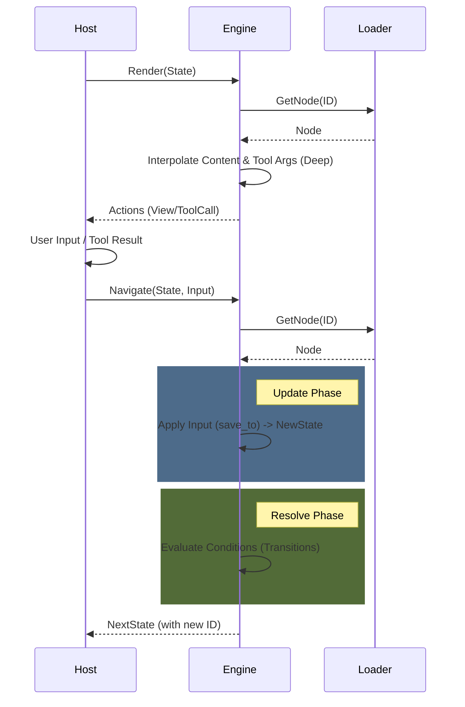
```mermaid
sequenceDiagram
    participant Host
    participant Engine
    participant Loader

    Host->>Engine: Render(State)
    Engine->>Loader: GetNode(ID)
    Loader-->>Engine: Node
    Engine->>Engine: Interpolate Content & Tool Args (Deep)
    Engine-->>Host: Actions (View/ToolCall)
    
    Host->>Host: User Input / Tool Result
    
    Host->>Engine: Navigate(State, Input)
    Engine->>Loader: GetNode(ID)
    Loader-->>Engine: Node
    
    rect rgba(77, 107, 138, 1)
        note right of Engine: Update Phase
        Engine->>Engine: Apply Input (save_to) -> NewState
    end
    
    rect rgba(82, 107, 56, 1)
        note right of Engine: Resolve Phase
        Engine->>Engine: Evaluate Conditions (Transitions)
    end
    
    Engine-->>Host: NextState (with new ID)
```

**Fases do Ciclo:**

1. **Render (View)**: Carrega o nó, aplica interpolação profunda (incluindo argumentos de ferramentas) e retorna as ações. O estado *não* muda.
2. **Navigate (Update)**:
    * **Update**: Aplica o input ao contexto da sessão (se `save_to` estiver definido).
    * **Resolve**: Avalia as condições de transição baseadas no novo contexto.
    * **Transition**: Retorna o novo estado apontando para o próximo nó.

### 7.1. Universal Action Semantics ("Duck Typing") - v0.7

Na versão 0.7, o Engine adotou a semântica de "Actions Universais", removendo a necessidade estrita de definir `type: tool`. O comportamento do nó é inferido por suas propriedades:

* **Action Node**: Se possui `do`, executa uma ferramenta.
* **Input Node**: Se possui `wait` ou `input_type`, aguarda input do usuário.
* **Content Node**: Se possui `content` (ou corpo Markdown), renderiza texto.

> **Futuro (DSL)**: Para ver como o Trellis evoluirá para suportar "Macro Nodes" (`type: flow`) e sintaxe mais compacta via um Compilador de Grafo, consulte [docs/architecture/dsl_compiler.md](../architecture/dsl_compiler.md).

**Padrões e Restrições:**

1. **Text + Action (The "Zero Fatigue" Pattern)**:
   * Um nó pode ter texto E ação. O Engine renderiza o texto e imediatamente dispara a ferramenta.
   * *Exemplo*: "Carregando..." (`text`) + `init_db` (`do`).

2. **Mutual Exclusion (Action vs Input)**:
   * **Constraint**: Um nó **Não Pode** ter `do` E `wait`.
   * *Motivo*: O Engine não pode estar em dois estados (`WaitingForTool` e `WaitingForInput`) simultaneamente.

### 7.2. Hot Reload Lifecycle (v0.6)

No modo `watch`, o Runner orquestra o recarregamento do motor e a reidratação do estado usando um `SignalContext` hierárquico.

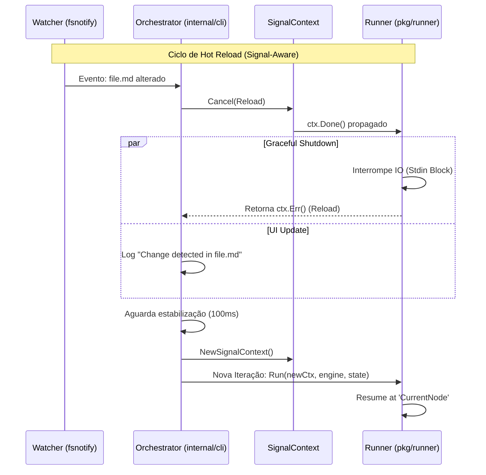
```mermaid
sequenceDiagram
    participant W as Watcher (fsnotify)
    participant O as Orchestrator (internal/cli)
    participant S as SignalContext
    participant R as Runner (pkg/runner)

    Note over W, R: Ciclo de Hot Reload (Signal-Aware)
    W->>O: Evento: file.md alterado
    O->>S: Cancel(Reload)
    S->>R: ctx.Done() propagado
    
    par Graceful Shutdown
        R->>R: Interrompe IO (Stdin Block)
        R-->>O: Retorna ctx.Err() (Reload)
    and UI Update
        O->>O: Log "Change detected in file.md"
    end
    
    O->>O: Aguarda estabilização (100ms)
    O->>S: NewSignalContext()
    O->>R: Nova Iteração: Run(newCtx, engine, state)
    R->>R: Resume at 'CurrentNode'
```

**Estratégias de Recuperação (Guardrails):**

1. **Node Tipo 'tool' → 'text'**: Se o estado salvo era `WaitingForTool`, mas o nó foi alterado para `text` (ou deletado), o motor reseta o status para `Active` para evitar travamentos.
2. **Erro de Sintaxe**: Se o arquivo alterado contiver erro de sintaxe, o Runner aguarda a próxima correção sem derrubar o processo e registra o erro via `logger.Error`.
3. **Session Scoping**: No modo `watch`, se nenhum ID de sessão for fornecido, um ID determinístico baseado no hash do caminho do repositório (`watch-<hash>`) é gerado para evitar colisões entre projetos.

### 8. Protocolo de Efeitos Colaterais (Side-Effect Protocol)

O protocolo de side-effects permite que o Trellis solicite a execução de código externo (ferramentas) de forma determinística e segura.

#### 8.1. Filosofia: "Syscalls" para a IA

O Trellis trata chamadas de ferramenta como "Chamadas de Sistema" (Syscalls). O Engine não executa a ferramenta; ele **pausa** e solicita ao Host que a execute.

1. **Intenção (Intent)**: O Engine renderiza um nó do tipo `tool` e emite uma ação `CALL_TOOL`.
2. **Suspensão (Yield)**: O Engine entra em estado `WaitingForTool`, aguardando o resultado.
3. **Dispatch**: O Host (CLI, Servidor HTTP, MCP) recebe a solicitação e executa a lógica (ex: chamar API, rodar script).
4. **Resumo (Resume)**: O Host chama `Navigate` passando o `ToolResult`. O Engine retoma a execução verificando transições baseadas nesse resultado.

#### 8.2. Ciclo de Vida da Chamada de Ferramenta

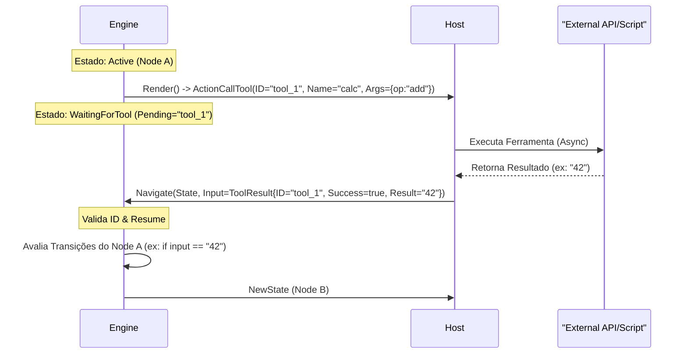
```mermaid
sequenceDiagram
    participant Engine
    participant Host
    participant External as "External API/Script"

    Note over Engine: Estado: Active (Node A)
    Engine->>Host: Render() -> ActionCallTool(ID="tool_1", Name="calc", Args={op:"add"})
    
    Note over Engine: Estado: WaitingForTool (Pending="tool_1")
    
    Host->>External: Executa Ferramenta (Async)
    External-->>Host: Retorna Resultado (ex: "42")
    
    Host->>Engine: Navigate(State, Input=ToolResult{ID="tool_1", Success=true, Result="42"})
    
    Note over Engine: Valida ID & Resume
    Engine->>Engine: Avalia Transições do Node A (ex: if input == "42")
    Engine->>Host: NewState (Node B)
```

#### 8.3. Universal Dispatcher

Graças a este desacoplamento, a mesma definição de grafo pode usar ferramentas implementadas de formas diferentes dependendo do adaptador:

* **CLI Runner**: Executa scripts locais (`.sh`, `.py`) ou funções Go embutidas.
* **Process Adapter (v0.7)**: Executor seguro para scripts e binários definidos em `tools.yaml` ou inline (`x-exec`).
  * *Contract*: Input via `TRELLIS_ARG_*` (Env Vars), Output via Stdout.
  * *JSON Auto-Detection*: O runner detecta automaticamente se o Stdout é um JSON válido (inicia com `{` ou `[` e termina com `}` ou `]`) e o converte para objeto estruturado.
  * *Caveat*: Se o JSON for inválido, ele faz fallback silencioso para string crua.
  * *Security*: Argumentos nunca são passados como flags de CLI para evitar injeção.
* **MCP Server**: Repassa a chamada para um cliente MCP (ex: Claude Desktop, IDE).
* **HTTP Server**: Webhooks que notificam serviços externos (ex: n8n, Zapier).

#### 8.4. Defining Tools in Loam

You can define available tools directly in the Node's frontmatter. This allows the Engine to be aware of the tool's schema (name, description, parameters) without needing hardcoded Go structs.

```yaml
type: text
tools:
  - name: get_weather
    description: Get current temperature
    parameters:
      type: object
      properties:
        city: { type: string }
---
The weather is...
```

#### 8.5. Reusable Tool Libraries (Polymorphic Design)

To support modularity, the `tools` key in Frontmatter is polymorphic. It accepts both inline definitions and string references to other files.

```yaml
tools:
  - name: local_tool         # Inline Definition
    description: ...
  - "modules/tools/math.md"  # Reference (Mixin)
```

##### Resolution Strategy

The `loam.Loader` implements a recursive resolution strategy with **Shadowing** (Last-Write-Wins).

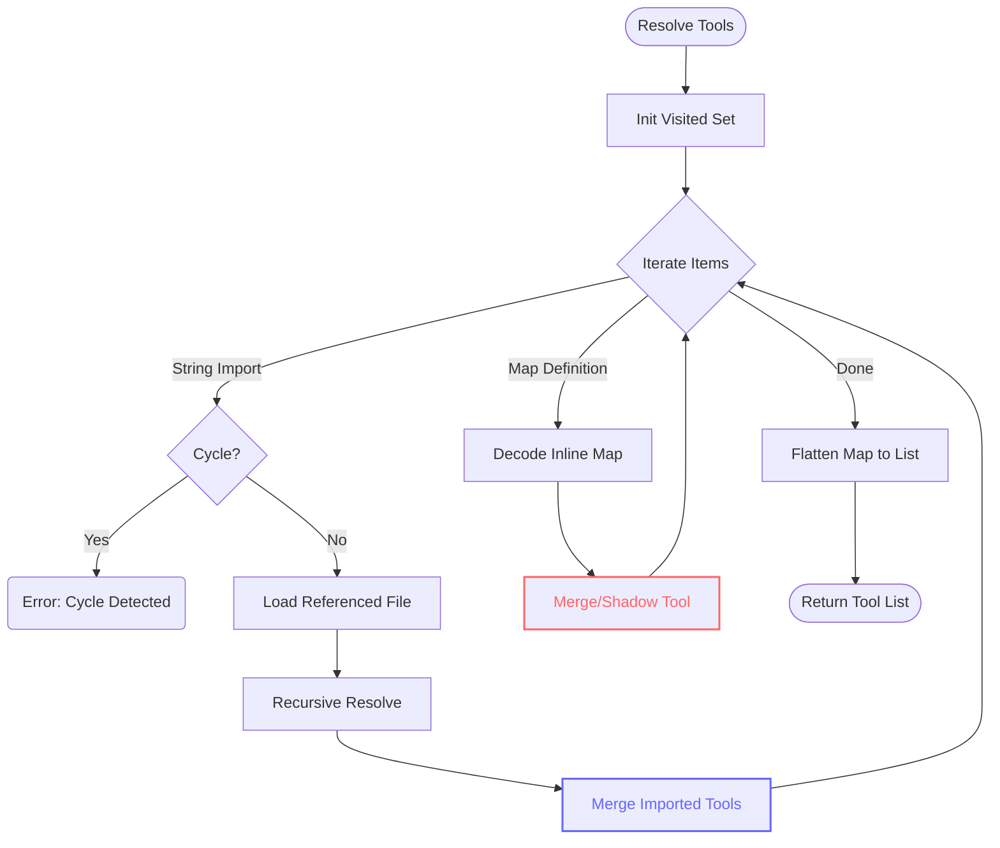
```mermaid
flowchart TD
    Start([Resolve Tools]) --> Init[Init Visited Set]
    Init --> Iterate{Iterate Items}
    
    Iterate -->|String Import| CheckCycle{Cycle?}
    CheckCycle -- Yes --> Error(Error: Cycle Detected)
    CheckCycle -- No --> Load[Load Referenced File]
    Load --> Recurse[Recursive Resolve]
    Recurse --> MergeImport[Merge Imported Tools]
    MergeImport --> Iterate
    
    Iterate -->|Map Definition| Decode[Decode Inline Map]
    Decode --> MergeInline[Merge/Shadow Tool]
    MergeInline --> Iterate
    
    Iterate -- Done --> Flatten[Flatten Map to List]
    Flatten --> End([Return Tool List])
    
    style MergeInline stroke:#f66,stroke-width:2px,color:#f66
    style MergeImport stroke:#66f,stroke-width:2px,color:#66f
```

**Technical Constraints:**

1. **Polymorphism (`[]any`)**: The Loader accepts generic types to support this UX. This requires **manual schema validation** at runtime.
2. **Cycle Detection**: Recursive imports are guarded against infinite loops (`visited` set).
3. **Shadowing Policy**: Local definitions always override imported ones.

### 8.6. Idempotência e Deduplicação (v0.7)

O Trellis garante a execução **at-most-once** para Efeitos Colaterais (Tool Calls) usando chaves determinísticas.

**O Contrato:**

1. **Determinismo**: Reexecutar o mesmo Estado + Nó produz exatamente a mesma `IdempotencyKey`.
2. **Escopo**: A unicidade é garantida por `SessionID + NodeID + StepIndex + ToolName`.

**Diagrama de Sequência:**

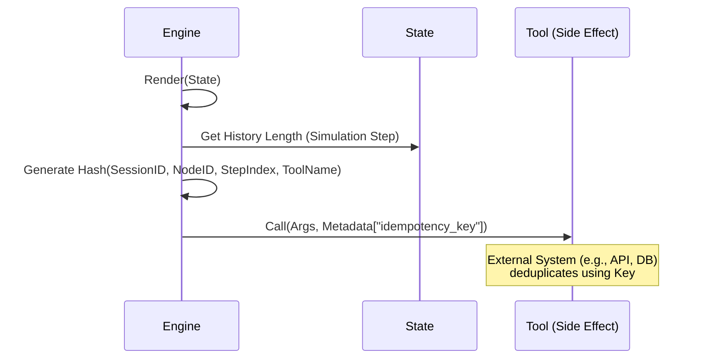
```mermaid
sequenceDiagram
    participant E as Engine
    participant S as State
    participant T as Tool (Side Effect)
    
    E->>E: Render(State)
    E->>S: Get History Length (Simulation Step)
    E->>E: Generate Hash(SessionID, NodeID, StepIndex, ToolName)
    E->>T: Call(Args, Metadata["idempotency_key"])
    Note over T: External System (e.g., API, DB)<br/>deduplicates using Key
```

### 8.7. Orquestração SAGA Nativa (v0.7)

O Trellis suporta o **Padrão SAGA** nativamente, permitindo transações distribuídas confiáveis sem um coordenador de banco de dados central.

#### 8.7.1. Conceito: Simetria Do/Undo

Toda "Ação" (Efeito Colateral) pode ter uma "Reversão" (Transação Compensatória) correspondente definida diretamente no nó.

```go
type Node struct {
    Do   *ToolCall // A Ação Primária (ex: Cobrar Cartão)
    Undo *ToolCall // A Ação Compensatória (ex: Estornar Cartão)
}
```

Isso garante **Localidade de Comportamento**: o código que reverte uma ação reside ao lado da própria ação.

#### 8.7.2. Ciclo de Vida do Rollback

Quando uma ferramenta falha com `on_error: rollback`, **OU** quando um nó transita explicitamente para `to: rollback`, o Engine entra em **Modo Rollback**:

1. **Unwind (Desempilhar)**: O Engine desempilha o histórico um a um.
2. **Compensate (Compensar)**: Se um nó desempilhado tiver uma definição `undo`, o Engine a executa.
3. **Continue**: O rollback continua até que o histórico esteja vazio ou um savepoint seja alcançado (Start).

> **Garantia de Ciclo de Vida**: O Engine garante que `OnNodeLeave` seja emitido para o nó que iniciou o rollback (seja por erro ou transição) *antes* que a sequência de rollback comece, assegurando observabilidade consistente.

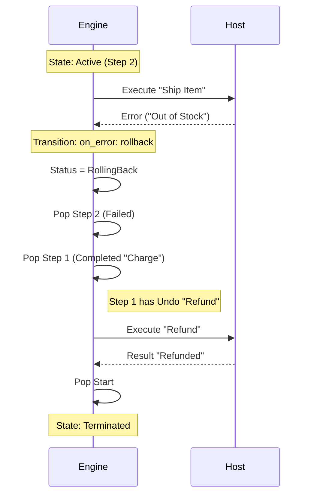
```mermaid
sequenceDiagram
    participant Engine
    participant Host
    
    Note over Engine: State: Active (Step 2)
    Engine->>Host: Execute "Ship Item"
    Host-->>Engine: Error ("Out of Stock")
    
    Note over Engine: Transition: on_error: rollback
    Engine->>Engine: Status = RollingBack
    Engine->>Engine: Pop Step 2 (Failed)
    Engine->>Engine: Pop Step 1 (Completed "Charge")
    
    Note right of Engine: Step 1 has Undo "Refund"
    Engine->>Host: Execute "Refund"
    Host-->>Engine: Result "Refunded"
    
    Engine->>Engine: Pop Start
    Note over Engine: State: Terminated
```

### 8.8. Estratégias Async & Long-Running (v0.7+)

O Trellis suporta nativamente a orquestração de processos assíncronos sem violar seu modelo determinístico, delegando a gestão temporal ao Host/Runner.

1. **Fire-and-Forget (Non-Blocking)**:
    * **Cenário**: Disparar um webhook ou log sem esperar resposta.
    * **Implementação**: O Runner despacha a goroutine e retorna imediatamente `Success: true` para o Engine. O Engine não bloqueia.

2. **Async/Await (The Callback Pattern)**:
    * **Cenário**: "Human-in-the-Loop" ou "Deploy de 30 min".
    * **Protocolo**: Ferramenta retorna status `PENDING`. O Engine entra em estado `WaitingForCallback` (novo estado proposto) ou permanece em `WaitingForTool` com flag de persistência.
    * **Ciclo**: Sessão é hibernada. Host externo acorda a sessão via `Navigate(ToolResult)` quando o evento ocorre.

3. **Process Supervisor (Daemon Strategy)**:
    * **Conceito**: O Trellis pode atuar como "Kernel" monitorando processos satélites (`sidecars`).
    * **Mecanismo**: Um `ProcessAdapter` avançado mantém subprocessos vivos e converte `sys.exit` ou `stdout` em eventos (`signals`) que transicionam o grafo (ex: `on_signal: process_crash -> restart`).

### 8.9. Estratégia de Achatamento de Metadata (Loader Adapter)

Para suportar UX rica em YAML (objetos aninhados) mantendo o Domínio Core simples (`map[string]string`), o `loam.Loader` implementa uma **Estratégia de Achatamento (Flattening)**.

**Problema**: O `domain.ToolCall.Metadata` do Core é estritamente um `map[string]string` para garantir protocolos de serialização planos (HTTP Headers, JSON simples). No entanto, usuários querem definir configurações complexas como `x-exec` naturalmente no YAML.

**Solução**: O Adaptador aceita `map[string]any` e o achata recursivamente usando notação de ponto (ou traço para prefixos específicos) antes de criar o Nó de Domínio.

**Exemplo**:

*YAML Input:*

```yaml
metadata:
  x-exec:
    command: python
    args: ["main.py"]
```

*Domain Representation:*

```go
Metadata: {
  "x-exec-command": "python",
  "x-exec-args": "main.py"
}
```

### 9. Arquitetura do Runner & IO

O `Runner` serve como a ponte entre o Engine Core e o mundo externo. Ele gerencia o loop de execução, lida com middleware e delega IO para um `IOHandler`.

A partir da **v0.7.5**, o `Runner` foi refatorado para implementar a interface `lifecycle.Worker` (`Run(context.Context) error`), tornando-o compatível com supervisores e gerenciadores de processos da biblioteca `lifecycle`. O Runner agora é **stateful** (encapsula `Engine` e `State` inicial) e **single-use**.

#### 9.1. Ciclo da Sessão

> **Nota**: O Runner é instanciado com todas as suas dependências (Engine, Initial State) e executa até a conclusão ou erro. Ele não deve ser reutilizado.

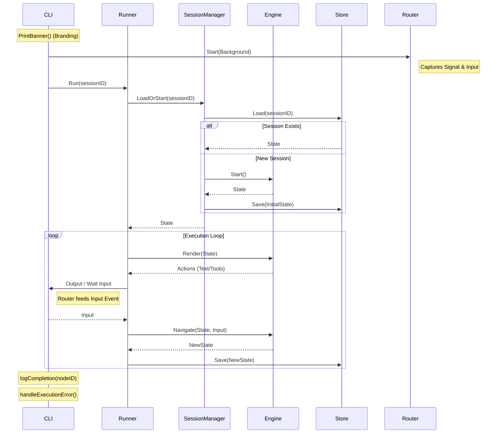
```mermaid
sequenceDiagram
    participant CLI
    participant Runner
    participant SessionManager
    participant Engine
    participant Store

    Note over CLI: PrintBanner() (Branding)
    
    CLI->>Router: Start(Background)
    Note right of Router: Captures Signal & Input
    
    CLI->>Runner: Run(sessionID)
    Runner->>SessionManager: LoadOrStart(sessionID)
    SessionManager->>Store: Load(sessionID)
    alt Session Exists
        Store-->>SessionManager: State
    else New Session
        SessionManager->>Engine: Start()
        Engine-->>SessionManager: State
        SessionManager->>Store: Save(InitialState)
    end
    SessionManager-->>Runner: State

    loop Execution Loop
        Runner->>Engine: Render(State)
        Engine-->>Runner: Actions (Text/Tools)
        Runner->>CLI: Output / Wait Input
        Note right of CLI: Router feeds Input Event
        CLI-->>Runner: Input
        Runner->>Engine: Navigate(State, Input)
        Engine-->>Runner: NewState
        Runner->>Store: Save(NewState)
    end

    Note over CLI: logCompletion(nodeID)
    Note over CLI: handleExecutionError()
```

#### 9.2. Stateless & Async IO

O Trellis suporta dois modos primários de operação:

1. **Text Mode** (`TextHandler`): Para uso interativo TUI/CLI. Bloqueia no input do usuário através de um canal (`inputChan`). Suporta a opção `WithStdin()` para leitura direta de `os.Stdin` em aplicações autônomas.
2. **JSON Mode** (`JSONHandler`): Para automação headless e integração de API.

**Restrição Chave para Modo JSON:**

* **Strict JSON Lines (JSONL)**: Todos os inputs para o `JSONHandler` devem ser strings JSON de linha única.
* **Async/Non-Blocking**: O handler lê de Stdin em uma goroutine em background, permitindo cancelamento (timeout/interrupt).
* **Mapeamento de Sinais (Context-Aware)**: O Runner monitora:
  * `signals.Context().Done()`: Sinal de Usuário Explícito (SIGINT). Mapeia para `"interrupt"`.
  * `ctx.Done()` (Parent): Orquestrador Externo (Watch Reload). Tratado como Saída Limpa (sem mapeamento de sinal).
  * `inputCtx.Done()` (Deadline): Mapeia para `"timeout"`.

#### 9.3. Semântica de Texto e Bloqueio

O comportamento de nós de texto segue a semântica de State Machine pura:

1. **Nodes de Texto (`type: text`)**: São, por padrão, **Non-Blocking (Pass-through)** para o Engine.
    * Se houver uma transição válida incondicional, transita *imediatamente*.
    * **Nota de UX**: A transição é imediata (Pass-through) em todos os modos. Se você deseja que o usuário leia o texto antes de continuar (pressione Enter), deve definir explicitamente `wait: true`.
2. **Pausas Explícitas**:
    * `wait: true`: Força pausa para input (ex: "Pressione Enter") em *ambos* os modos.
    * `type: question`: Pausa explícita aguardando resposta (hard step).

#### 9.4. Diagrama de Decisão (Input Logic)

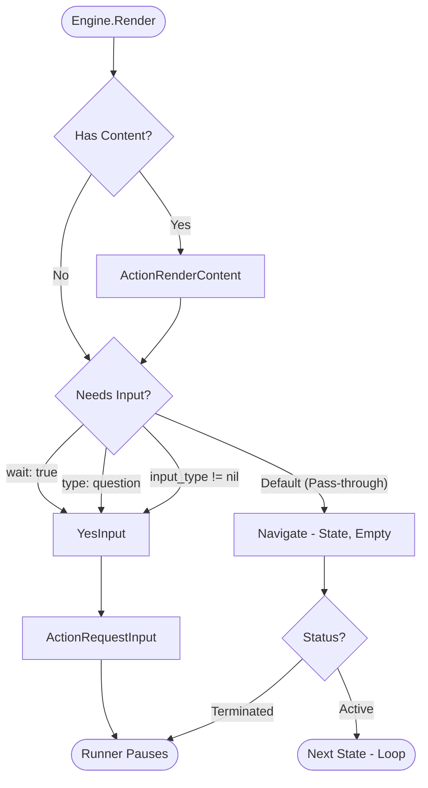
```mermaid
flowchart TD
    Start([Engine.Render]) --> Content{Has Content?}
    Content -- Yes --> EmitRender[ActionRenderContent]
    Content -- No --> CheckInput
    EmitRender --> CheckInput

    CheckInput{Needs Input?}
    CheckInput -->|wait: true| YesInput
    CheckInput -->|type: question| YesInput
    CheckInput -->|input_type != nil| YesInput
    CheckInput -->|"Default (Pass-through)"| AutoNav[Navigate - State, Empty]

    YesInput --> EmitRequest[ActionRequestInput]
    EmitRequest --> Stop([Runner Pauses])

    AutoNav --> Result{Status?}
    Result -- Terminated --> Stop
    Result -- Active --> Next([Next State - Loop])
```

#### 9.5. Padrão: Stdin Pump (IO Safety)

O tratamento de input em Go, especialmente com `os.Stdin`, é bloqueante por natureza. O pacote `lifecycle`, através do `InputSource`, abstrai o padrão **Stdin Pump**, garantindo que leituras sejam não-bloqueantes e canceláveis via Contexto, evitando "leitores fantasmas". O `TextHandler` do Trellis agora atua apenas como consumidor desses eventos pré-processados.

* **Produtor Único**: Uma goroutine persistente (`pump`) lê do Reader subjacente eternamente.
* **Canal Bufferizado**: Resultados (`string` ou `error`) são enviados para `events.Router`.
* **Consumo via Router**: O `NewInteractiveRouter` despacha esses eventos para os handlers registrados.

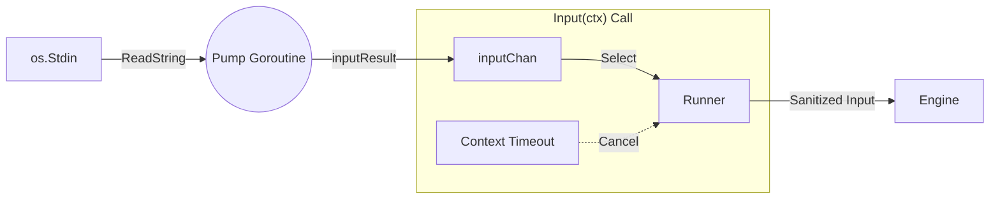
```mermaid
flowchart LR
    Stdin[os.Stdin] -->|ReadString| Pump((Pump Goroutine))
    Pump -->|inputResult| Chan[inputChan]
    
    subgraph "Input(ctx) Call"
        Chan -->|Select| Consumer[Runner]
        Timer[Context Timeout] -.->|Cancel| Consumer
    end
    
    Consumer -->|Sanitized Input| Engine
```

> **Stewardship Note**: This pattern prevents multiple goroutines from fighting over `bufio.Reader`. The `Runner` automatically memoizes the handler instance to ensure that reusing a `Runner` instance also reuses the single Pump goroutine.

#### 9.5.1. Estratégia Windows Console (CONIN$)

No Windows, o comportamento padrão do `os.Stdin` difere significativamente do Unix. Pressionar `Ctrl+C` frequentemente fecha o stream `Stdin` imediatamente (enviando `io.EOF`) antes que o handler de sinal do SO possa interceptar a interrupção. Isso leva a uma condição de corrida onde a aplicação trata a interrupção como um simples End-Of-File ou "User Quit" em vez de um sinal.

**A Solução:**
Para mitigar isso, a biblioteca `lifecycle` (`pkg/termio`) detecta se está rodando em um Terminal Windows e, se sim, abre `CONIN$` diretamente. Isso é feito transparentemente pelo `NewInteractiveRouter`, garantindo robustez de sinais e input em todas as plataformas.

#### 9.6. Architectural Insight: Engine-bound vs Runner-bound

Para manter a arquitetura limpa, diferenciamos onde cada responsabilidade reside:

1. **Engine-bound (Passive/Logic)**:
    * *Exemplos*: `LifecycleHooks` (`OnNodeEnter`, `OnTransition`).
    * *Natureza*: O Engine apenas **emite** eventos sobre o que calculou. Ele não sabe quem está ouvindo e não espera resposta.
    * *Propósito*: Observabilidade pura.

2. **Runner-bound (Active/Control)**:
    * *Exemplos*: `StateStore` (Persistência), `ToolInterceptor` (Segurança), `SignalManager` (Interrupção).
    * *Natureza*: O Runner **orquestra** e decide se o fluxo deve continuar, pausar ou falhar.
    * *Propósito*: Controle do Ciclo de Vida e Integração com o Mundo Real (IO).

Essa separação garante que o Core permaneça uma Máquina de Estados Pura e Determinística, enquanto o Runner assume a responsabilidade pela "sujeira" (Timeouts, Discos, Sinais de SO).

#### 9.7. Estratégia de Persistência (Scope)

* **Workspace-first**: As sessões são armazenadas em `.trellis/sessions/` no diretório de trabalho atual.
* **Motivação**: Isolar sessões por projeto (como `.git` ou `.terraform`), facilitando o desenvolvimento e evitando colisões globais em ambientes multi-projeto.
* **Formato**: Arquivos JSON simples para facilitar inspeção e debugging manual ("Loam-ish").

#### 9.8. Session Management CLI (Chaos Control)

Para gerenciar o ciclo de vida dessas sessões persistentes, o Trellis expõe comandos administrativos ("Chaos Control"):

* **List (`ls`)**: Enumera sessões ativas no workspace.
* **Inspect**: Visualiza o Estado JSON puro (Current Node, Context, History) para debugging.
* **Remove (`rm`)**: Permite "matar" sessões travadas ou limpar o ambiente.

Essa camada é crucial para operações de longa duração, onde "desligar e ligar de novo" (resetar o processo) não é suficiente para limpar o estado.

> **Maintenance Note**: O file.Store não implementa *Auto-Pruning* (limpeza automática) de sessões antigas. Cabe ao administrador ou desenvolvedor executar `trellis session rm` periodicamente ou configurar scripts externos de limpeza (cron) se o diretório de sessões crescer excessivamente.

#### 9.9. Semântica do File Store (Passagem de Bastão)

Embora o File Store permita durabilidade, ele impõe restrições arquiteturais específicas:

* **Armazenamento Passivo**: O file storage é passivo. Ele não empurra atualizações para processos em execução.
* **Modelo Baton Passing**:
  * Se o **Processo A** está rodando e aguardando input, e o **Processo B** atualiza o arquivo de estado (ex: via Sinal), o **Processo A não acordará automaticamente**.
  * O Processo A é efetivamente um "Zumbi" em relação ao novo estado até que seja reiniciado ou faça polling explícito (polling não implementado na v0.6).
  * Este modelo suporta **"Stop-and-Resume"** (Passagem de Bastão), mas não **"Controle Remoto"** em tempo real.

#### 10. Fluxo de Dados e Serialização

#### 10.1. Data Binding (SaveTo)

O Trellis adota a propriedade `save_to` para indicar a *intenção* de persistir a resposta de um nó no contexto da sessão.

```yaml
type: question
text: "Qual é o seu nome?"
save_to: "user_name" # Salva input em context["user_name"]
```

**Regras de Execução:**

1. **Precedência**: O valor é salvo no contexto *antes* de avaliar as transições.
2. **Imutabilidade**: O Engine realiza **Deep Copy** do Contexto a cada transição.
3. **Tipagem Preservada**: `save_to` armazena o input como recebido (`any`).

#### 9.2. Variable Interpolation

O Trellis adota uma arquitetura plugável para interpolação de variáveis via interface `Interpolator`.

* **Default Strategy**: Go Templates (`{{ .UserName }}`).
* **Legacy Strategy**: `strings.ReplaceAll` (`{{ Key }}`).

#### 10.3. Global Strict Serialization

O Trellis força **Strict Mode** em todos os adaptadores para resolver o problema do `float64` em JSON. Números são decodificados como `json.Number` ou `int64` para garantir integridade de IDs e timestamps.

#### 10.4. Data Contracts (Validation & Defaults)

**Serialização Padrão (Snake Case):**

Para garantir interoperabilidade, o Engine serializa seu estado para JSON usando chaves em `snake_case` (ex: `current_node_id`, `pending_tool_call`), independentemente da nomeação interna das structs em Go. Isso permite integração mais limpa com ferramentas externas e inspeção manual de sessão.

**Fail Fast (Required Context):**

Nós servem como fronteiras de dados e podem impor contratos de execução:

```yaml
required_context:
  - user_id
  - api_key
```

Se uma chave estiver faltando, o Engine aborta a execução com `ContextValidationError`.

**Fail Fast (Typed Context):**

Para garantir tipagem de dados, um nó pode declarar `context_schema`:

```yaml
context_schema:
    api_key: string
    retries: int
    tags: [string]
```

O Engine valida tipos antes de renderizar o nó e aborta a execução com `ContextTypeValidationError`
se houver tipos inválidos ou campos ausentes.

**Valores Padrão (Mocking):**

Nós (convencionalmente `start`) podem definir valores de fallback para simplificar o desenvolvimento local:

```yaml
default_context:
  api_url: "http://localhost:8080"
```

#### 10.5. Initial Context Injection (Seed State)

Para facilitar testes automatizados e integração, o Trellis permite injetar o estado inicial.

* **API**: `Engine.Start(ctx, initialData map[string]any)`
* **CLI**: Flag `--context '{"user": "Alice"}'`
* **Configuração**: Use `trellis.WithEntryNode("custom_start")` para sobrescrever o ponto de entrada padrão ("start").
* **Precedência**: `initialData` (Runtime) > `default_context` (File).
* **Uso**: Dados injetados estão disponíveis imediatamente para interpolação (`{{.user}}`) no nó de entrada.

---

## III. Funcionalidades Estendidas (System Features)

Recursos avançados para escalabilidade, segurança e integração.

### 11. Escalabilidade: Sub-Grafos e Namespaces

Para escalar fluxos complexos, o Trellis suporta **Sub-Grafos** via organização de diretórios.

#### 11.1. Semântica `jump_to` vs `to`

* **`to`**: Transição local (mesmo arquivo/contexto).
* **`jump_to`**: Transição para um **Sub-Grafo** ou Módulo externo (mudança de contexto).

#### 11.2. IDs Implícitos e Normalização

* **Implicit IDs**: Arquivos em subdiretórios herdam o caminho como ID (ex: `modules/checkout/start`).
* **Normalization**: O Adapter normaliza todos os IDs para usar `/` (forward slash).

#### 11.3. Syntactic Sugar: Options

Atalho para menus de escolha simples.

* **Options**: Correspondência exata de texto. Avaliadas PRIMEIRO.
* **Transitions**: Lógica genérica. Avaliadas DEPOIS.

### 12. Controle de Execução e Governança

#### 12.1. Interceptors (Safety Middleware)

Para mitigar riscos de execução arbitrária, o Runner aceita interceptadores. (Veja o [Security Guide](./guides/security.md) para Criptografia e PII).

```go
type ToolInterceptor func(ctx, call) (allowed bool, result ToolResult, err error)
```

* **ConfirmationMiddleware**: Solicita confirmação explícita (`[y/N]`). O trecho `metadata.confirm_msg` no nó pode personalizar o alerta.
* **AutoApproveMiddleware**: Para modo Headless/Automação.

#### 12.2. Error Handling (on_error)

Mecanismo robusto para recuperação de falhas em ferramentas. (Veja o [Native SAGA Guide](./guides/native_saga.md) para orquestração automática e o [Manual SAGA Guide](./guides/manual_saga_pattern.md) para a abordagem manual).

* Se `ToolResult.IsError` for true:
  * O Engine **PULA** o `save_to` (evita context poisoning).
  * O Engine busca transição `on_error` ou `on_error: "retry"`.
  * Se houver `on_error`: Transita para o nó de recuperação.
  * Se não houver handler, o erro sobe (Panic/Fatal).

#### 12.3. Controle de Execução (Signals & Timeouts)

Mecanismos para controle de fluxo assíncrono e limites de execução.

**Timeouts (Sinal de Sistema):**

* **Definição**: `timeout: 30s` (declarativo no nó).
* **Handler**: `on_timeout: "retry_node"` (Sugar) ou `on_signal: { timeout: ... }`.
* **Mapping**: O Runner mapeia `context.DeadlineExceeded` automaticamente para o sinal `"timeout"`.
* **Fail Fast**: Se o sinal `"timeout"` não for tratado via `on_signal`, o Runner encerra a execução com erro (`timeout exceeded`). Isso evita loops infinitos ou estados zumbis.

**Sinais Globais (Interrupções):**

* **API**: `POST /signal` (e.g., Interrupt, Shutdown).
* **Handlers**: O Engine verifica `on_signal` no estado atual.
* **Workflow**:
  1. Runner detecta sinal via Context ou Input.
  2. Engine tenta criar transição (`on_signal`).
  3. **Sucesso**: Fluxo continua no novo estado.
  4. **Falha (Unhandled/Loader Error)**: Runner aborta execução (`fail fast`).


```mermaid
flowchart TD
    Start([Execute Tool]) --> Result{Result.IsError?}
    Result -- No --> Success[Apply save_to & Transitions]
    Result -- Yes --> HasHandler{Has on_error?}
    
    HasHandler -- Yes --> Recovery([Transition to on_error Node])
    HasHandler -- No --> FailFast{{STOP: UnhandledToolError}}
    
    style FailFast fill:#f00,stroke:#333,color:#fff
    style Recovery fill:#6f6,stroke:#333,color:#000
```

#### 12.4. System Context Namespace

O namespace `sys.*` é reservado no Engine.

* **Read-Only**: Templates podem ler (`{{ .sys.error }}`).
* **Write-Protected**: `save_to` não pode escrever em `sys` (proteção contra injeção).

#### 12.5. Global Signals (Interrupts)

O Trellis suporta a conversão de sinais do sistema operacional (ex: `Ctrl+C` / `SIGINT`) em transições de estado.

* **`on_signal`**: Define um mapa de sinais para nós de destino.
* **Syntactic Sugar**: `on_interrupt` mapeia para `on_signal["interrupt"]`.
* **Engine.Signal**: Método que dispara a transição.

```yaml
type: text
wait: true
on_signal:
  interrupt: confirm_exit
```

Se o sinal "interrupt" for recebido enquanto o nó estiver ativo, o Engine transitará para `confirm_exit` em vez de encerrar o processo.

> **Consistency Note**: Quando um sinal dispara uma transição, o evento `OnNodeLeave` é emitido para o nó interrompido, mantendo a consistência do ciclo de vida.

#### 12.6. Extensibility: Signals & Contexts

O mecanismo de `on_signal` é a base para extensibilidade do fluxo via eventos:

* **System Contexts (Timeouts)**: `on_signal: { timeout: "retry_node" }` ou `on_timeout: "retry_node"`. (Implementado)
* **External Signals (Interrupts)**: `on_signal: { interrupt: "exit_node" }` ou `on_interrupt: "exit_node"`. (Implementado)
* **External Signals (Webhooks)**: `on_signal: { payment_received: "success" }`. Disparado via `POST /signal`. (Implementado)
* **Payload injection (Future)**: Injeção de dados junto com o sinal (ex: webhook payload -> `context.webhook_data`).

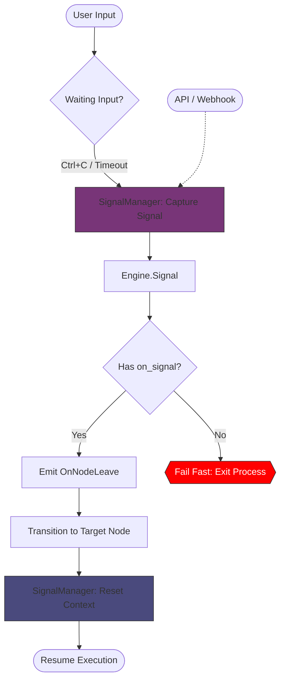
```mermaid
flowchart TD
    Start([User Input]) --> Wait{Waiting Input?}
    Wait -- Ctrl+C / Timeout --> Sig[SignalManager: Capture Signal]
    InputAPI([API / Webhook]) -.-> Sig
    Sig --> Engine[Engine.Signal]
    
    Engine --> Handled{Has on_signal?}
    Handled -- Yes --> Leave[Emit OnNodeLeave]
    Leave --> Transition[Transition to Target Node]
    
    Transition --> Reset[SignalManager: Reset Context]
    Reset --> Resume([Resume Execution])
    
    Handled -- No --> Exit{{Fail Fast: Exit Process}}
    
    style Sig fill:#783578,stroke:#333
    style Reset fill:#4a4a7d,stroke:#333
    style Exit fill:#f00,stroke:#333,color:#fff
```

#### 12.7. Sanitização de Input & Limites

Para garantir operação robusta em produção (especialmente em ambientes de memória compartilhada como Pods Kubernetes), o Trellis impõe limites no input do usuário na camada do Runner. Isso se aplica globalmente a **todos os adaptadores** (CLI, HTTP, MCP).

* **Tamanho Máximo de Input**: Padrão de 4KB. Configurável via `TRELLIS_MAX_INPUT_SIZE`.
* **Caracteres de Controle**: Automaticamente remove códigos ANSI/Control perigosos para prevenir envenenamento de log.
* **Comportamento**: Inputs excedendo o limite são **Rejeitados** (retornando erro) em vez de truncados silenciosamente, preservando a integridade do estado ("Estado Determinístico").

Veja [Deployment Strategies](../docs/guides/deployment_strategies.md) para conselhos de provisionamento.

### 13. Adapters & Interfaces

#### 13.1. Camada de Apresentação

Responsável por converter visualmente o grafo e estados.

* **Trellis Graph**: Gera diagramas Mermaid.
  * **Start/Root** (`(( ))`): Nó inicial ou com ID "start".
  * **Question/Input** (`[/ /]`): Nós que exigem interação do usuário.
  * **Tool/Action** (`[[ ]]`): Nós que executam efeitos colaterais.
  * **Default** (`[ ]`): Nós de texto simples ou lógica interna.
  * **Timeouts** (`⏱️`): Anotação visual no label do nó.

**Arestas e Transições:**

* **Fluxo Normal** (`-->`): Transições padrão.
* **Salto de Módulo** (`-.->`): Transições entre arquivos (`jump_to`).
* **Sinais/Interrupções** (`-. ⚡ .->`): Transições disparadas por `on_signal`.

#### 13.1.1. Visual Debug Strategies (Visualizing State)

A flag `--session <id>` permite sobrepor o estado de uma sessão ao grafo estático.

**Implementação Atual (v0.6 - "Heatmap"):**

* **Modelo**: Conjunto de Nós Visitados (Set).
* **Estilo**: Nós visitados ficam azuis; nó atual fica amarelo.
* **Limitação (Caveat)**: Não representa a **ordem** nem a **frequência** de visita.
  * Se o fluxo fez `A -> B -> A -> C`, o grafo mostra `A`, `B` e `C` pintados.
  * Não é possível distinguir se o usuário veio de `B` ou `Start`.
  * Loops aparecem achatados.

**Evolução Futura (Vision):**

Para debugging forense de falhas complexas (Saga/Loops), o modelo visual precisará evoluir:

1. **Numbered Path (Badges)**: Adicionar badges (ex: `🔴 #1, #3`) aos nós para indicar a ordem da sequência de passos.
2. **Edge Highlighting**: Pintar as **arestas** percorridas. Desafio técnico: Mermaid não facilita ID em arestas.
3. **Sequence Diagram Export**: Para fluxos lineares longos, um Diagrama de Sequência (`sequenceDiagram`) pode ser mais legível que um Flowchart, mostrando temporalidade no eixo Y.
4. **Interactive Scrubbing**: Ferramenta Web (HTML/JS) que permite "tocar" o histórico (Previous/Next), iluminando o caminho passo-a-passo.

> **Decisão Sóbria**: Mantivemos a v0.6 simples (Heatmap) pois resolve 80% dos casos ("Onde parei?" e "Por onde passei?") sem complexidade de renderização dinâmica. É uma ferramenta de **Orientação**, não de **Perícia**.

#### 13.2. HTTP Server (Stateless)

Adaptador REST API (`internal/adapters/http`).

* **Endpoints**: `POST /navigate`, `GET /graph`.
* **SSE (Server-Sent Events)**: Endpoint `/events` notifica clientes sobre mudanças (Hot-Reload).
  * Fonte: `fsnotify` (via Loam).
  * Transporte: `text/event-stream`.

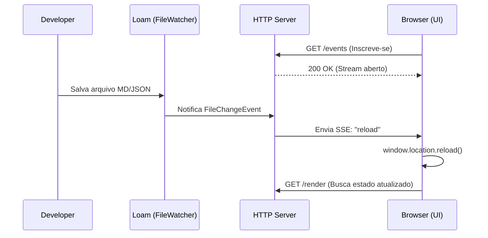
```mermaid
sequenceDiagram
    participant Dev as Developer
    participant Loam as Loam (FileWatcher)
    participant Server as HTTP Server
    participant Client as Browser (UI)

    Client->>Server: GET /events (Inscreve-se)
    Server-->>Client: 200 OK (Stream aberto)
    
    Dev->>Loam: Salva arquivo MD/JSON
    Loam->>Server: Notifica FileChangeEvent
    Server->>Client: Envia SSE: "reload"
    Client->>Client: window.location.reload()
    Client->>Server: GET /render (Busca estado atualizado)
```

#### 13.3. MCP Adapter

Expõe o Trellis como um servidor MCP (Model Context Protocol).

* **Tools Expostas**: `navigate`, `render_state`.

#### 13.4. Modelo de Persistência Redis

Para suportar sessões persistentes escaláveis, o adaptador Redis implementa uma estratégia de indexação especializada.

* **Armazenamento**: Sessões são armazenadas como blobs JSON em chaves estritas (`trellis:session:<id>`) com um TTL opcional.
* **Indexação**: Um `ZSET` (`trellis:session:index`) rastreia sessões ativas usando o timestamp de expiração como score.
* **Manutenção Preguiçosa**: A operação `List()` realiza a manutenção. Ela remove entradas expiradas do índice (*ZREMRANGEBYSCORE*) antes de retornar sessões válidas.

> **Trade-off**: Este design mantém o adaptador stateless (sem necessidade de workers em background), alinhando-se com arquiteturas Serverless. No entanto, significa que `List()` incorre um custo de escrita. Para ambientes de alto throughput exigindo listagem somente leitura, este comportamento pode ser desabilitado em favor de um garbage collector externo (Trabalho Futuro).

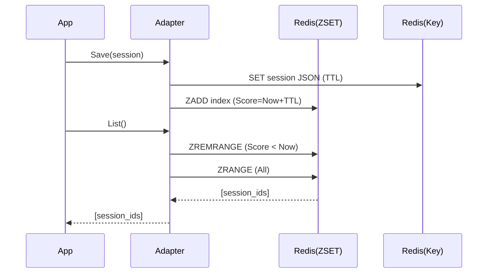
```mermaid
sequenceDiagram
    participant App
    participant Adapter
    participant Redis(ZSET)
    participant Redis(Key)

    App->>Adapter: Save(session)
    Adapter->>Redis(Key): SET session JSON (TTL)
    Adapter->>Redis(ZSET): ZADD index (Score=Now+TTL)
    
    App->>Adapter: List()
    Adapter->>Redis(ZSET): ZREMRANGE (Score < Now)
    Adapter->>Redis(ZSET): ZRANGE (All)
    Redis(ZSET)-->>Adapter: [session_ids]
    Adapter-->>App: [session_ids]
```

### 14. Segurança de Dados e Privacidade

O Trellis oferece suporte camadas de middleware para garantir conformidade com políticas de segurança (Encryption at Rest) e privacidade (PII Sanitization).

#### 14.1. Envelope Encryption (At Rest)

Para proteger o estado da sessão (que pode conter chaves de API e dados do usuário) em armazenamento não confiável (como disco ou REDIS compartilhado), utilizamos o **Envelope Pattern**.

O middleware criptografa todo o estado da sessão e o armazena dentro de um "Estado Envelope" opaco.

```mermaid
graph LR
    Engine[Engine State] -->|Plain JSON| Middleware[Encryption Middleware]
    Middleware -->|AES-GCM (Key A)| Cipher[Ciphertext Blob]
    Cipher -->|Wrap| Envelope[Envelope State]
    Envelope -->|Save| Store[Storage Adapter]
    
    subgraph "Envelope State"
        Ctx["__encrypted__: <base64>"]
    end
```

* **Key Rotation**: O middleware suporta rotação de chaves sem downtime. Ao carregar, ele tenta a chave ativa; se falhar, tenta chaves de fallback sequencialmente. Ao salvar, sempre re-encripta com a chave ativa mais recente.

#### 14.2. PII Sanitization (Compliance)

Um middleware separado permite a sanitização de dados sensíveis (Personally Identifiable Information) antes da persistência.

* **Deep Masking**: Percorre recursivamente o mapa de contexto e substitui valores de chaves sensíveis (ex: `password`, `ssn`, `api_key`) por `***`.
* **Imutabilidade em Memória**: A sanitização ocorre em uma **cópia profunda** (Deep Copy) do estado antes de salvar. O estado em memória usado pelo Engine permanece intacto para execução contínua.
* **Caveat**: Se o processo falhar e for reiniciado, os dados persistidos estarão mascarados (`***`), o que pode impedir a retomada se o fluxo depender desses dados. Use este middleware para Compliance de Logs ou quando a durabilidade do dado sensível não for crítica.
* **Resources**: `trellis://graph`.

### 15. Observabilidade (Observability)

O Trellis fornece **três camadas** de observabilidade, cada uma com propósitos distintos:

1. **Lifecycle Hooks** → Eventos de transição assíncronos
2. **Graph Visualization** → Representação estrutural (Mermaid)
3. **Introspection** → Snapshots do estado de execução em tempo real

---

#### 15.1 Lifecycle Hooks (Event Streaming)

* **Hooks**: `OnNodeEnter`, `OnNodeLeave`, `OnToolReturn`, etc.
* **Padrão de Log**: Eventos usam chaves consistentes.
  * `node_id`: ID do nó.
  * `tool_name`: Nome da ferramenta (nunca vazio).
  * `type`: Tipo do evento (`node_enter`, `node_leave`, `tool_call`, `tool_return`).
  * **Nota**: O tipo de evento `tool_call` é preservado para estabilidade histórica de observabilidade, mesmo que o campo do Nó agora seja `Do`.
* **Integração**: Pode ser usado com `log/slog` e `Prometheus` sem acoplar essas dependências ao Core (ex: `examples/structured-logging`).

##### Diagrama de Eventos (Lifecycle Hooks)

O diagrama abaixo ilustra onde cada evento é emitido durante o ciclo `Navigate`:

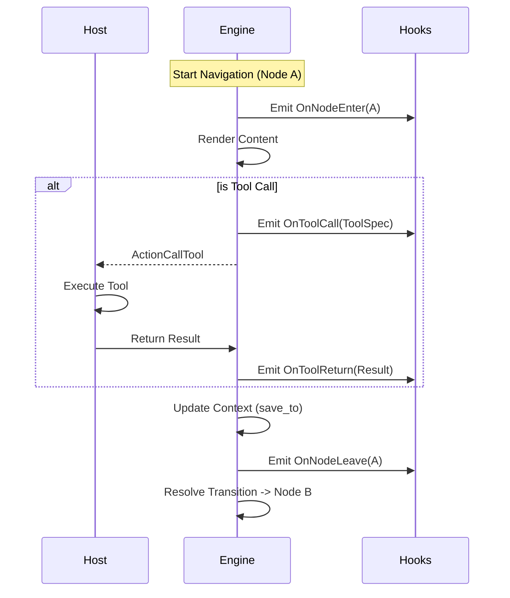
```mermaid
sequenceDiagram
    participant Host
    participant Engine
    participant Hooks

    Note over Engine: Start Navigation (Node A)
    
    Engine->>Hooks: Emit OnNodeEnter(A)
    Engine->>Engine: Render Content
    
    alt is Tool Call
        Engine->>Hooks: Emit OnToolCall(ToolSpec)
        Engine-->>Host: ActionCallTool
        Host->>Host: Execute Tool
        Host->>Engine: Return Result
        Engine->>Hooks: Emit OnToolReturn(Result)
    end

    Engine->>Engine: Update Context (save_to)
    
    Engine->>Hooks: Emit OnNodeLeave(A)
    
    Engine->>Engine: Resolve Transition -> Node B
```

---

#### 15.2 Introspection (State Snapshots)

O **Runner** implementa a interface `TypedWatcher[*domain.State]` da biblioteca [`github.com/aretw0/introspection`](https://github.com/aretw0/introspection), permitindo observação do estado interno do Engine durante a execução.

##### Assinatura do Contrato

```go
type TypedWatcher[T any] interface {
    State() T                           // Retorna snapshot do estado atual
    Watch(ctx context.Context) <-chan StateChange[T]  // Stream de mudanças de estado
}
```

##### Implementação no Runner

1. **`State() *domain.State`**:
   * Retorna um **snapshot isolado** do estado atual (via `State.Snapshot()`).
   * **Thread-safe**: Protegido por `sync.RWMutex` para acesso concorrente.
   * **Zero-copy para leituras**: Retorna a referência ao `lastState` já capturado.

2. **`Watch(ctx context.Context) <-chan StateChange`**:
   * Cria um canal de observação registrado no Runner.
   * Cada mudança de estado é transmitida via broadcast **não-bloqueante**.
   * **Auto-cleanup**: Goroutine de monitoramento remove o watcher quando o contexto é cancelado (usando padrão **copy-and-swap** para evitar race conditions).
   * **Backpressure handling**: Watchers lentos resultam em eventos descartados (contabilizados em `droppedCount` para futura instrumentação).

##### Exemplo: Monitoramento em Tempo Real

```go
package main

import (
    "context"
    "fmt"
    
    "github.com/aretw0/trellis/pkg/runner"
    "github.com/aretw0/trellis/pkg/observability"
)

func main() {
    r := runner.NewRunner(/* ... */)
    
    ctx := context.Background()
    
    // Agregador consolida múltiplos watchers
    agg := observability.NewAggregator()
    agg.AddWatcher(r)  // Runner implementa TypedWatcher
    
    changes := agg.Watch(ctx)
    
    go func() {
        for change := range changes {
            state := change.NewState
            fmt.Printf("Node: %s | Context: %v\n", 
                state.CurrentNodeID, state.Context)
        }
    }()
    
    r.Run(ctx)
}
```

##### Garantias de Concorrência

| Operação          | Proteção           | Comportamento                          |
|-------------------|--------------------|----------------------------------------|
| `State()`         | `RWMutex.RLock()`  | Leituras paralelas permitidas          |
| `Watch()`         | `Mutex.Lock()`     | Registro serializado                   |
| `broadcastState()`| `RWMutex.RLock()`  | Broadcast paralelo às leituras         |
| Cleanup (ctx)     | `Mutex.Lock()`     | Remoção copy-and-swap (thread-safe)    |

##### Arquitetura de Broadcast

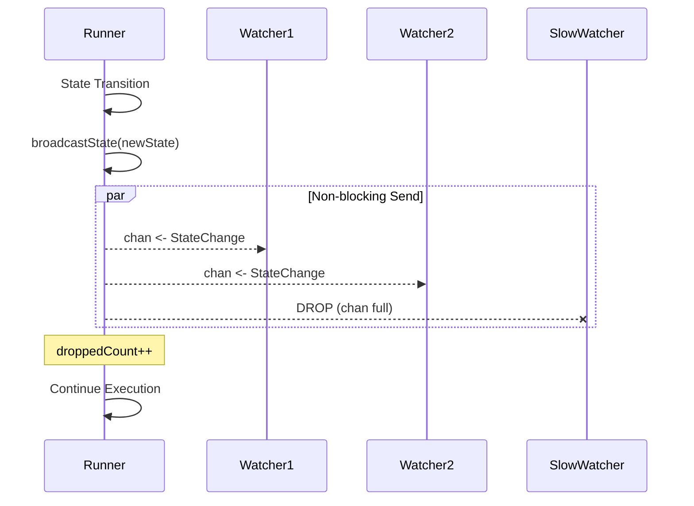
```mermaid
sequenceDiagram
    participant Runner
    participant Watcher1
    participant Watcher2
    participant SlowWatcher

    Runner->>Runner: State Transition
    Runner->>Runner: broadcastState(newState)
    
    par Non-blocking Send
        Runner-->>Watcher1: chan <- StateChange
        Runner-->>Watcher2: chan <- StateChange
        Runner--xSlowWatcher: DROP (chan full)
    end
    
    Note over Runner: droppedCount++
    Runner->>Runner: Continue Execution
```

**Decisão de Design**: O broadcast **nunca bloqueia** o Runner. Watchers lentos perdem eventos ao invés de stall na execução. Isso preserva o determinismo do Engine e evita deadlocks.

---

#### 15.3 Separação de Responsabilidades

| Camada          | Propósito                          | Uso Típico                          |
|-----------------|-----------------------------------|-------------------------------------|
| **Hooks**       | Auditoria, Logs, Métricas         | Prometheus, OpenTelemetry           |
| **Visualization**| Análise estrutural, Debugging     | CI/CD, Documentação                 |
| **Introspection**| Dashboards, Debugging interativo | REPL, Web UI, Estado em tempo real  |

### 16. Process Adapter (Execução de Script Local)

O `ProcessAdapter` permite que o Trellis orquestre scripts locais (`.sh`, `.py`, `.js`, etc.) como ferramentas de primeira classe.

* **Objetivo**: "Glue Code". Permitir que o Trellis automatize tarefas de infraestrutura sem reimplementar a lógica em Go.
* **Arquitetura**: `Engine -> ToolCall -> ProcessAdapter -> os/exec`.

**Security Model (v0.7 - Strict Registry):**

O adaptador segue uma política de "Allow-Listing" rigorosa. Scripts não podem ser invocados arbitrariamente pelo Markdown. O Host Go deve registrar explicitamente quais comandos estão disponíveis.

1. **Registry**: Mapeia `tool_name` -> `command` + `default_args`.
2. **No Shell**: Usa `exec.Command` diretamente, evitando `sh -c` para mitigar injeção de comandos.
3. **Input Mapping**: Argumentos complexos devem ser passados via Variáveis de Ambiente (`TRELLIS_ARG_KEY=VAL`) ou Stdin (JSON), evitando injeção de flags na linha de comando.

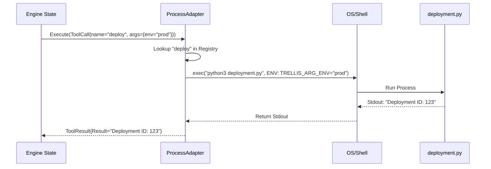
```mermaid
sequenceDiagram
    participant State as Engine State
    participant Adapter as ProcessAdapter
    participant OS as OS/Shell
    participant Script as deployment.py

    State->>Adapter: Execute(ToolCall{name="deploy", args={env="prod"}})
    Adapter->>Adapter: Lookup "deploy" in Registry
    Adapter->>OS: exec("python3 deployment.py", ENV: TRELLIS_ARG_ENV="prod")
    OS->>Script: Run Process
    Script-->>OS: Stdout: "Deployment ID: 123"
    OS-->>Adapter: Return Stdout
    Adapter-->>State: ToolResult{Result="Deployment ID: 123"}
```
