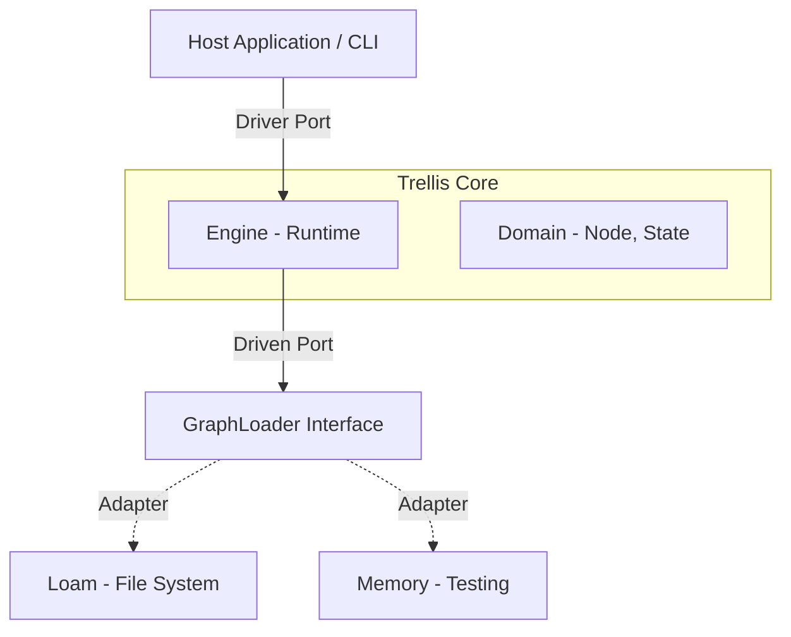
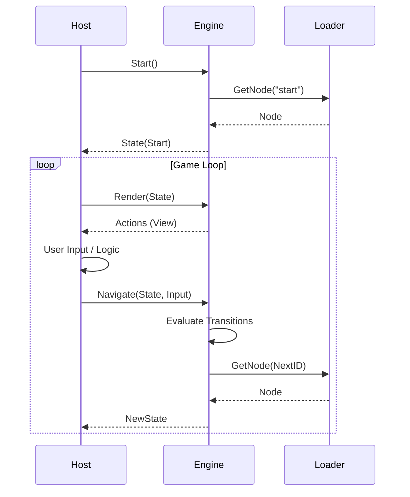
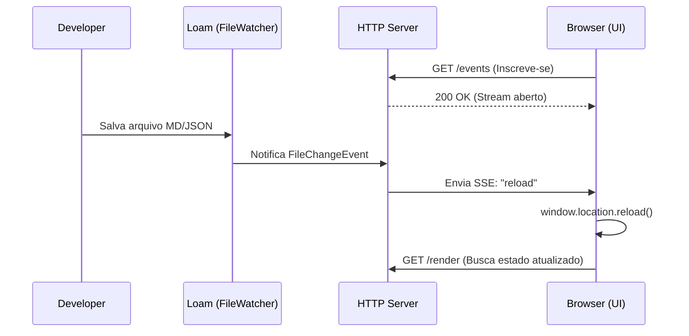

# Technical: Trellis Architecture

## 1. Arquitetura Hexagonal (Ports & Adapters)

O *Core* da Trellis não conhece banco de dados, não conhece HTTP e não conhece CLI. Ele define **Portas** (Interfaces) que o mundo externo deve satisfazer.
Essa arquitetura desacoplada torna o Trellis leve o suficiente para ser embutido em CLIs simples ou usado como biblioteca "low-level" dentro de frameworks de Agentes de IA maiores.

### 1.1. Driver Ports (Entrada)

A API primária para interagir com o engine.

- `Engine.Render(state)`: Retorna a view (ações) para o estado atual e se é terminal.
- `Engine.Navigate(state, input)`: Computa o próximo estado dado um input.
- `Engine.Inspect()`: Retorna o grafo completo para visualização.

### 1.2. Driven Ports (Saída)

As interfaces que o engine usa para buscar dados.

- `GraphLoader.GetNode(id)`: Abstração para carregar nós. O **Loam** implementa isso via adapter.
- `GraphLoader.ListNodes()`: Descoberta de nós para introspecção.

### 1.3. Diagrama de Arquitetura



### 1.4. Fluxo de Execução



## 2. Estrutura de Diretórios

```text
trellis/
├── cmd/
│   └── trellis/       # Entrypoint (Wiring dos Ports e Adapters)
├── internal/          # Detalhes de implementação (Privado)
│   ├── adapters/      # Implementações (Loam, Memory) e Loaders
│   └── runtime/       # Engine de execução
├── pkg/               # Contratos Públicos (Safe to import)
│   ├── domain/        # Node, Transition, Action (Structs puras)
│   └── ports/         # Interfaces (Driver & Driven)
└── go.mod
```

## 3. Integridade e Persistência

### 3.1. O Papel do Loam

O **Loam** atua como bibliotecário e camada de persistência.

- **Responsabilidade**: Garantir integridade e fornecer documentos normalizados (`DocumentModel`).
- **Trellis Adapter (`LoamLoader`)**: Converte `DocumentModel` para JSON/Structs que o Compiler entende.
- **Constraints**: Em modo de desenvolvimento, o Loam facilita o hot-reload e a leitura segura de arquivos.

### 1.5. Model Context Protocol (MCP) Adapter

Introduzido na v0.3.3 (Experimental), o adaptador MCP (`internal/adapters/mcp`) expõe o Trellis como um Servidor MCP.

- **Tools**:
  - `render_state`: Mapeia para `Engine.Render`.
  - `navigate`: Mapeia para `Engine.Navigate`.
  - `get_graph`: Mapeia para `Engine.Inspect`.
- **Resources**:
  - `trellis://graph`: Retorna o grafo via `Engine.Inspect`.
- **Transports**: Suporta `Stdio` (para agentes locais) e `SSE` (para remoto/debug).

### 3.2. Global Strict Serialization

O Trellis adota uma postura de "Strict Types" para garantir a determinística da máquina de estados.

#### O Problema do `float64`

Por padrão, decodificadores JSON em Go tratam números arbitrários como `float64`. Isso é catastrófico para IDs numéricos grandes ou timestamps.

#### A Solução

O Trellis força o modo estrito em **todos** os adaptadores. Isso garante que números sejam decodificados como `json.Number` ou `int64`, e que exista consistência entre JSON e YAML.

## 4. Escalabilidade: Sub-Grafos e Namespaces (v0.4+)

Para escalar fluxos complexos, o Trellis suporta **Sub-Grafos** via organização de diretórios.

### 4.1. Semântica `jump_to` vs `to`

Tecnicamente, o Trellis Engine vê apenas IDs (`to_node_id`). O conceito de `jump_to` é **açúcar sintático** do adaptador Loam para clareza arquitetural.

- **`to`**: Indica uma transição local, dentro do mesmo contexto lógico ou arquivo.
- **`jump_to`**: Indica uma transição para um **Sub-Grafo** ou Módulo externo. É uma sinalização explícita de mudança de contexto.

```yaml
transitions:
  - text: "Checkout"
    jump_to: modules/checkout/start # Semântica: Mudança de Contexto
```

### 4.2. IDs Implícitos e Normalização

1. **Implicit IDs**: Arquivos em subdiretórios herdam o caminho como ID (ex: `modules/checkout/start`).
2. **Normalization**: O Adapter normaliza todos os IDs para usar `/` (forward slash), garantindo que fluxos criados no Windows rodem no Linux sem alterações.

## 5. Princípios de Design (Constraints)

Para evitar a "Complexidade Oculta", seguimos estas restrições:

### 5.1. Logic-Data Decoupling

A lógica complexa **nunca** deve residir no grafo (Markdown).

- **Errado**: `condition: user.age > 18 && user.status == 'active'` (Exige parser complexo).
- **Correto**: `condition: is_adult_active` (O Host resolve e retorna bool).

> Veja [Interactive Inputs](../docs/guides/interactive_inputs.md) para detalhes sobre como o Host gerencia inputs.

### 5.2. Strict Mode Compiler

O compilador deve ser implacável.

- Variáveis não declaradas resultam em erro de compilação.
- O objetivo é **Confiança Total**: Se compilou, não existem "Dead Ends" lógicos causados por typos.

## 6. Stateless Server Mode (v0.3.3+)

Introduzido na versão 0.3.3, o Trellis pode operar como um servidor HTTP stateless.

- **Contract-First**: A API é definida em `api/openapi.yaml`.
- **Implementação**: `internal/adapters/http` usa `chi` como roteador.
- **Endpoints de Dados**:
  - `GET /graph`: Retorna o grafo completo.
  - `POST /navigate`: Recebe `State` + `Input`, retorna `NewState`.
- **Endpoints de Gerenciamento**:
  - `GET /health`: Liveness probe.
  - `GET /info`: Metadados e versões.

> Para um guia prático, veja [Running HTTP Server](../docs/guides/running_http_server.md).

## 7. Real-Time & Events (SSE)

Para suportar experiências dinâmicas (como **Hot-Reload** no navegador), o Trellis utiliza **Server-Sent Events (SSE)**.

### 7.1. Por que SSE e não WebSockets?

- **Simplicidade**: SSE usa HTTP padrão (`Content-Type: text/event-stream`). Não requer upgrade de protocolo ou handshake complexo.
- **Unidirecional**: O Trellis é o "State of Truth". O cliente apenas reage a mudanças (ex: arquivo salvo no disco -> notifica cliente -> cliente recarrega). Para enviar dados (inputs), o cliente continua usando `POST /navigate` (HTTP padrão).
- **Reconexão Nativa**: O objeto `EventSource` do navegador gerencia reconexões automaticamente.

### 7.2. Fluxo de Hot-Reload



### 7.3. Event Source & Caveats

O Trellis desacopla a fonte de eventos do transporte SSE:

1. **Fonte (Source)**: O `LoamLoader` utiliza `fsnotify` (via biblioteca Loam) para monitorar o sistema de arquivos.
    - *Nota*: Atualmente, o evento emitido é genérico (`"reload"`), sinalizando que *alguma coisa* mudou.
    - *Futuro*: A interface `Watch` retorna `chan string`, permitindo eventos granulares como `update:docs/start.md` ou `delete:modules/auth.json`.

2. **Transporte**: O handler SSE (`Server.SubscribeEvents`) apenas repassa as strings recebidas pelo canal para o cliente HTTP.

> **Limitações Atuais (v0.3.3)**:
>
> - O watcher monitora recursivamente todos os arquivos suportados (`.md`, `.json`, `.yaml`). Edições rápidas podem disparar múltiplos reloads (debounce básico implementado).
> - Não há distinção de qual arquivo mudou no payload do evento SSE (apenas `data: reload`).
