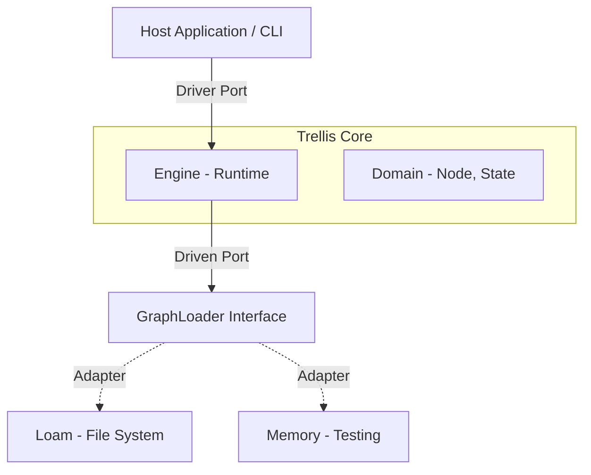
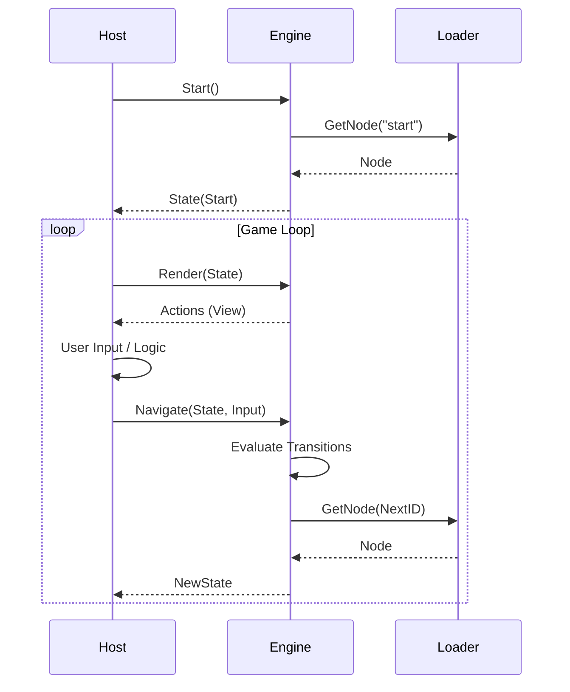

# Technical: Trellis Architecture

## Arquitetura Hexagonal (Ports & Adapters)

O *Core* da Trellis não conhece banco de dados, não conhece HTTP e não conhece CLI. Ele define **Portas** (Interfaces) que o mundo externo deve satisfazer.
Essa arquitetura desacoplada torna o Trellis leve o suficiente para ser embutido em CLIs simples ou usado como biblioteca "low-level" dentro de frameworks de Agentes de IA maiores.

### 1. Driver Ports (Entrada)

A API primária para interagir com o engine.

- `Engine.Render(state)`: Retorna a view (ações) para o estado atual e se é terminal.
- `Engine.Navigate(state, input)`: Computa o próximo estado dado um input.
- `Engine.Inspect()`: Retorna o grafo completo para visualização.

### 2. Driven Ports (Saída)

As interfaces que o engine usa para buscar dados.

- `GraphLoader.GetNode(id)`: Abstração para carregar nós. O **Loam** implementa isso via adapter.
- `GraphLoader.ListNodes()`: Descoberta de nós para introspecção.

### Diagrama de Arquitetura (Hexagonal)



### Fluxo de Execução



## 3. Global Strict Serialization (Integridade de Dados)

O Trellis adota uma postura de "Strict Types" para garantir a determinística da máquina de estados, especialmente ao lidar com `map[string]any` (Metadados).

### O Problema do `float64`

Por padrão, decodificadores JSON em Go tratam números arbitrários como `float64`. Isso é catastrófico para:

- IDs numéricos grandes (ex: Snowflake IDs).
- Timestamps de alta precisão.
- Inteiros que não devem virar decimais (ex: `count: 1` virando `1.0`).

### A Solução: Global Strict Mode

A partir da integração com **Loam v0.10.4**, o Trellis força o modo estrito em **todos** os adaptadores (JSON e Markdown/YAML).
Isso garante que:

- Números são decodificados como `json.Number` (string-based) ou `int64`, nunca `float64` impreciso.
- Existe consistência de tipos entre formatos diferentes (JSON vs YAML não causam "drift" de esquema).

## Estrutura de Diretórios e Decisões

```text
trellis/
├── cmd/
│   └── trellis/       # Entrypoint (Wiring dos Ports e Adapters)
├── internal/          # Detalhes de implementação (Privado)
│   ├── adapters/      # Implementações (Loam, Memory) e Loaders
│   └── runtime/       # Engine de execução
├── pkg/               # Contratos Públicos (Safe to import)
│   ├── domain/        # Node, Transition, Action (Structs puras)
│   └── ports/         # Interfaces (Driver & Driven)
└── go.mod
```

### O Papel do Loam

O **Loam** atua como bibliotecário e camada de persistência.

- **Responsabilidade**: Garantir integridade e fornecer documentos normalizados (`DocumentModel`).
- **Trellis Adapter (`LoamLoader`)**: Converte `DocumentModel` para JSON/Structs que o Compiler entende.
- **Constraints (Dev Mode)**: Quando executado via `go run` (sem build), o Loam força o uso de um diretório temporário para evitar side-effects em arquivos locais. Isso exige cuidado ao testar caminhos relativos em desenvolvimento.

### Estratégia de Compilação

O Compiler do Trellis valida estaticamente:

- Integridade do JSON/Markdown.
- Links mortos (em breve).

## 4. Princípios de Design (Constraints)

Para evitar a "Complexidade Oculta", seguimos estas restrições:

### Logic-Data Decoupling (Desacoplamento Lógico)

A lógica complexa **nunca** deve residir no grafo (Markdown).

- **Errado**: `condition: user.age > 18 && user.status == 'active'` (Isso exige um parser complexo e contexto).

- **Correto**: `condition: is_adult_active` (O Host resolve isso e retorna bool). O Trellis apenas pergunta.

> Veja [Interactive Inputs](../docs/guides/interactive_inputs.md) para detalhes sobre como o Host gerencia inputs.

### Strict Mode Compiler

O compilador deve ser implacável.

- Variáveis não declaradas resultam em erro de compilação.
- Links quebrados resultam em erro de compilação.
- O objetivo é **Confiança Total**: Se compilou, não existem "Dead Ends" lógicos causados por typos.
