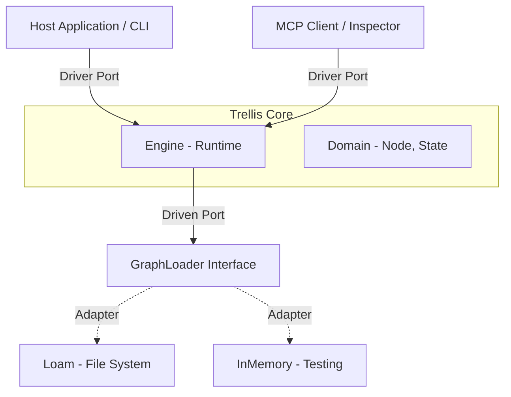
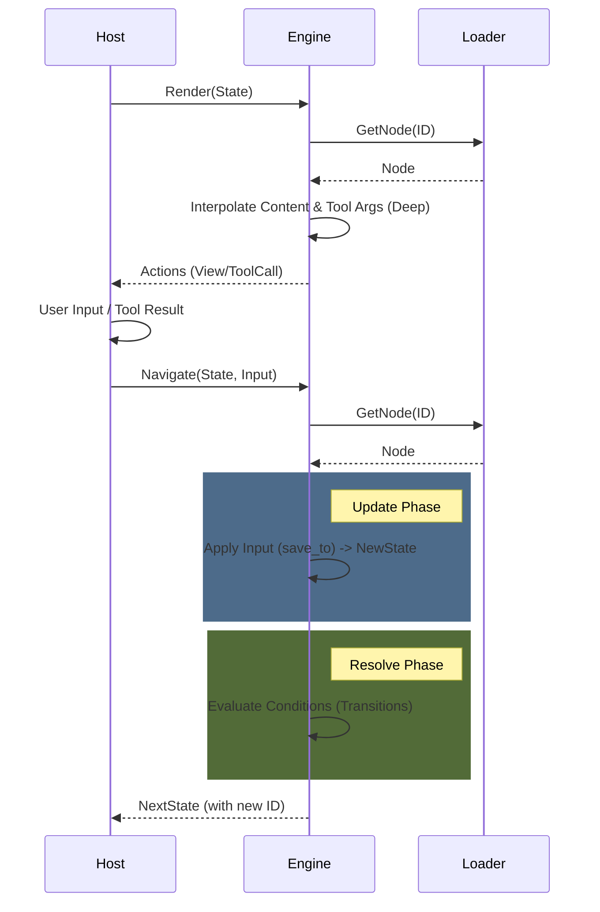
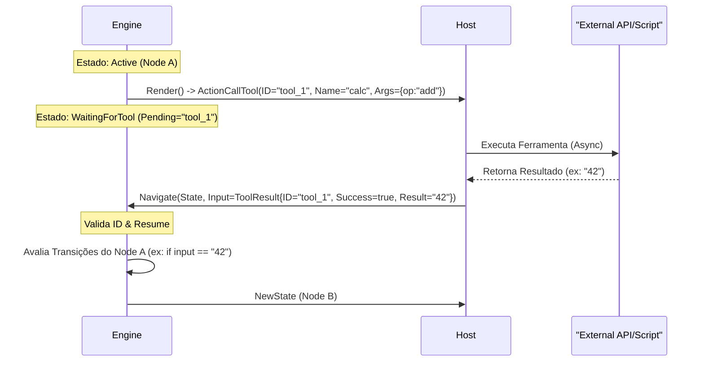
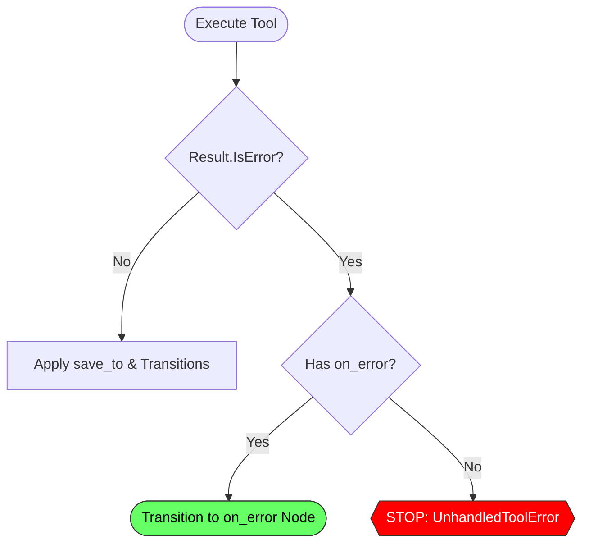
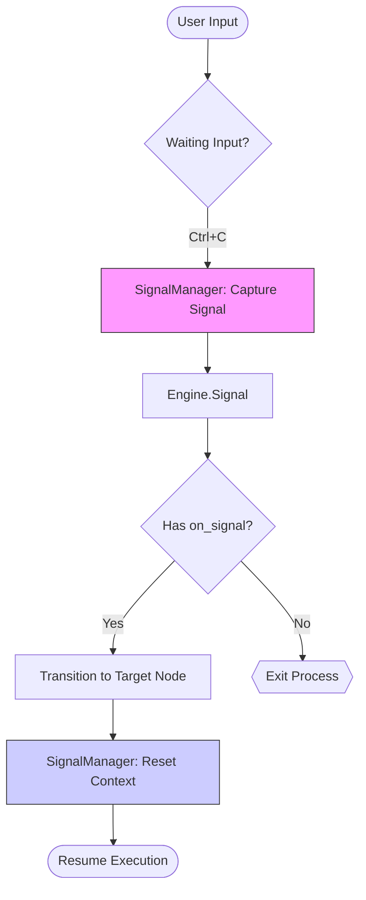
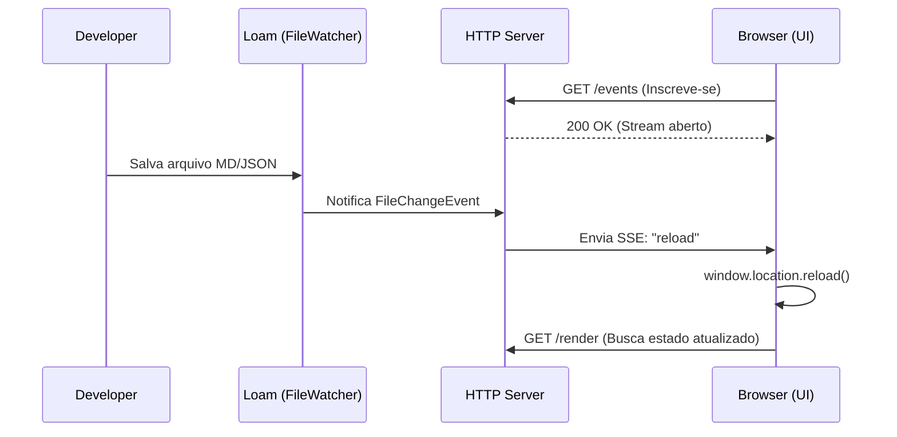

# Technical Reference: Trellis Architecture

## I. Fundamentos (Core Foundation)

Esta seção define os pilares arquiteturais, regras de design e estratégias que governam todo o projeto.

### 1. Arquitetura Hexagonal (Ports & Adapters)

O *Core* da Trellis não conhece banco de dados, não conhece HTTP e não conhece CLI. Ele define **Portas** (Interfaces) que o mundo externo deve satisfazer.
Essa arquitetura desacoplada torna o Trellis leve o suficiente para ser embutido em CLIs simples ou usado como biblioteca "low-level" dentro de frameworks de Agentes de IA maiores.

#### 1.1. Driver Ports (Entrada)

A API primária para interagir com o engine.

- `Engine.Render(state)`: Retorna a view (ações) para o estado atual e se é terminal.
- `Engine.Navigate(state, input)`: Computa o próximo estado dado um input.
- `Engine.Inspect()`: Retorna o grafo completo para visualização.

#### 1.2. Driven Ports (Saída)

As interfaces que o engine usa para buscar dados.

- `GraphLoader.GetNode(id)`: Abstração para carregar nós. O **Loam** implementa isso via adapter.
- `GraphLoader.ListNodes()`: Descoberta de nós para introspecção.

#### 1.3. Diagrama de Arquitetura



### 2. Estrutura de Diretórios

```text
trellis/
├── cmd/
│   └── trellis/       # Entrypoint (CLI)
├── internal/          # Detalhes de implementação (Privado)
│   ├── adapters/      # Implementações (Loam, HTTP, MCP)
│   ├── presentation/  # TUI & Renderização
│   ├── runtime/       # Engine de execução
│   └── validator/     # Lógica de validação
├── pkg/               # Contratos Públicos (Safe to import)
│   ├── adapters/      # Adaptadores de Infraestrutura (Inmemory)
│   ├── domain/        # Core Domain (Node, State)
│   ├── ports/         # Interfaces (Driver & Driven)
│   ├── registry/      # Registro de Ferramentas
│   └── runner/        # Loop de Execução e Handlers
└── go.mod
```

### 3. Princípios de Design (Constraints)

Para evitar a "Complexidade Oculta", seguimos estas restrições:

#### 3.1. Logic-Data Decoupling

A lógica complexa **nunca** deve residir no grafo (Markdown).

- **Errado**: `condition: user.age > 18 && user.status == 'active'` (Exige parser complexo).
- **Correto**: `condition: is_adult_active` (O Host resolve e retorna bool).

> Veja [Interactive Inputs](../docs/guides/interactive_inputs.md) para detalhes sobre como o Host gerencia inputs.

#### 3.2. Strict Mode Compiler

O compilador deve ser implacável.

- Variáveis não declaradas resultam em erro de compilação.
- O objetivo é **Confiança Total**: Se compilou, não existem "Dead Ends" lógicos causados por typos.

#### 3.3. Convenção de Ponto de Entrada (Entry Point)

O Trellis segue a filosofia **Convention over Configuration** para o início do fluxo.

- **ID Obrigatório**: O fluxo SEMPRE começa no nó com ID `start`.
- **Resolução de Arquivo**: Por padrão, o `LoamLoader` busca por um arquivo chamado `start.md` (ou `start.json`) na raiz do diretório.
- **Sub-Grafos**: Ao pular para um sub-módulo (`jump_to: modules/auth`), o engine busca por `modules/auth/start.md`.

> **Nota**: Embora seja possível injetar um `State` inicial diferente via código (`engine.Navigate(ctx, customState, input)`), a CLI e os Runners padrão assumem `start` como entrypoint.

### 4. Estratégia de Testes

Para garantir a estabilidade do Core enquanto o projeto evolui, definimos uma pirâmide de testes rígida:

#### 4.1. Níveis de Teste

1. **Core/Logic (Unit)**:
   - **Alvo**: `pkg/domain`, `internal/runtime`.
   - **Estilo**: Table-Driven Tests extensivos.
   - **Objetivo**: Garantir que a máquina de estados (Engine) transite corretamente dado um input, sem depender de IO ou Filesystem.
   - **Strict Serialization**: Inclui testes de regressão (`tests/serialization_test.go`) para garantir consistência de `json.Number` e tipos.

2. **Adapters (Contract Tests)**:
   - **Alvo**: `LoamLoader` vs `MemoryLoader`.
   - **Estilo**: Interface Compliance Tests.
   - **Objetivo**: O mesmo suite de testes deve rodar contra ambas as implementações para garantir que o comportamento seja idêntico. Se o `MemoryLoader` funciona, o `LoamLoader` deve funcionar igual.

3. **Integration (E2E)**:
   - **Alvo**: `cmd/trellis` (Blackbox).
   - **Estilo**: CLI Runners / JSON In-Out.
   - **Objetivo**: Simular um usuário real ou sistema externo interagindo com o binário. Verifica se a "cola" (Wiring) entre as camadas está funcionando.

4. **Snapshot Testing**:
   - **Alvo**: CLI Output / TUI.
   - **Objetivo**: Garantir que a experiência de cada pixel na tela não regrediu (útil para detectar quebras de layout).

---

## II. Mecânica do Core (Engine & IO)

Esta seção detalha o funcionamento interno do engine, ciclo de vida e tratamento de dados.

### 5. Ciclo de Vida do Engine (Lifecycle)

O Engine segue um ciclo de vida estrito de **Resolve-Execute-Update** para garantir previsibilidade.



**Fases do Ciclo:**

1. **Render (View)**: Carrega o nó, aplica interpolação profunda (incluindo argumentos de ferramentas) e retorna as ações. O estado *não* muda.
2. **Navigate (Update)**:
    - **Update**: Aplica o input ao contexto da sessão (se `save_to` estiver definido).
    - **Resolve**: Avalia as condições de transição baseadas no novo contexto.
    - **Transition**: Retorna o novo estado apontando para o próximo nó.

### 6. Protocolo de Efeitos Colaterais (Side-Effect Protocol)

O protocolo de side-effects permite que o Trellis solicite a execução de código externo (ferramentas) de forma determinística e segura.

#### 6.1. Filosofia: "Syscalls" para a IA

O Trellis trata chamadas de ferramenta como "Chamadas de Sistema" (Syscalls). O Engine não executa a ferramenta; ele **pausa** e solicita ao Host que a execute.

1. **Intenção (Intent)**: O Engine renderiza um nó do tipo `tool` e emite uma ação `CALL_TOOL`.
2. **Suspensão (Yield)**: O Engine entra em estado `WaitingForTool`, aguardando o resultado.
3. **Dispatch**: O Host (CLI, Servidor HTTP, MCP) recebe a solicitação e executa a lógica (ex: chamar API, rodar script).
4. **Resumo (Resume)**: O Host chama `Navigate` passando o `ToolResult`. O Engine retoma a execução verificando transições baseadas nesse resultado.

#### 6.2. Ciclo de Vida da Chamada de Ferramenta



#### 6.3. Universal Dispatcher

Graças a este desacoplamento, a mesma definição de grafo pode usar ferramentas implementadas de formas diferentes dependendo do adaptador:

- **CLI Runner**: Executa scripts locais (`.sh`, `.py`) ou funções Go embutidas.
- **MCP Server**: Repassa a chamada para um cliente MCP (ex: Claude Desktop, IDE).
- **HTTP Server**: Webhooks que notificam serviços externos (ex: n8n, Zapier).

#### 6.4. Defining Tools in Loam

You can define available tools directly in the Node's frontmatter. This allows the Engine to be aware of the tool's schema (name, description, parameters) without needing hardcoded Go structs.

```yaml
type: text
tools:
  - name: get_weather
    description: Get current temperature
    parameters:
      type: object
      properties:
        city: { type: string }
---
The weather is...
```

#### 6.5. Reusable Tool Libraries (Polymorphic Design)

To support modularity, the `tools` key in Frontmatter is polymorphic. It accepts both inline definitions and string references to other files.

```yaml
tools:
  - name: local_tool         # Inline Definition
    description: ...
  - "modules/tools/math.md"  # Reference (Mixin)
```

##### Resolution Strategy

The `LoamLoader` implements a recursive resolution strategy with **Shadowing** (Last-Write-Wins).


**Technical Constraints:**

1. **Polymorphism (`[]any`)**: The Loader accepts generic types to support this UX. This requires **manual schema validation** at runtime.
2. **Cycle Detection**: Recursive imports are guarded against infinite loops (`visited` set).
3. **Shadowing Policy**: Local definitions always override imported ones.

### 7. Runner & IO Architecture

The `Runner` serves as the bridge between the Core Engine and the outside world. It manages the execution loop, handles middleware, and delegates IO to an `IOHandler`.

#### 7.1. Stateless & Async IO

Trellis supports two primary modes of operation:

1. **Text Mode** (`TextHandler`): For interactive TUI/CLI usage. Blocks on user input.
2. **JSON Mode** (`JSONHandler`): For headless automation and API integration.

**Key constraint for JSON Mode:**

- **Strict JSON Lines (JSONL)**: All inputs to the `JSONHandler` must be single-line JSON strings.
- **Async/Non-Blocking**: The handler reads from Stdin in a background goroutine, allowing cancellation (timeout/interrupt).

#### 7.2. Semântica de Texto e Bloqueio

O comportamento de nós de texto segue a semântica de State Machine pura:

1. **Nodes de Texto (`type: text`)**: São, por padrão, **Non-Blocking (Pass-through)**.
    - Se houver uma transição válida incondicional, transita *imediatamente*.
2. **Pausas Explícitas**:
    - `wait: true`: Força pausa para input (ex: "Pressione Enter").
    - `type: prompt`: Alias semântico para `question`.

#### 7.3. Diagrama de Decisão (Input Logic)


### 8. Fluxo de Dados e Serialização

#### 8.1. Data Binding (SaveTo)

O Trellis adota a propriedade `save_to` para indicar a *intenção* de persistir a resposta de um nó no contexto da sessão.

```yaml
type: question
text: "Qual é o seu nome?"
save_to: "user_name" # Salva input em context["user_name"]
```

**Regras de Execução:**

1. **Precedência**: O valor é salvo no contexto *antes* de avaliar as transições.
2. **Imutabilidade**: O Engine realiza **Deep Copy** do Contexto a cada transição.
3. **Tipagem Preservada**: `save_to` armazena o input como recebido (`any`).

#### 8.2. Variable Interpolation

O Trellis adota uma arquitetura plugável para interpolação de variáveis via interface `Interpolator`.

- **Default Strategy**: Go Templates (`{{ .UserName }}`).
- **Legacy Strategy**: `strings.ReplaceAll` (`{{ Key }}`).

#### 8.3. Global Strict Serialization

O Trellis força **Strict Mode** em todos os adaptadores para resolver o problema do `float64` em JSON. Números são decodificados como `json.Number` ou `int64` para garantir integridade de IDs e timestamps.

#### 8.4. Data Contracts (Required Context)

Nós podem declarar dependências explícitas para **Fail Fast**:

```yaml
required_context:
  - user_id
  - api_key
```

Se uma chave estiver faltando no Contexto, o Engine aborta a execução com `ContextValidationError` antes de processar o nó.

---

## III. Funcionalidades Estendidas (System Features)

Recursos avançados para escalabilidade, segurança e integração.

### 9. Escalabilidade: Sub-Grafos e Namespaces

Para escalar fluxos complexos, o Trellis suporta **Sub-Grafos** via organização de diretórios.

#### 9.1. Semântica `jump_to` vs `to`

- **`to`**: Transição local (mesmo arquivo/contexto).
- **`jump_to`**: Transição para um **Sub-Grafo** ou Módulo externo (mudança de contexto).

#### 9.2. IDs Implícitos e Normalização

- **Implicit IDs**: Arquivos em subdiretórios herdam o caminho como ID (ex: `modules/checkout/start`).
- **Normalization**: O Adapter normaliza todos os IDs para usar `/` (forward slash).

#### 9.3. Syntactic Sugar: Options

Atalho para menus de escolha simples.

- **Options**: Correspondência exata de texto. Avaliadas PRIMEIRO.
- **Transitions**: Lógica genérica. Avaliadas DEPOIS.

### 10. Segurança e Policies

#### 10.1. Interceptors (Safety Middleware)

Para mitigar riscos de execução arbitrária, o Runner aceita interceptadores:

```go
type ToolInterceptor func(ctx, call) (allowed bool, result ToolResult, err error)
```

- **ConfirmationMiddleware**: Solicita confirmação explícita (`[y/N]`). O trecho `metadata.confirm_msg` no nó pode personalizar o alerta.
- **AutoApproveMiddleware**: Para modo Headless/Automação.

#### 10.2. Error Handling (on_error)

Mecanismo robusto para recuperação de falhas em ferramentas.

- Se `ToolResult.IsError` for true:
  - O Engine **PULA** o `save_to` (evita context poisoning).
  - Se houver `on_error`: Transita para o nó de recuperação.
  - Se não houver: **Fail Fast** (Engine aborta com erro).



#### 10.3. System Context Namespace

O namespace `sys.*` é reservado no Engine.

- **Read-Only**: Templates podem ler (`{{ .sys.error }}`).
- **Write-Protected**: `save_to` não pode escrever em `sys` (proteção contra injeção).

#### 10.4. Global Signals (Interrupts)

O Trellis suporta a conversão de sinais do sistema operacional (ex: `Ctrl+C` / `SIGINT`) em transições de estado.

- **`on_signal`**: Define um mapa de sinais para nós de destino.
- **Engine.Signal**: Método que dispara a transição.

```yaml
type: text
wait: true
on_signal:
  interrupt: confirm_exit
```

Se o sinal "interrupt" for recebido enquanto o nó estiver ativo, o Engine transitará para `confirm_exit` em vez de encerrar o processo.



### 11. Adapters & Interfaces

#### 11.1. Camada de Apresentação

Responsável por converter visualmente o grafo e estados.

- **Trellis Graph**: Gera diagramas Mermaid.
  - Start: `(( ))`
  - Tool: `[[ ]]`
  - Prompt: `[/ /]`

#### 11.2. HTTP Server (Stateless)

Adaptador REST API (`internal/adapters/http`).

- **Endpoints**: `POST /navigate`, `GET /graph`.
- **SSE (Server-Sent Events)**: Endpoint `/events` notifica clientes sobre mudanças (Hot-Reload).
  - Fonte: `fsnotify` (via Loam).
  - Transporte: `text/event-stream`.



#### 11.3. MCP Adapter

Expõe o Trellis como um servidor MCP (Model Context Protocol).

- **Tools Expostas**: `navigate`, `render_state`.
- **Resources**: `trellis://graph`.

### 12. Observability

Trellis fornece **Lifecycle Hooks** para instrumentação externa.

- **Hooks**: `OnNodeEnter`, `OnNodeLeave`, `OnToolReturn`, etc.
- **Integração**: Pode ser usado com `log/slog` e `Prometheus` sem acoplar essas dependências ao Core (ex: `examples/structured-logging`).
