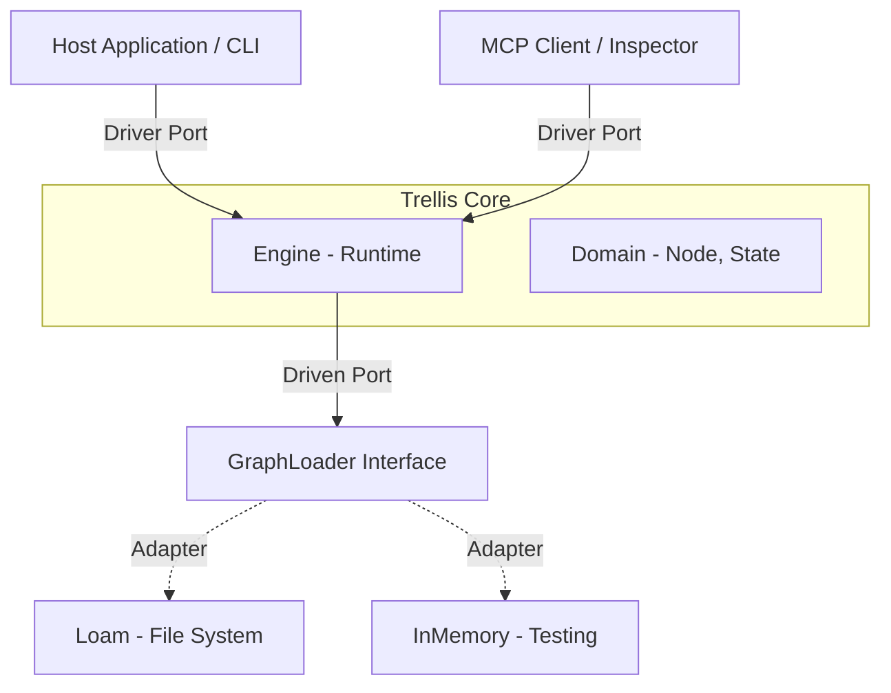
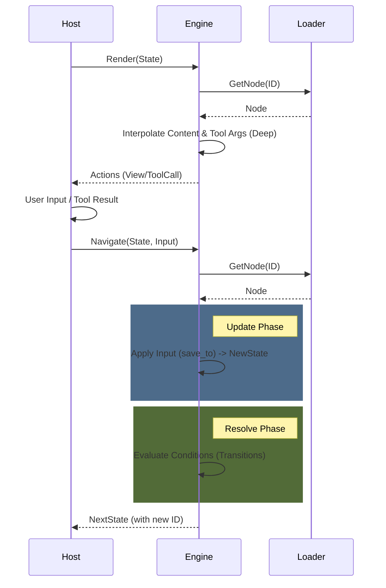
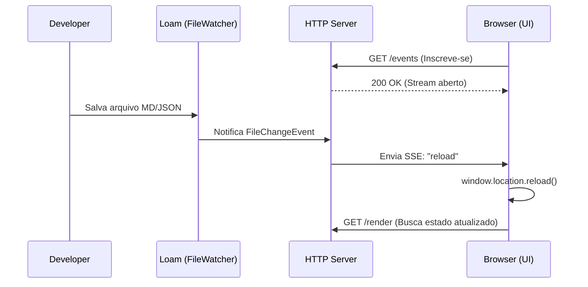
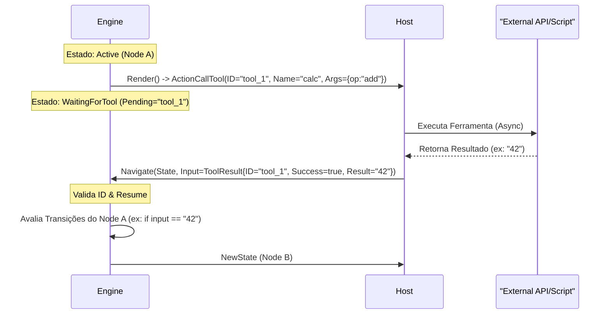
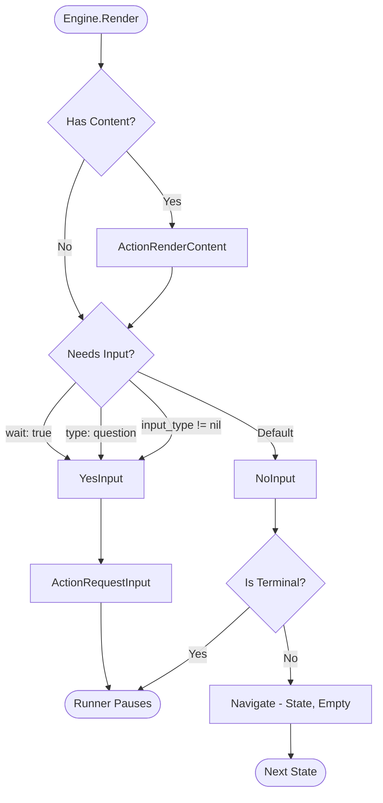
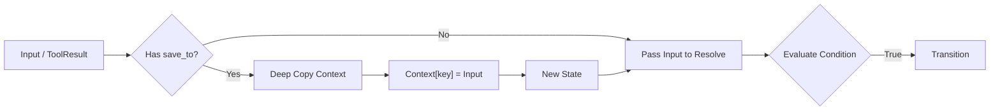

# Technical: Trellis Architecture

## 1. Arquitetura Hexagonal (Ports & Adapters)

O *Core* da Trellis não conhece banco de dados, não conhece HTTP e não conhece CLI. Ele define **Portas** (Interfaces) que o mundo externo deve satisfazer.
Essa arquitetura desacoplada torna o Trellis leve o suficiente para ser embutido em CLIs simples ou usado como biblioteca "low-level" dentro de frameworks de Agentes de IA maiores.

### 1.1. Driver Ports (Entrada)

A API primária para interagir com o engine.

- `Engine.Render(state)`: Retorna a view (ações) para o estado atual e se é terminal.
- `Engine.Navigate(state, input)`: Computa o próximo estado dado um input.
- `Engine.Inspect()`: Retorna o grafo completo para visualização.

### 1.2. Driven Ports (Saída)

As interfaces que o engine usa para buscar dados.

- `GraphLoader.GetNode(id)`: Abstração para carregar nós. O **Loam** implementa isso via adapter.
- `GraphLoader.ListNodes()`: Descoberta de nós para introspecção.

### 1.3. Diagrama de Arquitetura



### 1.4. Ciclo de Vida do Engine (Lifecycle)

O Engine segue um ciclo de vida estrito de **Resolve-Execute-Update** para garantir previsibilidade.



**Fases do Ciclo:**

1. **Render (View)**: Carrega o nó, aplica interpolação profunda (incluindo argumentos de ferramentas) e retorna as ações. O estado *não* muda.
2. **Navigate (Update)**:
    - **Update**: Aplica o input ao contexto da sessão (se `save_to` estiver definido).
    - **Resolve**: Avalia as condições de transição baseadas no novo contexto.
    - **Transition**: Retorna o novo estado apontando para o próximo nó.

## 2. Estrutura de Diretórios

```text
trellis/
├── cmd/
│   └── trellis/       # Entrypoint (CLI)
├── internal/          # Detalhes de implementação (Privado)
│   ├── adapters/      # Implementações (Loam, HTTP, MCP)
│   ├── presentation/  # TUI & Renderização
│   ├── runtime/       # Engine de execução
│   └── validator/     # Lógica de validação
├── pkg/               # Contratos Públicos (Safe to import)
│   ├── adapters/      # Adaptadores de Infraestrutura (Inmemory)
│   ├── domain/        # Core Domain (Node, State)
│   ├── ports/         # Interfaces (Driver & Driven)
│   ├── registry/      # Registro de Ferramentas
│   └── runner/        # Loop de Execução e Handlers
└── go.mod
```

### 3. Camada de Apresentação (Presentation Layer)

`internal/presentation`

Responsável por converter visualmente o grafo e estados do Engine para o usuário final.

#### 3.1. Visualização de Grafo (`trellis graph`)

O Trellis gera diagramas Mermaid seguindo convenções semânticas para diferenciar os tipos de nós:

| Tipo de Nó | Forma Mermaid | Sintaxe | Significado |
| :--- | :--- | :--- | :--- |
| **Start** | Círculo | `((ID))` | Ponto de entrada ("start"). |
| **Tool** | Sub-rotina | `[[ID]]` | Execução de side-effect externo. |
| **Question/Prompt** | Paralelogramo | `[/ID/]` | Ponto de espera por input do usuário. |
| **Text/Outros** | Retângulo | `[ID]` | Exibição de conteúdo estático. |

A geração do grafo lida automaticamente com:

- **Sanitização de IDs**: Caracteres como `/`, `.`, `-` são normalizados para `_`.
- **Escape de Condições**: Aspas em condições são convertidas para evitar quebra de sintaxe.
- **Sub-grafos**: Transições entre diretórios diferentes são representadas por linhas pontilhadas (`-.->`).

## 4. Integridade e Persistência

### 4.1. O Papel do Loam

O **Loam** atua como bibliotecário e camada de persistência.

- **Responsabilidade**: Garantir integridade e fornecer documentos normalizados (`DocumentModel`).
- **Trellis Adapter (`LoamLoader`)**: Converte `DocumentModel` para JSON/Structs que o Compiler entende.
- **Constraints**: Em modo de desenvolvimento, o Loam facilita o hot-reload e a leitura segura de arquivos.

### 1.5. Model Context Protocol (MCP) Adapter

Introduzido na v0.3.3 (Experimental), o adaptador MCP (`internal/adapters/mcp`) expõe o Trellis como um Servidor MCP.

- **Tools**:
  - `render_state`: Mapeia para `Engine.Render`.
  - `navigate`: Mapeia para `Engine.Navigate`.
  - `get_graph`: Mapeia para `Engine.Inspect`.
- **Resources**:
  - `trellis://graph`: Retorna o grafo via `Engine.Inspect`.
- **Transports**: Suporta `Stdio` (para agentes locais) e `SSE` (para remoto/debug).

### 3.2. Global Strict Serialization

O Trellis adota uma postura de "Strict Types" para garantir a determinística da máquina de estados.

#### O Problema do `float64`

Por padrão, decodificadores JSON em Go tratam números arbitrários como `float64`. Isso é catastrófico para IDs numéricos grandes ou timestamps.

#### A Solução

O Trellis força o modo estrito em **todos** os adaptadores. Isso garante que números sejam decodificados como `json.Number` ou `int64`, e que exista consistência entre JSON e YAML.

### 3.3. Fluxo de Dados e Serialização

O Trellis utiliza múltiplas camadas de serialização, o que explica a presença de diferentes tags (`json`, `yaml`, `mapstructure`) nas structs do domínio.

1. **Entrada (Source)**: Arquivos `.md` (YAML Frontmatter) ou `.json`.
2. **Leitura (Loam)**: A biblioteca Loam usa `mapstructure` para decodificar YAML/JSON genérico em structs de DTO (`internal/dto`).
3. **Adaptação (Loader)**: O `LoamLoader` converte os DTOs em um novo JSON limpo, estritamente tipado para o domínio.
4. **Compilação (Engine)**: O `Compiler` lê esse JSON interno e popula as structs de Domínio (`pkg/domain`).

**Por que a mistura de tags?**
Para evitar a duplicação excessiva de structs, alguns tipos do Domínio (como `ToolCall`) são reutilizados nos DTOs.

- `json`: Usado pelo **Compiler** (interno) e pela API REST/MCP (externo).
- `mapstructure`: Usado pelo **Loam** para ler arquivos de disco.
- `yaml`: Usado apenas para documentação ou ferramentas de exportação futuras (não utilizado no load crítico).

## 4. Escalabilidade: Sub-Grafos e Namespaces (v0.4+)

Para escalar fluxos complexos, o Trellis suporta **Sub-Grafos** via organização de diretórios.

### 4.1. Semântica `jump_to` vs `to`

Tecnicamente, o Trellis Engine vê apenas IDs (`to_node_id`). O conceito de `jump_to` é **açúcar sintático** do adaptador Loam para clareza arquitetural.

- **`to`**: Indica uma transição local, dentro do mesmo contexto lógico ou arquivo.
- **`jump_to`**: Indica uma transição para um **Sub-Grafo** ou Módulo externo. É uma sinalização explícita de mudança de contexto.

```yaml
transitions:
  - text: "Checkout"
    jump_to: modules/checkout/start # Semântica: Mudança de Contexto
```

### 4.2. IDs Implícitos e Normalização

1. **Implicit IDs**: Arquivos em subdiretórios herdam o caminho como ID (ex: `modules/checkout/start`).
2. **Normalization**: O Adapter normaliza todos os IDs para usar `/` (forward slash), garantindo que fluxos criados no Windows rodem no Linux sem alterações.

### 4.3. Syntactic Sugar: Options vs Transitions

Para reduzir a verbosidade em menus de escolha simples, introduzimos a chave `options`.

- **Transitions**: Controle total (`condition: input == "A" || input == "B"`).
- **Options**: Atalho para correspondência exata de texto.

#### Regra de Precedência (Evaluation Order)

O `LoamLoader` compila `options` e `transitions` em uma única lista plana de transições do domínio. A ordem é estrita:

1. **Options (Matches Específicos)**: Avaliadas primeiro.
2. **Transitions (Lógica Genérica/Fallback)**: Avaliadas em seguida.

Isso habilita o padrão **"Menu with Fallback"**:

```yaml
options:
  - text: "Sim"
    to: "step_yes"
transitions:
  - to: "step_default" # Catch-All (sem condição), executado apenas se não for "Sim"
```

## 5. Runner & IO Architecture

The `Runner` serves as the bridge between the Core Engine and the outside world. It manages the execution loop, handles middleware (like confirmation), and delegates IO to an `IOHandler`.

### Stateless & Async IO

Trellis supports two primary modes of operation:

1. **Text Mode** (`TextHandler`): For interactive TUI/CLI usage. Blocks on user input.
2. **JSON Mode** (`JSONHandler`): For headless automation and API integration.

**Key constraint for JSON Mode:**

- **Strict JSON Lines (JSONL)**: All inputs to the `JSONHandler`, including tool results, must be single-line JSON strings.
- **Async/Non-Blocking**: The handler reads from Stdin in a background goroutine. This allows the Engine to cancel wait operations (e.g. timeout or interrupt) without hanging on OS-level read syscalls.

## 6. Princípios de Design (Constraints)

Para evitar a "Complexidade Oculta", seguimos estas restrições:

### 6.1. Logic-Data Decoupling

A lógica complexa **nunca** deve residir no grafo (Markdown).

- **Errado**: `condition: user.age > 18 && user.status == 'active'` (Exige parser complexo).
- **Correto**: `condition: is_adult_active` (O Host resolve e retorna bool).

> Veja [Interactive Inputs](../docs/guides/interactive_inputs.md) para detalhes sobre como o Host gerencia inputs.

### 6.2. Strict Mode Compiler

O compilador deve ser implacável.

- Variáveis não declaradas resultam em erro de compilação.
- O objetivo é **Confiança Total**: Se compilou, não existem "Dead Ends" lógicos causados por typos.

### 6.3. Convenção de Ponto de Entrada (Entry Point)

O Trellis segue a filosofia **Convention over Configuration** para o início do fluxo.

- **ID Obrigatório**: O fluxo SEMPRE começa no nó com ID `start`.
- **Resolução de Arquivo**: Por padrão, o `LoamLoader` busca por um arquivo chamado `start.md` (ou `start.json`) na raiz do diretório.
- **Sub-Grafos**: Ao pular para um sub-módulo (`jump_to: modules/auth`), o engine busca por `modules/auth/start.md`.

> **Nota**: Embora seja possível injetar um `State` inicial diferente via código (`engine.Navigate(ctx, customState, input)`), a CLI e os Runners padrão assumem `start` como entrypoint.

## 7. Stateless Server Mode (v0.3.3+)

Introduzido na versão 0.3.3, o Trellis pode operar como um servidor HTTP stateless.

- **Contract-First**: A API é definida em `api/openapi.yaml`.
- **Implementação**: `internal/adapters/http` usa `chi` como roteador.
- **Endpoints de Dados**:
  - `GET /graph`: Retorna o grafo completo.
  - `POST /navigate`: Recebe `State` + `Input`, retorna `NewState`.
- **Endpoints de Gerenciamento**:
  - `GET /health`: Liveness probe.
  - `GET /info`: Metadados e versões.

> Para um guia prático, veja [Running HTTP Server](../docs/guides/running_http_server.md).

## 8. Real-Time & Events (SSE)

Para suportar experiências dinâmicas (como **Hot-Reload** no navegador), o Trellis utiliza **Server-Sent Events (SSE)**.

### 8.1. Por que SSE e não WebSockets?

- **Simplicidade**: SSE usa HTTP padrão (`Content-Type: text/event-stream`). Não requer upgrade de protocolo ou handshake complexo.
- **Unidirecional**: O Trellis é o "State of Truth". O cliente apenas reage a mudanças (ex: arquivo salvo no disco -> notifica cliente -> cliente recarrega). Para enviar dados (inputs), o cliente continua usando `POST /navigate` (HTTP padrão).
- **Reconexão Nativa**: O objeto `EventSource` do navegador gerencia reconexões automaticamente.

### 8.2. Fluxo de Hot-Reload



### 8.3. Event Source & Caveats

O Trellis desacopla a fonte de eventos do transporte SSE:

1. **Fonte (Source)**: O `LoamLoader` utiliza `fsnotify` (via biblioteca Loam) para monitorar o sistema de arquivos.
    - *Nota*: Atualmente, o evento emitido é genérico (`"reload"`), sinalizando que *alguma coisa* mudou.
    - *Futuro*: A interface `Watch` retorna `chan string`, permitindo eventos granulares como `update:docs/start.md` ou `delete:modules/auth.json`.

2. **Transporte**: O handler SSE (`Server.SubscribeEvents`) apenas repassa as strings recebidas pelo canal para o cliente HTTP.

> **Limitações Atuais (v0.3.3)**:
>
> - Não há distinção de qual arquivo mudou no payload do evento SSE (apenas `data: reload`).

## 9. Protocolo de Efeitos Colaterais (Side-Effect Protocol)

Introduzido na v0.4.0, o protocolo de side-effects permite que o Trellis solicite a execução de código externo (ferramentas) de forma determinística e segura.

### 9.1. Filosofia: "Syscalls" para a IA

O Trellis trata chamadas de ferramenta como "Chamadas de Sistema" (Syscalls). O Engine não executa a ferramenta; ele **pausa** e solicita ao Host que a execute.

1. **Intenção (Intent)**: O Engine renderiza um nó do tipo `tool` e emite uma ação `CALL_TOOL`.
2. **Suspensão (Yield)**: O Engine entra em estado `WaitingForTool`, aguardando o resultado.
3. **Dispatch**: O Host (CLI, Servidor HTTP, MCP) recebe a solicitação e executa a lógica (ex: chamar API, rodar script).
4. **Resumo (Resume)**: O Host chama `Navigate` passando o `ToolResult`. O Engine retoma a execução verificando transições baseadas nesse resultado.

### 9.2. Ciclo de Vida da Chamada de Ferramenta



### 9.3. Universal Dispatcher

Graças a este desacoplamento, a mesma definição de grafo pode usar ferramentas implementadas de formas diferentes dependendo do adaptador:

- **CLI Runner**: Executa scripts locais (`.sh`, `.py`) ou funções Go embutidas.
- **MCP Server**: Repassa a chamada para um cliente MCP (ex: Claude Desktop, IDE).
- **HTTP Server**: Webhooks que notificam serviços externos (ex: n8n, Zapier).

### 9.4. Semântica de Texto e Bloqueio (v0.5 Semantic Cleanup)

Na v0.5, o comportamento de nós de texto foi alinhado com a semântica de State Machine pura:

1. **Nodes de Texto (`type: text`)**: São, por padrão, **Non-Blocking (Pass-through)**.
    - O Engine renderiza o conteúdo e, se houver uma transição válida incondicional, transita *imediatamente*.
    - Isso permite usar nós de texto como "Templates" ou passos intermediários de computação/display que não exigem input.

2. **Pausas Explícitas**:
    - Para forçar o Engine a aguardar input (ex: "Pressione Enter"), use:

      ```yaml
      type: text
      wait: true
      ```

    - Ou utilize o tipo semântico explícito (alias para `type: question`):

      ```yaml
      type: prompt # Alias para question
      ```

> **Migration Note**: Fluxos antigos que dependiam de `type: text` pausar implicitamente devem adicionar `wait: true`.

#### Diagrama de Decisão (Input Logic)



### 9.5. Segurança e Policies (Interceptor)

Para mitigar riscos de execução arbitrária, introduzimos o padrão **Interceptor** no Runner:

```go
type ToolInterceptor func(ctx, call) (allowed bool, result ToolResult, err error)
```

- **ConfirmationMiddleware**: Padrão para modo interativo. Intercepta a chamada e solicita confirmação explícita (`[y/N]`) ao usuário antes de permitir a execução.
- **AutoApproveMiddleware**: Padrão para modo Headless/Automação.

### 9.6. Metadata-Driven Safety (v0.4.1+)

Além da confirmação padrão, o Trellis permite que o autor do fluxo personalize a mensagem de segurança via metadados.

```yaml
type: tool
tool_call:
  name: delete_database
metadata:
  confirm_msg: "⚠️  DANGER: This will destroy production data. Are you sure?"
```

O `ConfirmationMiddleware` detecta o campo `confirm_msg` e o utiliza no prompt, permitindo alertas contextuais ricos.

### 9.7. Protocolo de Mensagens de Sistema (System Messages)

Para permitir que o sistema se comunique com o usuário fora do fluxo principal (sem ser conteúdo de nó), a v0.4.1 introduziu `ActionSystemMessage` (`SYSTEM_MESSAGE`).

- **Finalidade**: Logs, feedback de status ("Salvando...", "Executando ferramenta..."), avisos de erro não-fatais.
- **Semântica**: Notificação Unidirecional (Fire-and-forget). O cliente deve exibir a mensagem mas não precisa responder.
- **Formato**:

  ```json
  [
    {
      "Type": "SYSTEM_MESSAGE",
      "Payload": "Tool 'calc' returned 42"
    }
  ]
  ```

- **Diferença para RenderContent**: `RenderContent` é *Conteúdo do Nó* (parte da narrativa). `SystemMessage` é *Metadado da Infraestrutura*.

### 9.8. Defining Tools in Loam

You can define available tools directly in the Node's frontmatter. This allows the Engine to be aware of the tool's schema (name, description, parameters) without needing hardcoded Go structs.

```yaml
type: text
tools:
  - name: get_weather
    description: Get current temperature
    parameters:
      type: object
      properties:
        city: { type: string }
---
The weather is...
```

### 9.9. Reusable Tool Libraries (Polymorphic Design)

To support modularity, the `tools` key in Frontmatter is polymorphic. It accepts both inline definitions and string references to other files.

```yaml
tools:
  - name: local_tool         # Inline Definition
    description: ...
  - "modules/tools/math.md"  # Reference (Mixin)
```

#### Resolution Strategy

The `LoamLoader` implements a recursive resolution strategy with **Shadowing** (Last-Write-Wins).


**Technical Constraints & Stewardship:**

1. **Polymorphism (`[]any`)**: The Loader accepts generic types to support this UX. This requires **manual schema validation** at runtime to prevent silent failures (e.g. typos in field names).
2. **Cycle Detection**: Recursive imports must be guarded against infinite loops (Stack Overflow). The Loader maintains a `visited` set.
3. **Shadowing Policy**: Local definitions always override imported ones (Last-Write-Wins semantics). This allows specializing generic tools for specific nodes.

### 9.10. Error Handling (on_error)

Introduzido na v0.5.1, o campo `on_error` fornece um mecanismo robusto para recuperação de falhas em ferramentas.

```yaml
type: tool
tool_call: { name: "risky_tool" }
on_error: "recovery_node" # Se IsError=true, transita para cá
transitions:
  - to: "success_node" # Se Success, segue fluxo normal
```

**Comportamento do Engine:**

1. **Prioridade**: O Engine verifica `ToolResult.IsError` *antes* de qualquer outra lógica.
2. **Context Safety**: Ao acionar `on_error`, o Engine **PULA** a etapa de `Update Context` (save_to). Isso evita que mensagens de erro poluam variáveis esperadas para conter dados válidos.
3. **Fluxo Limpo**: O erro é tratado como uma exceção de fluxo, desviando para um nó de recuperação que pode exibir uma mensagem amigável ou tentar uma estratégia alternativa.
4. **Fail Fast Strategy**: Se uma ferramenta retornar erro (`IsError: true`) e o nó **NÃO possuir** um handler `on_error`, o Engine **abortará a execução** retornando um erro detalhado. Isso previne "Context Poisoning" (salvar erro técnico como dado de negócio) e força o desenvolvedor a tratar explicitamente falhas de infraestrutura.


## 10. Variable Interpolation (v0.4.1+)

A partir da v0.4.1, o Trellis adota uma arquitetura plugável para interpolação de variáveis.

### 10.1. Interpolator Interface

O motor define a interface `Interpolator` em `pkg/runtime`:

```go
type Interpolator func(ctx context.Context, templateStr string, data any) (string, error)
```

Isso permite que consumidores da biblioteca (Hosts) injetem sua própria lógica de template (ex: Mustache, Jinja2, Lua) se desejarem.

### 10.2. Default Strategy: Go Templates

A implementação padrão (`DefaultInterpolator`) utiliza a biblioteca nativa `text/template` do Go.

- **Sintaxe**: Standard Go Templates (`{{ .UserName }}`, `{{ if .IsVIP }}...{{ end }}`).
- **Robustez**: Suporta acesso a campos aninhados, condicionais, loops e pipes.
- **Segurança**: Executa em contexto isolado, mas requer cuidado ao renderizar HTML (use `html/template` no Host se necessário, o Trellis foca em Texto/Dados).

### 10.3. Legacy Strategy

Para facilitar a migração, o Trellis fornece `LegacyInterpolator`, que mantém o comportamento antigo de `strings.ReplaceAll` com a sintaxe `{{ Key }}` (sem ponto).

Para usar, basta configurar o Engine:

```go
engine, err := trellis.New(dir, trellis.WithInterpolator(runtime.LegacyInterpolator))
```

## 11. Data Binding (SaveTo)

Introduzido na v0.5, o conceito de Data Binding permite simplificar a coleta de informações em fluxos interativos.

### 11.1. Intenção vs Mecanismo

O Trellis adota a propriedade `save_to` (Salvar Em) para indicar a *intenção* de persistir a resposta de um nó no contexto da sessão.

```yaml
type: question
text: "Qual é o seu nome?"
save_to: "user_name" # Salva input em context["user_name"]
---
type: text
text: "Olá, {{ .user_name }}!" # Usa o valor salvo
```

### 11.2. Regras de Execução

1. **Precedência**: O valor é salvo no contexto *antes* de avaliar as transições. Isso permite usar o valor capturado nas condições de saída (`condition: input == 'yes'`).
2. **Imutabilidade de Estado**: O Engine do Trellis é funcional. Ao salvar um dado, um *novo* Estado é criado com uma cópia do Contexto atualizado + o novo valor. O estado anterior permanece inalterado.
3. **Tipagem Preservada (Fix v0.5)**: `save_to` armazena o input como recebido (`any`).
    - *Nested Access*: Se uma Tool retornar um Map/Struct, ele é salvo integralmente, permitindo acesso profundo (`{{ .data.id }}`).
    - *Caveat*: O Trellis trata valores de contexto como **Imutáveis**. Operações `save_to` substituem a chave inteira. Não há suporte (ainda) para atualizações parciais (`data.field = x`). O Host é responsável por garantir que objetos complexos passados sejam seguros para serialização (JSON-compatible).

#### Fluxo de Data Binding



### 11.3. Considerações de Segurança e Sanitização

O uso de `any` para inputs introduz flexibilidade, mas exige novos cuidados:

1. **Serialization Constraint**: Todo objeto salvo no Contexto (`save_to`) **DEVE ser JSON-serializável**.
    - *Risco*: Salvar funções, canais ou objetos com ciclos quebrará a persistência e o debugger (MCP).
    - *Mitigação*: O Host é responsável por sanitizar dados vindos de ferramentas antes de retorná-los.
2. **Memory & Performance**: O Engine realiza **Deep Copy** do Contexto a cada transição para garantir imutabilidade.
    - *Risco*: Armazenar objetos gigantes (ex: BLOBs, arrays de 10k itens) degradará severamente a performance.
    - *Recomendação*: armazene apenas referências (IDs/Paths) no Contexto, não o dado bruto, se for muito grande.
3. **System Namespace**: A proteção `sys.*` é aplicada no nível do Engine. Nem strings nem objetos complexos podem escrever neste namespace via `save_to`.
4. **Injection Risk**: O `DefaultInterpolator` trata os dados do Contexto como *literais*. Se um usuário digitar `{{ .secret }}`, o renderizador imprimirá `{{ .secret }}` textualmente. Seguro por padrão.
    - *Backlog*: Implementar **Namespaces** (`user.name` vs `sys.flags`) para proteger variáveis críticas.
5. **Sanitização**: O Trellis Engine (v0.5) armazena o input "raw". A validação (Regex, Length, Type) deve ser delegada a Middlewares ou a uma futura camada de Schema Validation.
    - *Recomendação*: Para web-apps, a camada de **Apresentação** (frontend) é responsável por escapar HTML (Anti-XSS).

Para permitir introspecção sem risco de colisão, o namespace `sys` é reservado.

1. **Read-Only (Templates)**: O fluxo PODE ler variáveis de sistema.
    - *Uso*: `{{ .sys.error }}` (para Error Handling), `{{ .sys.node_id }}` (Debug).
2. **Write-Protected (Inputs)**: O fluxo NÃO PODE escrever em `sys` via `save_to`.
    - *Motivo*: Segurança. Previne que outputs de LLM ou inputs de usuário alterem comportamento do Engine.
3. **Host-Controlled**: Apenas o código Go (Host/Plugins) pode escrever em `sys`. Isso abre portas para injeção de *variáveis de ambiente* seguras (ex: `sys.user_role`).

## 12. Camada de Apresentação (Presentation Layer)

`internal/presentation`

Responsável por converter visualmente o grafo e estados do Engine para o usuário final.

### 12.1. Visualização de Grafo (`trellis graph`)

O Trellis gera diagramas Mermaid seguindo convenções semânticas para diferenciar os tipos de nós:

| Tipo de Nó | Forma Mermaid | Sintaxe | Significado |
| :--- | :--- | :--- | :--- |
| **Start** | Círculo | `((ID))` | Ponto de entrada ("start"). |
| **Tool** | Sub-rotina | `[[ID]]` | Execução de side-effect externo. |
| **Question/Prompt** | Paralelogramo | `[/ID/]` | Ponto de espera por input do usuário. |
| **Text/Outros** | Retângulo | `[ID]` | Exibição de conteúdo estático. |

A geração do grafo lida automaticamente com:

- **Sanitização de IDs**: Caracteres como `/`, `.`, `-` são normalizados para `_` para compatibilidade com Mermaid.
- **Escape de Condições**: Aspas em condições são convertidas para evitar quebra de sintaxe nos labels.
- **Sub-grafos**: Transições entre diretórios diferentes são representadas por linhas pontilhadas (`-.->`).
