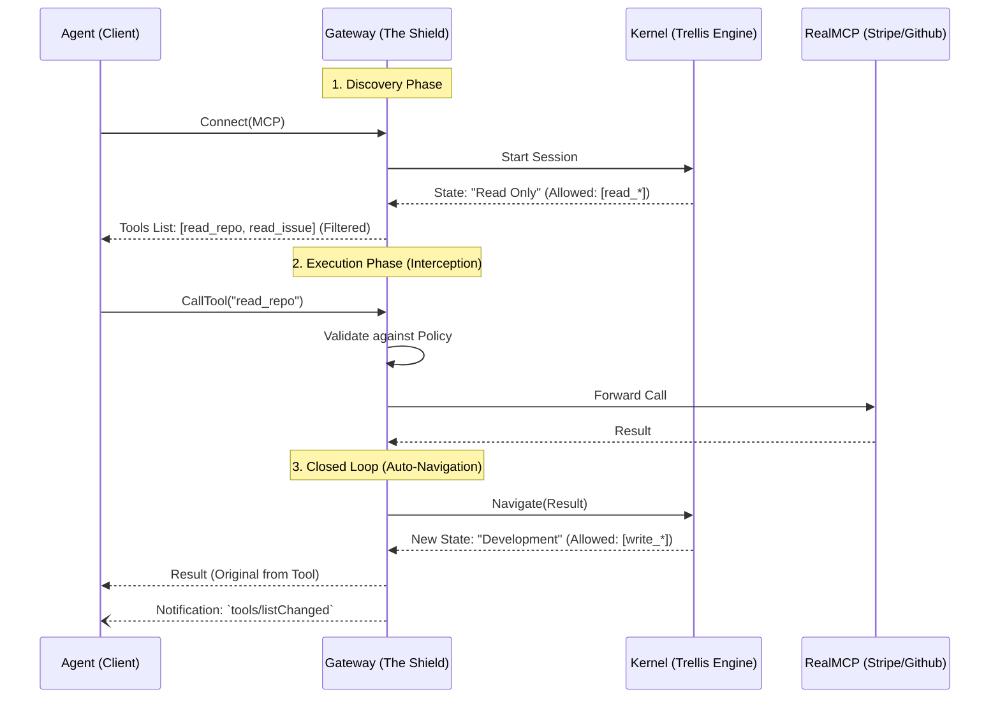

# Architecture Proposal: Contextual Tool Firewall & The "Trellis Gateway"

**Status**: **Accepted**
**Date**: 2026-02-19
**Related Concepts**: Security, Tool Use, Sibling Project

## 1. Visão Geral

Este documento define a arquitetura para o controle de acesso dinâmico a ferramentas em Agentes de IA.
Reconhecemos dois níveis de implementação:

1. **Soft Firewall (v0.7.2)**: Prompt Engineering (Hints).
2. **Hard Firewall (Future Sibling Project)**: Um Gateway MCP que atua como **Stateful Firewall**.

## 2. O Problema: "The God Mode Risk"

Agentes conectados via MCP a serviços críticos (Stripe, GitHub, AWS) operam hoje em "God Mode". Se eles têm a ferramenta, eles podem usá-la a qualquer momento.

Soluções atuais (Cloudflare AI Gateway, Kong) são **Stateless**: elas aplicam regras globais (Rate Limit, PII Redaction), mas não sabem *aonde* o Agente está no processo de negócio.

O Trellis introduz o conceito de **Stateful Firewall**: "Se o estado é 'Pagamento', bloqueie 'Deletar Repo'".

## 3. Estratégia A: Soft Firewall (Contextual Hints)

*Implementação no Trellis Core (v0.7.2)*.

O Core Engine apenas sugere políticas via metadados.

```yaml
# Node Definition
metadata:
  hint_tools: ["stripe_charge"]
```

**Fluxo**:

1. Trellis `Render(State)` -> Retorna `Hints`.
2. Host injeta no Prompt: *"Focus on using: stripe_charge"*.
3. **Segurança**: Baixa (O Agente pode ignorar).

## 4. Estratégia B: Trellis Gateway (The Sibling Project)

Para impor segurança real ("Hard Firewall") sem inchar o kernel do Trellis, propomos um **Projeto Irmão** (ex: `trellis-gate` ou `lattice`).

### 4.1. Arquitetura "Stateful Proxy"

O Gateway é um **MCP Router** que intercepta tráfego entre o Agente e as Ferramentas Reais.



### 4.2. Por que Interceptar? (The Closed Loop)

O Gateway intercepta a execução da ferramenta para garantir a sincronia de estado (**Closed Loop**).

1. **Se NÃO Interceptar**: O Agente executa a tool direto. O Agente precisa *lembrar* de avisar o Trellis que terminou. Se o Agente alucinar ou falhar, o Trellis fica desatualizado (Estado Zumbi).
2. **Ao Interceptar**: O Gateway garante que **Toda Ação gera uma Transição**. O Trellis está sempre sincronizado com a realidade.

### 4.3. Separação de Responsabilidades

* **Trellis (Kernel)**:
  * **Papel**: Policy Engine (Legislativo).
  * **Responsabilidade**: Define *o que* é permitido em cada estado.
  * **I/O**: Zero. Não conhece HTTP, SSE ou Stripe.
* **Gateway (Sibling)**:
  * **Papel**: Enforcer & Router (Executivo).
  * **Responsabilidade**: Gerencia conexões MCP, Autenticação e aplica o filtro.
  * **I/O**: Pesado. Proxy de tráfego.

## 5. Ilustração: `type: step`

Mencionamos `type: step` como uma abstração futura para "Universal Action Nodes".

No contexto do Gateway, qualquer nó que libera ferramentas e aguarda execução externa é efetivamente um "Passo" de um Workflow Sincronizado.

## 6. Diferencial de Mercado

Estamos na fronteira (Frontier Tech).

| Solução | Tipo | Contexto |
| :--- | :--- | :--- |
| **Cloudflare/Kong** | Gateway | Stateless (Regras Globais) |
| **NeMo Guardrails** | Lib Python | Conversational (Tópicos) |
| **LangGraph** | Code Framework | Internal (Python) |
| **Trellis Gateway** | **Protocol Gateway** | **Stateful (Business Process)** |

O Trellis Gateway permite definir regras de segurança baseadas no **Processo de Negócio**, agnósticas de linguagem ou modelo.

## 7. Inspiração: Colang 2.0 (NeMo Guardrails)

A análise do **Colang 2.0** valida a tese do Trellis de que **Guardrails são Processos**.

Assim como o Colang usa fluxos (`flow`) para restringir quais eventos são aceitos num dado momento, o Trellis usa o Estado Atual para restringir quais ferramentas podem ser chamadas (Contextual Firewall).

> **Nota**: A discussão sobre como o Trellis adotará a sintaxe compacta do Colang (Macro Nodes) e a arquitetura do **Graph Compiler** foi movida para [dsl_compiler.md](./dsl_compiler.md).
