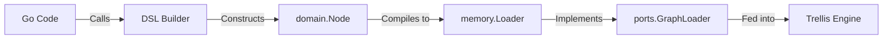

# Building Graphs in Go (DSL)

Starting from v0.7.7, Trellis provides a fluent Go API (DSL) for constructing graphs programmatically. This allows you to define workflows without writing YAML or JSON, enabling type safety and dynamic graph generation.

## Introduction

The `pkg/dsl` package provides a `Builder` that allows you to chain method calls to define nodes and transitions.

## Quick Start

### 1. Import the package

```go
import "github.com/aretw0/trellis/pkg/dsl"
```

### 2. Create a Builder

```go
b := dsl.New()
```

### 3. Define Nodes

You can define nodes using fluent methods like `Text()`, `Question()`, `Input()`, etc.

```go
// Question Node
b.Add("ask_name").
    Question("What is your name?").
    Input("text").
    SaveTo("name").
    Go("greet")

// Text Node with Template
b.Add("greet").
    Text("Nice to meet you, {{.name}}!").
    Go("end")

// Question Node
b.Add("menu").
    Question("How can I help you?").
    Input("choice", "Reset Password", "Contact Support").
    SaveTo("user_choice").
    Branch("input == 'Reset Password'", "reset_flow").
    Branch("input == 'Contact Support'", "support_flow")
```

### 4. Build and Run

Compile the graph into a `Loader` and pass it to the `Runner`.

```go
loader, err := b.Build()
if err != nil {
    panic(err)
}

engine, err := trellis.New("my-graph", trellis.WithLoader(loader))
if err != nil {
    panic(err)
}

// Use WithStdin() for interactive CLI support in standalone library usage
handler := runner.NewTextHandler(os.Stdout, runner.WithStdin())
r := runner.NewRunner(
    runner.WithEngine(engine),
    runner.WithInputHandler(handler),
)
r.Run(context.Background())
```

## DSL Reference

### Node Types

- **Text(content)**: Displays a message and continues immediately (Soft Step).
- **Question(content)**: Displays a message and waits for input (Hard Step).

### Input Configuration

- **Input(type, options...)**: Configures the input method.
  - `Input("text")`: Free text input.
  - `Input("choice", "A", "B")`: multiple choice.
  - `Input("confirm")`: Yes/No confirmation.
- **SaveTo(varName)**: Stores the result in the context.

### Transitions

- **Go(target)**: Unconditional transition.
- **Branch(condition, target)**: Conditional transition.
- **Error(target)**: Transition on error.
- **On(signal, target)**: Transition on global signal (e.g. "timeout").

### Context

- **Context(key, value)**: Sets a default context value for the node.

## Architecture

The DSL Builder constructs `domain.Node` objects which are then compiled into a `memory.Loader`. This loader implements the `ports.GraphLoader` interface, making it compatible with the Trellis Engine.


