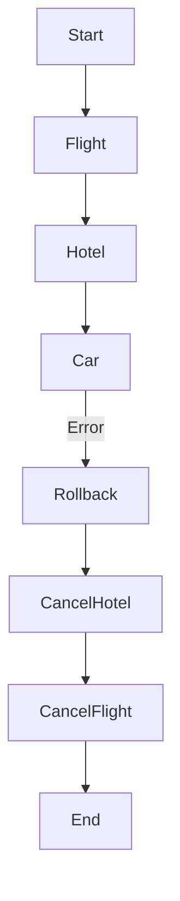

# Manual SAGA Pattern (Compensation)

Distributed transactions are complex. In durable workflows, we often use the **SAGA Pattern** to guarantee consistency across external systems without distributed locks.

> **Note**: This guide describes how to implement SAGA **manually** in Trellis v0.6 using `undo_action` metadata and custom wiring. Native SAGA orchestration (automatic rollback) is planned for future versions.

**The Concept:**
For every "Do" action, define an "Undo" action. If any step fails, execute the "Undos" in reverse order for successfully completed steps.

## Implementing Manual SAGA in Trellis

Trellis supports this pattern natively using `metadata` for annotation and `on_error` for flow control.

### 1. Define Compensatable Nodes

Use the `metadata.undo_action` key to indicate which tool/node reverses effect.

```yaml
# book_flight.md
type: tool
tool_call:
  name: book_flight
metadata:
  undo_action: cancel_flight
save_to: flight_id
on_error: rollback_manager
```

### 2. Handle Errors (The Rollback Trigger)

When a critical step fails, trigger the rollback sequence.

```yaml
# book_car.md
type: tool
tool_call:
  name: book_car
# If this fails, go to rollback
on_error: rollback_manager
```

### 3. Implement the Rollback Manager (Manual Chain)

In v0.6, you manually chain the compensation logic. A simple pattern is to have a "Rollback Entry" followed by the compensation steps.



### Example

See [`examples/manual-saga`](../../examples/manual-saga) for a complete working implementation.

Run it with:

```bash
go run ./examples/manual-saga
```

You will see:

1. Flight Booked (Success)
2. Hotel Booked (Success)
3. Car Booking Fails (Error)
4. Rollback Initiated
5. Hotel Cancelled
6. Flight Cancelled
