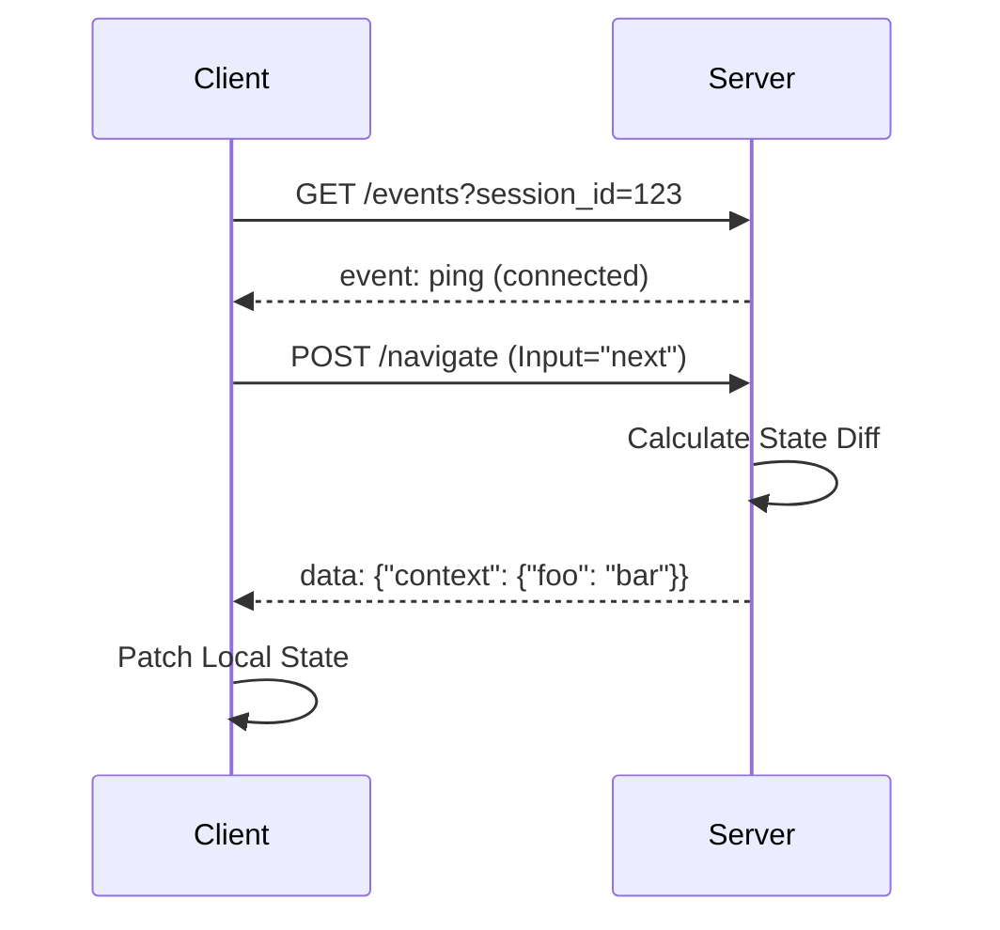

# Running the HTTP Server & Swagger UI

Trellis v0.4+ supports a **Stateless HTTP Server Mode**, allowing you to integrate the state machine engine into web applications, serverless functions, or AI agents.

This guide uses the built-in `examples/tour` flow to demonstrate how to run the server and interact with the API via Swagger UI.

## 1. Starting the Server

You can start the server using the `trellis serve` command. Provide the directory of the flow you want to serve.

```bash
# Serve the 'tour' example on port 8080
go run ./cmd/trellis serve --dir ./examples/tour --port 8080
```

*Or using the Makefile (development):*

```bash
make serve-tour
```

## 2. Real-Time Updates & Hot Reload (SSE)

The server exposes a `/events` endpoint for real-time updates using Server-Sent Events (SSE). It supports two modes:

1. **Global Hot Reload** (No parameters): Used by developer tools to reload the graph when files change.
2. **Session Reactivity** (`?session_id=...`): Used by frontends to receive granular state updates (Deltas).

### The Reactivity Loop



### Delta JSON Structure

The SSE `data` payload is a JSON object representing **only what changed**:

```json
{
  "session_id": "123",
  "current_node_id": "step_2",
  "status": "active",
  "context": {
    "points": 10
  },
  "history": {
    "appended": ["step_2"]
  }
}
```

### Filtering

You can filter which fields to watch using the `watch` parameter:

```bash
curl -N "http://localhost:8080/events?session_id=123&watch=context,status"
```

## 3. Accessing Swagger UI

Once the server is running, open your browser to:

👉 **[http://localhost:8080/swagger](http://localhost:8080/swagger)**

You will see the interactive API documentation.

## 4. Management Endpoints

- **Health Check**: `GET /health` -> `{"status": "ok"}`
- **Server Info**: `GET /info` -> Returns version metadata using the Separation of Concerns strategy:
  - `version`: The Trellis software version (e.g. `0.3.3`)
  - `api_version`: The OpenAPI Contract version (e.g. `0.1.0`)

## 5. Usage Examples (The Tour)

The `tour` flow starts at the `start` node. Since the server is stateless, **you (the client)** are responsible for holding the `state` object and passing it back to the server for each step.

### Step 1: Render the Start Node

First, we ask the engine to render the view for the entry point (`start`).

- **Endpoint**: `POST /render`
- **Goal**: See what the user should see first.

**Payload**:

```json
{
  "current_node_id": "start"
}
```

**Response (View)**:
The server returns actions (e.g., text to display) and `terminal: false`.

```json
{
  "actions": [
    {
      "type": "RENDER_CONTENT",
      "payload": "# Welcome to Trellis Tour\n\nThis is a simple interactive tour..."
    }
  ],
  "terminal": false
}
```

### Step 2: Navigate (Make a Choice)

The text asks us to choose "Inputs" or "Choice". Let's type "Inputs". We must send our **Current State** (which we constructed from the previous step: we are at `start`) and our **Input**.

- **Endpoint**: `POST /navigate`
- **Goal**: Transition to the next state.

**Payload**:

```json
{
  "state": {
    "current_node_id": "start",
    "memory": {},
    "history": ["start"]
  },
  "input": "Inputs"
}
```

**Response (New State)**:
The server calculates the transition and returns the new state object.

```json
{
  "current_node_id": "inputs",
  "history": ["start", "inputs"],
  "memory": {},
  "terminated": false
}
```

### Step 3: Render the New State

Now that we are at the `inputs` node, we call `render` again with this **new state** to see what happens next.

- **Endpoint**: `POST /render`

**Payload**:

```json
{
  "current_node_id": "inputs",
  "history": ["start", "inputs"],
  "memory": {}
}
```

## Summary

The loop is always:

1. **Render(State)** -> Show UI to User.
2. **User Input** -> Collect data.
3. **Navigate(State, Input)** -> Get New State.
4. Repeat.
